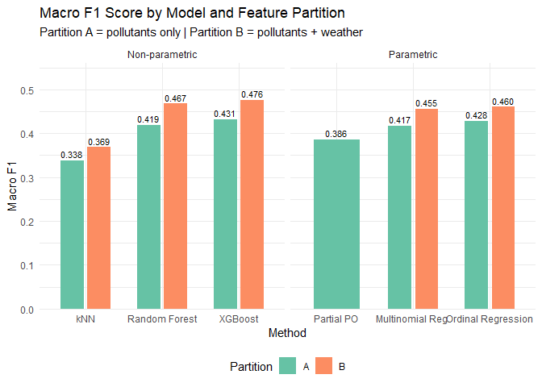
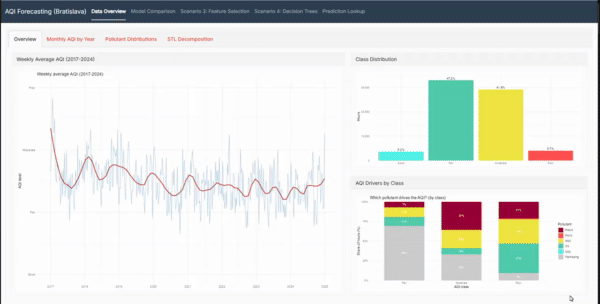
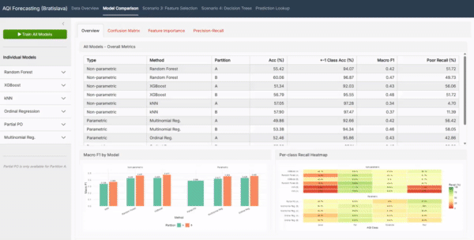
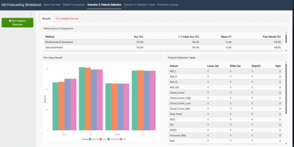

# Predicting Bratislava AQI (Air Quality Index) with ML

This project analyzes weather and air pollution data from Bratislava, Mamateyova street 2017-2024, to predict AQI (Air Quality Index), focusing on **poor** conditions. Based on the findings, classifications with multiple algorithms are performed and the results are compared to each other, showcasing that the best models achieve much stronger predictive power than just simple baseline model (predicting same AQI as the day before). It is a time-series problem, which with feature engineering can be made as supervised learning problem, suitable for classic machine learning models.

The whole analysis can be seen in [project.md](/project.md)

## Features
- Merged two datasets
- Thorough EDA, with a lot of plots and detailed explanations
- Non-parametric models -> **Random Forest, XGBoost and kNN**
- Parametric models -> **Ordinal regression, Partial PO model and Multinomial regression**
- Feature selection -> **Lasso, Elastic Net and Backward step**
- **Decision tree visualization** based on best RF model 
- **Shiny app**

## Data
This project required two datasets that were merged together based on the timestamps.

Pollutants: [European Environment Agency (EEA) Air Quality Download Service](https://eeadmz1-downloads-webapp.azurewebsites.net/)  
Weather: [Open Meteo Historical Weather](https://open-meteo.com/en/docs/historical-weather-api)

## Results

**Takeaway:** the best model, XGBoost on pollutants **and** weather, lifts Macro F1 from **0.433 to 0.476** over a persistence baseline, and raises recall on the critical *Poor* class from **32.5% to 51.9%**. Adding weather features to pollutants is worth a consistent **+0.03 to +0.05 Macro F1 for every model**, and `Pressure_MSL` ranks as the single most important predictor in both tree ensembles, which suggests that atmospheric pressure is the dominant meteorological driver of next-day AQI in Bratislava.

**Baseline** — predict tomorrow's AQI to be the same as today's.

| Metric          | Value |
|-----------------|-------|
| Macro F1        | 0.433 |
| Poor recall (%) | 32.5  |

**Model comparison** (sorted by Macro F1)

| Method                 | Features | Macro F1  | Poor recall (%) |
|------------------------|----------|-----------|-----------------|
| **XGBoost**            | B        | **0.476** | 51.9            |
| Random Forest          | B        | 0.467     | 49.7            |
| Ordinal Regression     | B        | 0.460     | 38.9            |
| Multinomial Regression | B        | 0.455     | 58.0            |
| Partial PO             | A        | 0.386     | **67.3**        |
| kNN                    | B        | 0.369     | 11.4            |

Feature set **A** is pollutants only, **B** is pollutants + weather. Every model scores its best on B, so B is reported throughout. Partial PO was only fitted on A, so its row is not directly comparable with the rest.

XGBoost wins on balanced performance, but the choice depends on the cost of a miss. For a health-warning system, where failing to flag a Poor-air hour is worse than a false alarm, Partial PO is worth a look, as it gives up Macro F1 but catches **67.3%** of Poor hours, roughly double the baseline. Among the models fitted on B, kNN is the only one that does not beat the baseline's 0.433 Macro F1.

## Getting started
The whole analysis can be seen [here](/project.md), on Github.
In case of local settings, this repo can be cloned and then run `project.Rmd` from beginning (dependency installation is included).  

## Project Table of Contents
- [Intro](/project.md#introduction)
- [EDA](/project.md#exploratory-data-analysis-eda)
- [Feature Engineering](/project.md#feature-engineering)
- [Models](/project.md#scenario-1-three-methods-across-two-feature-approaches--scenario-2-3-parametric-and-3-non-parametric-models)
    - [Random Forest](/project.md#random-forest)
    - [XGBoost](/project.md#xgboost)
    - [kNN](/project.md#k-nearest-neighbours-knn)
    - [Ordinal Regression](/project.md#ordinal-regression)
    - [Partial PO](/project.md#partial-proportional-odds)
    - [Multinomial Regression](/project.md#multinomial-regression)
- [Feature selection](/project.md#parameters)
- [Decision tree visualization](/project.md#decision-tree)
- [Conclusion](/project.md#conclusion)

## Shiny app

