AQI Prediction - Elements of AI Capstone Project
================
Filip Škrabák & Patrik Prizbul
2026-03-15

``` r
packages <- c(
  "conflicted", "tidyverse", "arrow", "lubridate", "tsibble",
  "here", # for handling paths correctly
  "corrplot", "zoo", # for na.approx
  "forecast", "generics", "fable",
  "feasts", "ggtime", ## gg_season
  "tseries", # for adf.test
  "MASS", #ordinal regression polr()
  "ranger", "pROC",
  "performance", "brant", "knitr", "scales", "xgboost", "kknn", "vip",
  "car", "VGAM", "patchwork", "PRROC", "glmnet",
  "rpart", "rpart.plot"
)

missing_packages <- setdiff(packages, rownames(installed.packages()))
if (length(missing_packages) > 0) {
  install.packages(missing_packages, repos = "https://cran.rstudio.com", dependencies = TRUE)
}

invisible(lapply(packages, library, character.only = TRUE))
```

    ## Warning: package 'ggplot2' was built under R version 4.4.3

    ## ── Attaching core tidyverse packages ──────────────────────── tidyverse 2.0.0 ──
    ## ✔ dplyr     1.1.4     ✔ readr     2.1.5
    ## ✔ forcats   1.0.0     ✔ stringr   1.5.1
    ## ✔ ggplot2   4.0.3     ✔ tibble    3.2.1
    ## ✔ lubridate 1.9.4     ✔ tidyr     1.3.1
    ## ✔ purrr     1.0.4

    ## Warning: package 'arrow' was built under R version 4.4.3

    ## 
    ## Attaching package: 'arrow'
    ## 
    ## The following object is masked from 'package:lubridate':
    ## 
    ##     duration
    ## 
    ## The following object is masked from 'package:utils':
    ## 
    ##     timestamp

    ## Warning: package 'tsibble' was built under R version 4.4.3

    ## 
    ## Attaching package: 'tsibble'
    ## 
    ## The following object is masked from 'package:lubridate':
    ## 
    ##     interval
    ## 
    ## The following objects are masked from 'package:base':
    ## 
    ##     intersect, setdiff, union

    ## Warning: package 'here' was built under R version 4.4.3

    ## here() starts at C:/Users/Patrick/Desktop/OZNAL/oznal-project26

    ## Warning: package 'corrplot' was built under R version 4.4.3

    ## corrplot 0.95 loaded
    ## 
    ## Attaching package: 'zoo'
    ## 
    ## The following object is masked from 'package:tsibble':
    ## 
    ##     index
    ## 
    ## The following objects are masked from 'package:base':
    ## 
    ##     as.Date, as.Date.numeric

    ## Warning: package 'forecast' was built under R version 4.4.3

    ## Warning: package 'generics' was built under R version 4.4.3

    ## 
    ## Attaching package: 'generics'
    ## 
    ## The following object is masked from 'package:lubridate':
    ## 
    ##     as.difftime
    ## 
    ## The following object is masked from 'package:dplyr':
    ## 
    ##     explain
    ## 
    ## The following objects are masked from 'package:base':
    ## 
    ##     as.difftime, as.factor, as.ordered, intersect, is.element, setdiff,
    ##     setequal, union

    ## Warning: package 'fable' was built under R version 4.4.3

    ## Loading required package: fabletools

    ## Warning: package 'fabletools' was built under R version 4.4.3

    ## Warning: package 'feasts' was built under R version 4.4.3

    ## Warning: package 'ggtime' was built under R version 4.4.3

    ## Warning: package 'tseries' was built under R version 4.4.3

    ## Registered S3 method overwritten by 'quantmod':
    ##   method            from
    ##   as.zoo.data.frame zoo 
    ## 
    ## Attaching package: 'MASS'
    ## 
    ## The following object is masked from 'package:dplyr':
    ## 
    ##     select

    ## Warning: package 'ranger' was built under R version 4.4.3

    ## Warning: package 'pROC' was built under R version 4.4.3

    ## Type 'citation("pROC")' for a citation.
    ## 
    ## Attaching package: 'pROC'
    ## 
    ## The following objects are masked from 'package:stats':
    ## 
    ##     cov, smooth, var

    ## Warning: package 'performance' was built under R version 4.4.3

    ## Warning: package 'brant' was built under R version 4.4.3

    ## Warning: package 'scales' was built under R version 4.4.3

    ## 
    ## Attaching package: 'scales'
    ## 
    ## The following object is masked from 'package:purrr':
    ## 
    ##     discard
    ## 
    ## The following object is masked from 'package:readr':
    ## 
    ##     col_factor

    ## Warning: package 'xgboost' was built under R version 4.4.3

    ## Warning: package 'kknn' was built under R version 4.4.3

    ## Warning: package 'vip' was built under R version 4.4.3

    ## 
    ## Attaching package: 'vip'
    ## 
    ## The following object is masked from 'package:utils':
    ## 
    ##     vi
    ## 
    ## Loading required package: carData
    ## 
    ## Attaching package: 'car'
    ## 
    ## The following object is masked from 'package:dplyr':
    ## 
    ##     recode
    ## 
    ## The following object is masked from 'package:purrr':
    ## 
    ##     some

    ## Warning: package 'VGAM' was built under R version 4.4.3

    ## Loading required package: stats4
    ## Loading required package: splines

    ## Warning: package 'patchwork' was built under R version 4.4.3

    ## 
    ## Attaching package: 'patchwork'
    ## 
    ## The following object is masked from 'package:MASS':
    ## 
    ##     area

    ## Warning: package 'PRROC' was built under R version 4.4.3

    ## Loading required package: rlang
    ## 
    ## Attaching package: 'rlang'
    ## 
    ## The following object is masked from 'package:arrow':
    ## 
    ##     string
    ## 
    ## The following objects are masked from 'package:purrr':
    ## 
    ##     %@%, flatten, flatten_chr, flatten_dbl, flatten_int, flatten_lgl,
    ##     flatten_raw, invoke, splice

    ## Warning: package 'glmnet' was built under R version 4.4.3

    ## Loading required package: Matrix
    ## 
    ## Attaching package: 'Matrix'
    ## 
    ## The following objects are masked from 'package:tidyr':
    ## 
    ##     expand, pack, unpack
    ## 
    ## Loaded glmnet 4.1-10
    ## 
    ## Attaching package: 'rpart'
    ## 
    ## The following object is masked from 'package:generics':
    ## 
    ##     prune

    ## Warning: package 'rpart.plot' was built under R version 4.4.3

``` r
conflict_prefer("filter", "dplyr")
```

    ## [conflicted] Will prefer dplyr::filter over any other package.

``` r
conflict_prefer("lag", "dplyr")
```

    ## [conflicted] Will prefer dplyr::lag over any other package.

``` r
conflict_prefer("select", "dplyr")
```

    ## [conflicted] Will prefer dplyr::select over any other package.

``` r
conflict_prefer("interval", "tsibble")
```

    ## [conflicted] Will prefer tsibble::interval over any other package.

``` r
conflict_prefer("vi", "vip")
```

    ## [conflicted] Will prefer vip::vi over any other package.

``` r
conflict_prefer("slice", "dplyr")
```

    ## [conflicted] Will prefer dplyr::slice over any other package.

``` r
here::i_am("project.Rmd")
```

    ## here() starts at C:/Users/Patrick/Desktop/OZNAL/oznal-project26

``` r
set.seed(2026) # reproducibility
```

# Introduction

The main objective of this project is to predict the Air Quality Index
(AQI) for Bratislava, Slovakia, using historical air quality and weather
data from Mamateyova street. This requires us to merge two datasets -
the pollutants dataset and the weather dataset. This is a multi-class
classification problem, since AQI is categorized into 6 classes, from
“Good” to “Extremely poor”. Since Bratislava has mostly Fair and
Moderate air quality, the dataset is imbalanced, and we have very few
examples of Very Poor and Extremely Poor class, which we address by
merging AQI into 4 classes (this is explained later).

## Project Hypothesis:

Current pollutant concentrations and lagged AQI values, combined with
concurrent weather conditions, carry sufficient information to classify
the AQI 24 hours ahead in Bratislava with Macro F1 meaningfully above a
persistence baseline, with emphasis on correctly identifying the
minority Poor class. Weather features provide additional predictive
value beyond pollutants alone.

# Pollutants Dataset

- This dataset comes from [European Enviroment Agency (EEA) Air Quality
  Download Service](https://eeadmz1-downloads-webapp.azurewebsites.net/)
- It contains pollutants from year 2017 until the end of 2024
- Dataset type is Primary Validated Data (E1a), which is verified

First, we load the dataset and take a look at its structure.

``` r
pollutants_data <- open_dataset(here("pollutants"))
glimpse(pollutants_data)
```

    ## FileSystemDataset with 11 Parquet files
    ## 902,260 rows x 12 columns
    ## $ Samplingpoint           <string> "SK/SPO-SK0001A_00001_500", "SK/SPO-SK0001A_0…
    ## $ Pollutant                <int32> 1, 1, 1, 1, 1, 1, 1, 1, 1, 1, 1, 1, 1, 1, 1, …
    ## $ Start            <timestamp[ns]> 2015-01-01 01:00:00, 2015-01-01 02:00:00, 201…
    ## $ End              <timestamp[ns]> 2015-01-01 02:00:00, 2015-01-01 03:00:00, 201…
    ## $ Value       <decimal128(38, 18)> 6.29622, 1.54280, 2.27962, 1.48694, 0.89908, …
    ## $ Unit                    <string> "ug.m-3", "ug.m-3", "ug.m-3", "ug.m-3", "ug.m…
    ## $ AggType                 <string> "hour", "hour", "hour", "hour", "hour", "hour…
    ## $ Validity                 <int32> 1, 2, 1, 1, 1, 1, 1, 1, 1, 1, 1, 1, 1, 1, 1, …
    ## $ Verification             <int32> 1, 1, 1, 1, 1, 1, 1, 1, 1, 1, 1, 1, 1, 1, 1, …
    ## $ ResultTime       <timestamp[ns]> 2016-10-09 14:16:10, 2016-09-20 18:28:27, 201…
    ## $ DataCapture <decimal128(38, 18)> NA, NA, NA, NA, NA, NA, NA, NA, NA, NA, NA, N…
    ## $ FkObservationLog        <string> "c4ae7c45-b99e-45d3-ad97-731478417d66", "8602…

There are 12 columns and 902 260 rows. First, lets keep only the
concerned station (SK0001A), the years of interest (2017-2024) and
relevant columns.

``` r
filtered_air_data <- pollutants_data %>%
  select(Start, Pollutant, Value, Samplingpoint, Validity) %>% # lazy loading
  filter(grepl("SK0001A", Samplingpoint)) %>%
  filter(year(Start) >= 2017, year(Start) <= 2024) %>%
  collect() 
```

Lets look at numeric ranges and unique values of the columns.

``` r
summary(filtered_air_data)
```

    ##      Start                          Pollutant        Value        
    ##  Min.   :2017-01-01 01:00:00.00   Min.   :   1   Min.   : -3.836  
    ##  1st Qu.:2019-01-01 10:00:00.00   1st Qu.:   5   1st Qu.:  5.410  
    ##  Median :2020-12-29 00:30:00.00   Median :   7   Median : 12.783  
    ##  Mean   :2020-12-29 15:50:02.91   Mean   :1223   Mean   : 21.264  
    ##  3rd Qu.:2022-12-26 14:00:00.00   3rd Qu.:   8   3rd Qu.: 27.421  
    ##  Max.   :2025-01-01 00:00:00.00   Max.   :6001   Max.   :657.845  
    ##  Samplingpoint         Validity    
    ##  Length:338624      Min.   :1.000  
    ##  Class :character   1st Qu.:1.000  
    ##  Mode  :character   Median :1.000  
    ##                     Mean   :1.134  
    ##                     3rd Qu.:1.000  
    ##                     Max.   :2.000

The summary suggests that:

- The `Value` column contains some negative values, which are probably
  sensor errors.
- The `Validity` is either 1 or 2. According to data source, both are
  valid, with 2 being below detection limit. We are keeping both.

Next, we should translate the `Pollutant` codes into human readable
names and reshape the data to have columns for each pollutant. Finally,
we make sure the data is sorted by measurement time and we convert it
into a tsibble (time series variant of tibble).

``` r
clean_air_data <- filtered_air_data %>%
  # Translate EU codes into factors
  mutate(Pollutant_Name = case_when(
    Pollutant == 1 ~ "SO2",
    Pollutant == 5 ~ "PM10",
    Pollutant == 7 ~ "O3",
    Pollutant == 8 ~ "NO2",
    #Pollutant == 10 ~ "CO",
    Pollutant == 6001 ~ "PM2.5"
  )) %>%
  select(Start, Pollutant_Name, Value) %>%
  pivot_wider(
    names_from = Pollutant_Name, 
    values_from = Value
  ) %>%
  arrange(Start) %>%
  as_tsibble(index = Start)

glimpse(clean_air_data)
```

    ## Rows: 69,718
    ## Columns: 6
    ## $ Start <dttm> 2017-01-01 01:00:00, 2017-01-01 02:00:00, 2017-01-01 03:00:00, …
    ## $ SO2   <dbl> 7.385760, 5.626700, 2.493750, 2.072940, 2.000850, 2.052720, 2.32…
    ## $ PM10  <dbl> 222.950, 195.860, 145.570, 131.990, 94.357, 79.897, 81.212, 75.3…
    ## $ NO2   <dbl> NA, 45.5553, 38.1042, 31.0796, 31.3415, 31.2841, 31.2268, 31.788…
    ## $ O3    <dbl> 3.4882, 4.1040, 3.0622, NA, 3.3312, 3.3406, 2.6328, 2.5596, 8.26…
    ## $ PM2.5 <dbl> 221.790, 201.800, 156.220, 142.550, 103.110, 88.121, 89.452, 83.…

``` r
#View(clean_air_data)
```

Now we have a cleaned dataset with 5 pollutants. Lets check whether our
time series has any gaps. Our data is hourly.

``` r
gaps <- clean_air_data %>%
  scan_gaps()

nrow(gaps)
```

    ## [1] 410

``` r
gaps
```

    ## # A tsibble: 410 x 1 [1h] <?>
    ##    Start              
    ##    <dttm>             
    ##  1 2017-05-23 19:00:00
    ##  2 2017-05-29 15:00:00
    ##  3 2017-05-29 16:00:00
    ##  4 2017-05-29 17:00:00
    ##  5 2017-05-29 18:00:00
    ##  6 2017-05-29 19:00:00
    ##  7 2018-02-23 12:00:00
    ##  8 2018-02-23 13:00:00
    ##  9 2018-02-23 14:00:00
    ## 10 2018-02-23 15:00:00
    ## # ℹ 400 more rows

There are 410 gaps. For now, lets fill them with NA values. Also check
the tsibble gaps again to make sure they are filled.

``` r
clean_air_data <- clean_air_data %>%
  fill_gaps()

has_gaps(clean_air_data)
```

    ## # A tibble: 1 × 1
    ##   .gaps
    ##   <lgl>
    ## 1 FALSE

``` r
interval(clean_air_data)
```

    ## <interval[1]>
    ## [1] 1h

``` r
duplicates(clean_air_data)
```

    ## Using `Start` as index variable.

    ## # A tibble: 0 × 6
    ## # ℹ 6 variables: Start <dttm>, SO2 <dbl>, PM10 <dbl>, NO2 <dbl>, O3 <dbl>,
    ## #   PM2.5 <dbl>

The output confirms there are no more gaps, the interval is 1 hour and
there are no duplicates.

``` r
complete_rows <- sum(complete.cases(clean_air_data)) # 60845
rows <- nrow(clean_air_data) # 70128

missing_percentage <- (rows - complete_rows) / rows * 100
missing_percentage
```

    ## [1] 13.23722

``` r
# longest gap
clean_air_data %>%
  as_tibble() %>%
  pivot_longer(-Start, names_to = "pollutant", values_to = "value") %>%
  arrange(pollutant, Start) %>%
  group_by(pollutant) %>%
  mutate(is_na = is.na(value),
         group = cumsum(!is_na & !lag(!is_na, default = TRUE))) %>%
  filter(is_na) %>%
  group_by(pollutant, group) %>%
  summarise(gap_start = min(Start), gap_end = max(Start), hours = n(), .groups = "drop") %>%
  arrange(desc(hours)) %>%
  select(-group) %>%
  mutate(days = hours / 24)
```

    ## # A tibble: 7,156 × 5
    ##    pollutant gap_start           gap_end             hours  days
    ##    <chr>     <dttm>              <dttm>              <int> <dbl>
    ##  1 NO2       2022-09-30 12:00:00 2022-10-10 17:00:00   246 10.2 
    ##  2 SO2       2017-04-24 11:00:00 2017-05-03 14:00:00   220  9.17
    ##  3 O3        2023-02-02 23:00:00 2023-02-11 10:00:00   204  8.5 
    ##  4 PM10      2024-08-11 16:00:00 2024-08-16 08:00:00   113  4.71
    ##  5 PM2.5     2024-08-11 16:00:00 2024-08-16 08:00:00   113  4.71
    ##  6 NO2       2024-08-11 19:00:00 2024-08-16 09:00:00   111  4.62
    ##  7 SO2       2024-08-11 19:00:00 2024-08-16 09:00:00   111  4.62
    ##  8 SO2       2022-09-30 12:00:00 2022-10-04 17:00:00   102  4.25
    ##  9 SO2       2018-06-06 01:00:00 2018-06-10 00:00:00    96  4   
    ## 10 O3        2024-08-11 19:00:00 2024-08-15 17:00:00    95  3.96
    ## # ℹ 7,146 more rows

13.24% of our data is missing. The longest gap (sequence of NA values)
for any pollutant is 10.2 days for NO2.

We have dicided that impute the gaps with linear interpolation for small
gaps (3 hours). Longer gaps will be kept as NA, as replacing them could
disrupt the seasonality or trends in data. The 3 hour gaps should be
short enough to not cause significant bias.

``` r
complete_air_data <- clean_air_data %>%
  # 0 clamp (pollutant concentrations cannot be negative)
  mutate(across(c(SO2, PM10, O3, NO2, `PM2.5`), ~ pmax(., 0, na.rm = FALSE))) %>%
  mutate(across(c(SO2, PM10, O3, NO2, `PM2.5`), ~ 
    zoo::na.approx(., na.rm = FALSE, maxgap = 3)
    )) 

complete_rows <- sum(complete.cases(complete_air_data)) # 60845
rows <- nrow(complete_air_data) # 70128
missing_percentage <- (rows - complete_rows) / rows * 100
missing_percentage
```

    ## [1] 3.935661

Now, after running the linear interpolation for maximum of 3 hour gaps,
we reduced the missing percentage to 3.94%, which is acceptable.

# Weather Dataset

- This dataset comes from [Open Meteo Historical
  Weather](https://open-meteo.com/en/docs/historical-weather-api)
- It contains weather data from year 2017 until the end of 2024

We now load the dataset and rename the columns.

``` r
weather_file_path <- here("weather", "open-meteo-48.12N17.10E163m.csv")

weather_raw <- read_csv(weather_file_path, skip = 3) %>%
  # We rename the columns manually, as the original names contain spaces and units
  rename(
    Start                 = time,
    Temperature           = `temperature_2m (°C)`,
    Humidity              = `relative_humidity_2m (%)`,
    Dew_Point             = `dew_point_2m (°C)`,
    Apparent_Temp         = `apparent_temperature (°C)`,
    Rain                  = `rain (mm)`,
    Precipitation         = `precipitation (mm)`,
    Snow_Depth            = `snow_depth (m)`,
    Snowfall              = `snowfall (cm)`,
    Weather_Code          = `weather_code (wmo code)`,
    Pressure_MSL          = `pressure_msl (hPa)`,
    Cloud_Cover           = `cloud_cover (%)`,
    Surface_Pressure      = `surface_pressure (hPa)`,
    Cloud_Cover_Low       = `cloud_cover_low (%)`,
    Cloud_Cover_Mid       = `cloud_cover_mid (%)`,
    Cloud_Cover_High      = `cloud_cover_high (%)`,
    ET0                   = `et0_fao_evapotranspiration (mm)`,
    Vapour_Pressure_Def   = `vapour_pressure_deficit (kPa)`,
    Wind_Speed            = `wind_speed_10m (km/h)`,
    Wind_Speed_100m       = `wind_speed_100m (km/h)`,
    Wind_Direction        = `wind_direction_10m (°)`,
    Wind_Gusts            = `wind_gusts_10m (km/h)`,
    Wind_Direction_100m   = `wind_direction_100m (°)`,
    Soil_Temp_0_7         = `soil_temperature_0_to_7cm (°C)`,
    Soil_Temp_7_28        = `soil_temperature_7_to_28cm (°C)`,
    Soil_Temp_28_100      = `soil_temperature_28_to_100cm (°C)`,
    Soil_Temp_100_255     = `soil_temperature_100_to_255cm (°C)`,
    Soil_Moisture_0_7     = `soil_moisture_0_to_7cm (m³/m³)`,
    Soil_Moisture_7_28    = `soil_moisture_7_to_28cm (m³/m³)`,
    Soil_Moisture_28_100  = `soil_moisture_28_to_100cm (m³/m³)`,
    Soil_Moisture_100_255 = `soil_moisture_100_to_255cm (m³/m³)`
  ) %>%
  filter(year(Start) >= 2017, year(Start) <= 2024)
```

    ## Rows: 78912 Columns: 31
    ## ── Column specification ────────────────────────────────────────────────────────
    ## Delimiter: ","
    ## dbl  (30): temperature_2m (°C), relative_humidity_2m (%), dew_point_2m (°C),...
    ## dttm  (1): time
    ## 
    ## ℹ Use `spec()` to retrieve the full column specification for this data.
    ## ℹ Specify the column types or set `show_col_types = FALSE` to quiet this message.

``` r
glimpse(weather_raw)
```

    ## Rows: 70,128
    ## Columns: 31
    ## $ Start                 <dttm> 2017-01-01 00:00:00, 2017-01-01 01:00:00, 2017-…
    ## $ Temperature           <dbl> -5.0, -6.6, -6.4, -6.3, -6.4, -7.2, -7.2, -7.3, …
    ## $ Humidity              <dbl> 84, 85, 85, 85, 85, 88, 91, 95, 94, 87, 80, 72, …
    ## $ Dew_Point             <dbl> -7.3, -8.6, -8.5, -8.5, -8.6, -8.9, -8.4, -7.9, …
    ## $ Apparent_Temp         <dbl> -9.0, -11.1, -10.8, -10.8, -10.7, -11.4, -11.1, …
    ## $ Rain                  <dbl> 0, 0, 0, 0, 0, 0, 0, 0, 0, 0, 0, 0, 0, 0, 0, 0, …
    ## $ Precipitation         <dbl> 0, 0, 0, 0, 0, 0, 0, 0, 0, 0, 0, 0, 0, 0, 0, 0, …
    ## $ Snow_Depth            <dbl> 0, 0, 0, 0, 0, 0, 0, 0, 0, 0, 0, 0, 0, 0, 0, 0, …
    ## $ Snowfall              <dbl> 0, 0, 0, 0, 0, 0, 0, 0, 0, 0, 0, 0, 0, 0, 0, 0, …
    ## $ Weather_Code          <dbl> 3, 0, 0, 0, 0, 0, 1, 1, 3, 1, 0, 0, 0, 3, 3, 3, …
    ## $ Pressure_MSL          <dbl> 1029.2, 1029.2, 1028.6, 1027.9, 1027.1, 1026.6, …
    ## $ Cloud_Cover           <dbl> 83, 0, 0, 0, 0, 1, 23, 37, 91, 35, 1, 0, 2, 100,…
    ## $ Surface_Pressure      <dbl> 1008.1, 1008.0, 1007.4, 1006.7, 1005.9, 1005.4, …
    ## $ Cloud_Cover_Low       <dbl> 0, 0, 0, 0, 0, 1, 23, 37, 91, 33, 1, 0, 100, 100…
    ## $ Cloud_Cover_Mid       <dbl> 0, 0, 0, 0, 0, 0, 0, 0, 0, 0, 0, 0, 0, 0, 0, 0, …
    ## $ Cloud_Cover_High      <dbl> 83, 0, 0, 0, 0, 0, 0, 0, 0, 2, 0, 0, 0, 0, 7, 9,…
    ## $ ET0                   <dbl> 0.00, 0.00, 0.00, 0.00, 0.00, 0.00, 0.00, 0.00, …
    ## $ Vapour_Pressure_Def   <dbl> 0.07, 0.06, 0.06, 0.06, 0.06, 0.04, 0.03, 0.02, …
    ## $ Wind_Speed            <dbl> 6.6, 9.9, 8.9, 9.0, 8.0, 7.8, 5.5, 7.2, 9.0, 9.4…
    ## $ Wind_Speed_100m       <dbl> 16.2, 12.7, 9.4, 8.7, 7.2, 5.4, 8.7, 12.1, 14.5,…
    ## $ Wind_Direction        <dbl> 315, 327, 346, 2, 36, 77, 101, 96, 88, 92, 92, 9…
    ## $ Wind_Gusts            <dbl> 11.9, 13.7, 13.0, 11.2, 11.5, 10.1, 10.1, 11.9, …
    ## $ Wind_Direction_100m   <dbl> 307, 315, 320, 330, 354, 53, 97, 102, 96, 93, 92…
    ## $ Soil_Temp_0_7         <dbl> -2.7, -4.4, -4.3, -4.3, -4.3, -4.3, -4.2, -4.1, …
    ## $ Soil_Temp_7_28        <dbl> 0.2, 0.2, 0.2, 0.1, 0.1, 0.1, 0.1, 0.1, 0.0, 0.0…
    ## $ Soil_Temp_28_100      <dbl> 3.5, 3.5, 3.5, 3.5, 3.4, 3.4, 3.4, 3.4, 3.3, 3.3…
    ## $ Soil_Temp_100_255     <dbl> 8.6, 8.6, 8.6, 8.6, 8.6, 8.6, 8.6, 8.6, 8.6, 8.5…
    ## $ Soil_Moisture_7_28    <dbl> 0.302, 0.301, 0.301, 0.301, 0.301, 0.301, 0.301,…
    ## $ Soil_Moisture_0_7     <dbl> 0.306, 0.306, 0.306, 0.306, 0.306, 0.306, 0.306,…
    ## $ Soil_Moisture_28_100  <dbl> 0.249, 0.247, 0.247, 0.247, 0.247, 0.247, 0.247,…
    ## $ Soil_Moisture_100_255 <dbl> 0.224, 0.224, 0.224, 0.224, 0.224, 0.224, 0.224,…

## Data Cleaning

``` r
cat("Rows:", nrow(weather_raw), "| Missing:", sum(!complete.cases(weather_raw)), "\n")
```

    ## Rows: 70128 | Missing: 0

``` r
cat("Columns:", ncol(weather_raw), "\n")
```

    ## Columns: 31

The weather dataset has no missing values. It has 31 columns.

We now look at the correlation heatmap to see correlations between
weather features. The heatmap is hierarchically clustered, so the most
correlated variables are grouped together, which helps us identify
clusters of collinear features.

``` r
cor_matrix <- weather_raw %>%
  select(-Start, -Weather_Code) %>%
  cor(use = "complete.obs")

cor_matrix %>%
  corrplot(
    method = "color", type = "upper", order = "hclust",
    addCoef.col = "black",
    number.cex = 0.4,
    number.digits = 1,
    tl.cex = 0.55, tl.col = "black",
    col = colorRampPalette(c("steelblue", "white", "firebrick"))(200),
    title = "Weather variable correlations",
    mar = c(0, 0, 1.5, 0)
  )
```

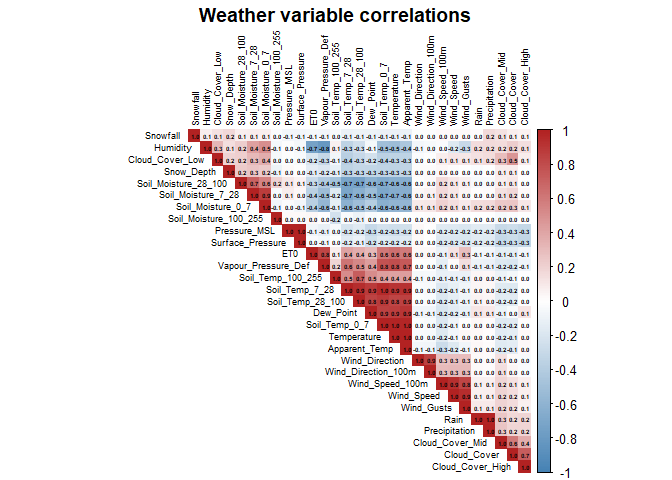<!-- -->

``` r
cor_matrix %>%
  as_tibble(rownames = "Var1") %>%
  pivot_longer(-Var1, names_to = "Var2", values_to = "Correlation") %>%
  filter(Var1 < Var2) %>%
  arrange(desc(abs(Correlation))) %>%
  head(20)
```

    ## # A tibble: 20 × 3
    ##    Var1              Var2                Correlation
    ##    <chr>             <chr>                     <dbl>
    ##  1 Pressure_MSL      Surface_Pressure          0.997
    ##  2 Apparent_Temp     Temperature               0.991
    ##  3 Precipitation     Rain                      0.988
    ##  4 Soil_Temp_0_7     Temperature               0.981
    ##  5 Apparent_Temp     Soil_Temp_0_7             0.977
    ##  6 Soil_Temp_0_7     Soil_Temp_7_28            0.958
    ##  7 Soil_Temp_28_100  Soil_Temp_7_28            0.947
    ##  8 Wind_Gusts        Wind_Speed                0.943
    ##  9 Wind_Speed        Wind_Speed_100m           0.931
    ## 10 Apparent_Temp     Soil_Temp_7_28            0.929
    ## 11 Soil_Temp_7_28    Temperature               0.918
    ## 12 Apparent_Temp     Dew_Point                 0.905
    ## 13 Dew_Point         Soil_Temp_7_28            0.884
    ## 14 Soil_Temp_0_7     Soil_Temp_28_100          0.880
    ## 15 Soil_Moisture_0_7 Soil_Moisture_7_28        0.877
    ## 16 Dew_Point         Temperature               0.869
    ## 17 Dew_Point         Soil_Temp_0_7             0.859
    ## 18 Wind_Direction    Wind_Direction_100m       0.857
    ## 19 Apparent_Temp     Soil_Temp_28_100          0.852
    ## 20 Dew_Point         Soil_Temp_28_100          0.841

The correlation heatmap confirms that we some variables are extremely
highly correlated. Some of there are caused by measuring the same
underlying phenomenon, but at different heights (e.g. wind speed at 10m
and 100m), or they are calculated from the other columns (e.g. apparent
temperature is calculated from temperature, humidity, and wind). Since
these features provide us no additional benefit, we drop them.

``` r
weather_data <- weather_raw %>%
  select(-c(
    Wind_Speed_100m, Wind_Direction_100m, 
    Soil_Temp_7_28, Soil_Temp_28_100, Soil_Temp_100_255,
    Soil_Moisture_7_28, Soil_Moisture_28_100, Soil_Moisture_100_255,
    Surface_Pressure, Apparent_Temp, Snow_Depth, ET0
  ))
```

# Merging the datasets

``` r
merged_data <- complete_air_data %>%
  inner_join(weather_data, by = "Start")

glimpse(merged_data)
```

    ## Rows: 70,128
    ## Columns: 24
    ## $ Start               <dttm> 2017-01-01 00:00:00, 2017-01-01 01:00:00, 2017-01…
    ## $ SO2                 <dbl> 7.385760, 5.626700, 2.493750, 2.072940, 2.000850, …
    ## $ PM10                <dbl> 222.950, 195.860, 145.570, 131.990, 94.357, 79.897…
    ## $ NO2                 <dbl> NA, 45.5553, 38.1042, 31.0796, 31.3415, 31.2841, 3…
    ## $ O3                  <dbl> 3.4882, 4.1040, 3.0622, 3.1967, 3.3312, 3.3406, 2.…
    ## $ PM2.5               <dbl> 221.790, 201.800, 156.220, 142.550, 103.110, 88.12…
    ## $ Temperature         <dbl> -5.0, -6.6, -6.4, -6.3, -6.4, -7.2, -7.2, -7.3, -6…
    ## $ Humidity            <dbl> 84, 85, 85, 85, 85, 88, 91, 95, 94, 87, 80, 72, 92…
    ## $ Dew_Point           <dbl> -7.3, -8.6, -8.5, -8.5, -8.6, -8.9, -8.4, -7.9, -6…
    ## $ Rain                <dbl> 0, 0, 0, 0, 0, 0, 0, 0, 0, 0, 0, 0, 0, 0, 0, 0, 0,…
    ## $ Precipitation       <dbl> 0, 0, 0, 0, 0, 0, 0, 0, 0, 0, 0, 0, 0, 0, 0, 0, 0,…
    ## $ Snowfall            <dbl> 0, 0, 0, 0, 0, 0, 0, 0, 0, 0, 0, 0, 0, 0, 0, 0, 0,…
    ## $ Weather_Code        <dbl> 3, 0, 0, 0, 0, 0, 1, 1, 3, 1, 0, 0, 0, 3, 3, 3, 2,…
    ## $ Pressure_MSL        <dbl> 1029.2, 1029.2, 1028.6, 1027.9, 1027.1, 1026.6, 10…
    ## $ Cloud_Cover         <dbl> 83, 0, 0, 0, 0, 1, 23, 37, 91, 35, 1, 0, 2, 100, 9…
    ## $ Cloud_Cover_Low     <dbl> 0, 0, 0, 0, 0, 1, 23, 37, 91, 33, 1, 0, 100, 100, …
    ## $ Cloud_Cover_Mid     <dbl> 0, 0, 0, 0, 0, 0, 0, 0, 0, 0, 0, 0, 0, 0, 0, 0, 0,…
    ## $ Cloud_Cover_High    <dbl> 83, 0, 0, 0, 0, 0, 0, 0, 0, 2, 0, 0, 0, 0, 7, 9, 1…
    ## $ Vapour_Pressure_Def <dbl> 0.07, 0.06, 0.06, 0.06, 0.06, 0.04, 0.03, 0.02, 0.…
    ## $ Wind_Speed          <dbl> 6.6, 9.9, 8.9, 9.0, 8.0, 7.8, 5.5, 7.2, 9.0, 9.4, …
    ## $ Wind_Direction      <dbl> 315, 327, 346, 2, 36, 77, 101, 96, 88, 92, 92, 95,…
    ## $ Wind_Gusts          <dbl> 11.9, 13.7, 13.0, 11.2, 11.5, 10.1, 10.1, 11.9, 17…
    ## $ Soil_Temp_0_7       <dbl> -2.7, -4.4, -4.3, -4.3, -4.3, -4.3, -4.2, -4.1, -3…
    ## $ Soil_Moisture_0_7   <dbl> 0.306, 0.306, 0.306, 0.306, 0.306, 0.306, 0.306, 0…

``` r
summary(merged_data)
```

    ##      Start                          SO2               PM10         
    ##  Min.   :2017-01-01 00:00:00   Min.   :  0.000   Min.   :  0.0026  
    ##  1st Qu.:2019-01-01 11:45:00   1st Qu.:  1.263   1st Qu.: 10.2610  
    ##  Median :2020-12-31 23:30:00   Median :  2.865   Median : 16.9470  
    ##  Mean   :2020-12-31 23:30:00   Mean   :  4.109   Mean   : 19.8183  
    ##  3rd Qu.:2023-01-01 11:15:00   3rd Qu.:  5.583   3rd Qu.: 25.7070  
    ##  Max.   :2024-12-31 23:00:00   Max.   :657.845   Max.   :394.6200  
    ##                                NA's   :938       NA's   :1003      
    ##       NO2                 O3             PM2.5           Temperature    
    ##  Min.   :  0.0109   Min.   :  0.00   Min.   :  0.0028   Min.   :-12.20  
    ##  1st Qu.:  8.2974   1st Qu.: 26.24   1st Qu.:  5.4461   1st Qu.:  4.70  
    ##  Median : 14.2354   Median : 49.08   Median : 10.1210   Median : 11.60  
    ##  Mean   : 18.2301   Mean   : 51.02   Mean   : 13.3395   Mean   : 11.88  
    ##  3rd Qu.: 23.7757   3rd Qu.: 71.23   3rd Qu.: 17.6728   3rd Qu.: 18.90  
    ##  Max.   :147.1190   Max.   :230.44   Max.   :292.5100   Max.   : 37.00  
    ##  NA's   :846        NA's   :785      NA's   :1146                       
    ##     Humidity        Dew_Point            Rain          Precipitation     
    ##  Min.   : 15.00   Min.   :-21.000   Min.   : 0.00000   Min.   : 0.00000  
    ##  1st Qu.: 59.00   1st Qu.:  0.900   1st Qu.: 0.00000   1st Qu.: 0.00000  
    ##  Median : 74.00   Median :  6.400   Median : 0.00000   Median : 0.00000  
    ##  Mean   : 71.61   Mean   :  6.296   Mean   : 0.06771   Mean   : 0.07233  
    ##  3rd Qu.: 87.00   3rd Qu.: 12.100   3rd Qu.: 0.00000   3rd Qu.: 0.00000  
    ##  Max.   :100.00   Max.   : 23.800   Max.   :19.50000   Max.   :19.50000  
    ##                                                                          
    ##     Snowfall         Weather_Code     Pressure_MSL     Cloud_Cover    
    ##  Min.   :0.000000   Min.   : 0.000   Min.   : 985.6   Min.   :  0.00  
    ##  1st Qu.:0.000000   1st Qu.: 0.000   1st Qu.:1012.0   1st Qu.: 15.00  
    ##  Median :0.000000   Median : 2.000   Median :1016.8   Median : 76.00  
    ##  Mean   :0.003247   Mean   : 8.687   Mean   :1017.1   Mean   : 59.77  
    ##  3rd Qu.:0.000000   3rd Qu.: 3.000   3rd Qu.:1022.2   3rd Qu.:100.00  
    ##  Max.   :1.890000   Max.   :75.000   Max.   :1047.5   Max.   :100.00  
    ##                                                                       
    ##  Cloud_Cover_Low  Cloud_Cover_Mid  Cloud_Cover_High Vapour_Pressure_Def
    ##  Min.   :  0.00   Min.   :  0.00   Min.   :  0.00   Min.   :0.0000     
    ##  1st Qu.:  0.00   1st Qu.:  0.00   1st Qu.:  0.00   1st Qu.:0.1300     
    ##  Median :  1.00   Median : 10.00   Median : 20.00   Median :0.3200     
    ##  Mean   : 22.19   Mean   : 31.66   Mean   : 40.53   Mean   :0.5528     
    ##  3rd Qu.: 28.00   3rd Qu.: 65.00   3rd Qu.: 92.00   3rd Qu.:0.7400     
    ##  Max.   :100.00   Max.   :100.00   Max.   :100.00   Max.   :4.9000     
    ##                                                                        
    ##    Wind_Speed    Wind_Direction    Wind_Gusts     Soil_Temp_0_7  
    ##  Min.   : 0.00   Min.   :  1.0   Min.   :  1.40   Min.   :-6.50  
    ##  1st Qu.: 8.00   1st Qu.:126.0   1st Qu.: 16.20   1st Qu.: 4.80  
    ##  Median :12.10   Median :270.0   Median : 23.80   Median :11.90  
    ##  Mean   :13.18   Mean   :221.5   Mean   : 25.65   Mean   :12.48  
    ##  3rd Qu.:17.40   3rd Qu.:316.0   3rd Qu.: 33.50   3rd Qu.:19.60  
    ##  Max.   :48.60   Max.   :360.0   Max.   :104.40   Max.   :38.30  
    ##                                                                  
    ##  Soil_Moisture_0_7
    ##  Min.   :0.0950   
    ##  1st Qu.:0.2150   
    ##  Median :0.2880   
    ##  Mean   :0.2798   
    ##  3rd Qu.:0.3450   
    ##  Max.   :0.4390   
    ## 

``` r
has_gaps(merged_data)
```

    ## # A tibble: 1 × 1
    ##   .gaps
    ##   <lgl>
    ## 1 FALSE

After the redundant variables are removed, we retain 24 features in
total. The merge has not changed the row count, and our time series has
no gaps. Both datasets have been successfully merged on the `Start`
timestamp, and they have been aligned correctly (no time zone conversion
is necessary).

# AQI Calculation

Next step is to add AQI. AQI is calculated based on the worst pollutant
in the area, so we calculate AQI level for each pollutant and then take
the maximum of those as the overall AQI level. There are 6 AQI levels,
from 1 (good) to 6 (extremely poor), based on the concentration
thresholds defined by the European Environment Agency (EEA).

``` r
# AQI levels and colors
aqi_levels <- c("Good", "Fair", "Moderate", "Poor", "Very poor", "Extremely poor")
aqi_colors <- c("Good"           = "#50f0e6",
                "Fair"           = "#50ccaa",
                "Moderate"       = "#f0e641",
                "Poor"           = "#ff5050",
                "Very poor"      = "#960032",
                "Extremely poor" = "#7d2181")

pollutant_colors <- c(
  "PM2.5"       = "#960032",
  "PM10"        = "#ff5050",
  "NO2"         = "#f0e641",
  "O3"          = "#50ccaa",
  "SO2"         = "#50f0e6",
  "Tie/Missing" = "#cccccc"
)

# European AQI calculation
complete_data_six <- merged_data %>%
  mutate(
    AQI_PM2.5 = case_when(
      `PM2.5` <=   5 ~ 1L, `PM2.5` <=  15 ~ 2L, `PM2.5` <=  50 ~ 3L,
      `PM2.5` <=  90 ~ 4L, `PM2.5` <= 140 ~ 5L, `PM2.5` >  140 ~ 6L
    ),
    AQI_PM10 = case_when(
      PM10 <=  15 ~ 1L, PM10 <=  45 ~ 2L, PM10 <= 120 ~ 3L,
      PM10 <= 195 ~ 4L, PM10 <= 270 ~ 5L, PM10 >  270 ~ 6L
    ),
    AQI_O3 = case_when(
      O3 <=  60 ~ 1L, O3 <= 100 ~ 2L, O3 <= 120 ~ 3L,
      O3 <= 160 ~ 4L, O3 <= 180 ~ 5L, O3 >  180 ~ 6L
    ),
    AQI_NO2 = case_when(
      NO2 <=  10 ~ 1L, NO2 <=  25 ~ 2L, NO2 <=  60 ~ 3L,
      NO2 <= 100 ~ 4L, NO2 <= 150 ~ 5L, NO2 >  150 ~ 6L
    ),
    AQI_SO2 = case_when(
      SO2 <=  20 ~ 1L, SO2 <=  40 ~ 2L, SO2 <= 125 ~ 3L,
      SO2 <= 190 ~ 4L, SO2 <= 275 ~ 5L, SO2 >  275 ~ 6L
    ),
    AQI = pmax(AQI_PM2.5, AQI_PM10, AQI_O3, AQI_NO2, AQI_SO2, na.rm = TRUE),
    AQI_Label = factor(
      case_when(
        AQI == 1L ~ aqi_levels[1],
        AQI == 2L ~ aqi_levels[2],
        AQI == 3L ~ aqi_levels[3],
        AQI == 4L ~ aqi_levels[4],
        AQI == 5L ~ aqi_levels[5],
        AQI == 6L ~ aqi_levels[6],
      ),
      levels = aqi_levels,
      ordered = TRUE # AQI is an ordered factor
    )
  )

glimpse(complete_data_six)
```

    ## Rows: 70,128
    ## Columns: 31
    ## $ Start               <dttm> 2017-01-01 00:00:00, 2017-01-01 01:00:00, 2017-01…
    ## $ SO2                 <dbl> 7.385760, 5.626700, 2.493750, 2.072940, 2.000850, …
    ## $ PM10                <dbl> 222.950, 195.860, 145.570, 131.990, 94.357, 79.897…
    ## $ NO2                 <dbl> NA, 45.5553, 38.1042, 31.0796, 31.3415, 31.2841, 3…
    ## $ O3                  <dbl> 3.4882, 4.1040, 3.0622, 3.1967, 3.3312, 3.3406, 2.…
    ## $ PM2.5               <dbl> 221.790, 201.800, 156.220, 142.550, 103.110, 88.12…
    ## $ Temperature         <dbl> -5.0, -6.6, -6.4, -6.3, -6.4, -7.2, -7.2, -7.3, -6…
    ## $ Humidity            <dbl> 84, 85, 85, 85, 85, 88, 91, 95, 94, 87, 80, 72, 92…
    ## $ Dew_Point           <dbl> -7.3, -8.6, -8.5, -8.5, -8.6, -8.9, -8.4, -7.9, -6…
    ## $ Rain                <dbl> 0, 0, 0, 0, 0, 0, 0, 0, 0, 0, 0, 0, 0, 0, 0, 0, 0,…
    ## $ Precipitation       <dbl> 0, 0, 0, 0, 0, 0, 0, 0, 0, 0, 0, 0, 0, 0, 0, 0, 0,…
    ## $ Snowfall            <dbl> 0, 0, 0, 0, 0, 0, 0, 0, 0, 0, 0, 0, 0, 0, 0, 0, 0,…
    ## $ Weather_Code        <dbl> 3, 0, 0, 0, 0, 0, 1, 1, 3, 1, 0, 0, 0, 3, 3, 3, 2,…
    ## $ Pressure_MSL        <dbl> 1029.2, 1029.2, 1028.6, 1027.9, 1027.1, 1026.6, 10…
    ## $ Cloud_Cover         <dbl> 83, 0, 0, 0, 0, 1, 23, 37, 91, 35, 1, 0, 2, 100, 9…
    ## $ Cloud_Cover_Low     <dbl> 0, 0, 0, 0, 0, 1, 23, 37, 91, 33, 1, 0, 100, 100, …
    ## $ Cloud_Cover_Mid     <dbl> 0, 0, 0, 0, 0, 0, 0, 0, 0, 0, 0, 0, 0, 0, 0, 0, 0,…
    ## $ Cloud_Cover_High    <dbl> 83, 0, 0, 0, 0, 0, 0, 0, 0, 2, 0, 0, 0, 0, 7, 9, 1…
    ## $ Vapour_Pressure_Def <dbl> 0.07, 0.06, 0.06, 0.06, 0.06, 0.04, 0.03, 0.02, 0.…
    ## $ Wind_Speed          <dbl> 6.6, 9.9, 8.9, 9.0, 8.0, 7.8, 5.5, 7.2, 9.0, 9.4, …
    ## $ Wind_Direction      <dbl> 315, 327, 346, 2, 36, 77, 101, 96, 88, 92, 92, 95,…
    ## $ Wind_Gusts          <dbl> 11.9, 13.7, 13.0, 11.2, 11.5, 10.1, 10.1, 11.9, 17…
    ## $ Soil_Temp_0_7       <dbl> -2.7, -4.4, -4.3, -4.3, -4.3, -4.3, -4.2, -4.1, -3…
    ## $ Soil_Moisture_0_7   <dbl> 0.306, 0.306, 0.306, 0.306, 0.306, 0.306, 0.306, 0…
    ## $ AQI_PM2.5           <int> 6, 6, 6, 6, 5, 4, 4, 4, 4, 4, 4, 4, 4, 4, 4, 4, 4,…
    ## $ AQI_PM10            <int> 5, 5, 4, 4, 3, 3, 3, 3, 3, 3, 3, 3, 3, 3, 3, 3, 3,…
    ## $ AQI_O3              <int> 1, 1, 1, 1, 1, 1, 1, 1, 1, 1, 1, 1, 1, 1, 1, 1, 1,…
    ## $ AQI_NO2             <int> NA, 3, 3, 3, 3, 3, 3, 3, 3, 2, 2, 2, 2, 3, 3, 3, 3…
    ## $ AQI_SO2             <int> 1, 1, 1, 1, 1, 1, 1, 1, 1, 1, 1, 1, 1, 1, 1, 1, 1,…
    ## $ AQI                 <int> 6, 6, 6, 6, 5, 4, 4, 4, 4, 4, 4, 4, 4, 4, 4, 4, 4,…
    ## $ AQI_Label           <ord> Extremely poor, Extremely poor, Extremely poor, Ex…

# Exploratory Data Analysis (EDA)

``` r
theme_set(theme_minimal() + 
  theme(panel.grid.major = element_blank(), 
        panel.grid.minor = element_blank(),
        panel.border = element_blank(),
        axis.line = element_line(colour = "grey"))) 
```

## AQI Distribution

``` r
complete_data_six %>%
  count(AQI_Label) %>%
  mutate(percent = n / sum(n) * 100) %>%
  ggplot(aes(AQI_Label, n, fill = AQI_Label)) +
  geom_col() +
  geom_text(aes(label = sprintf("%.1f%%", percent)), vjust = -0.5, size = 3.5) +
  scale_fill_manual(values = aqi_colors) +
  labs(title = "AQI Distribution (2017-2024)", x = "AQI", y = "Count")
```

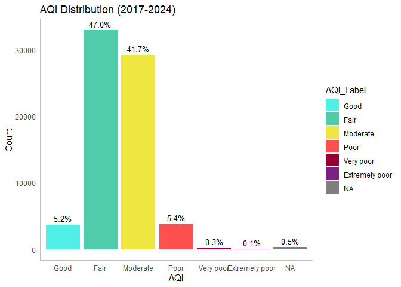<!-- -->

Air quality in Bratislava is mostly Fair and Moderate (~89%). Good air
quality happens in 5.2% of hours. Poor (original EEA classes 4-6,
including Very poor and Extremely poor) accounts for 5.8% of hours.

The dataset is imbalanced due to Bratislava having Fair and Moderate air
quality most of the time. The Poor class accounts for only 5.8% of the
data, yet it is a critical class to be able to predict. We don’t
consider this as a problem by itself, as the data distribution reflects
the reality of Bratislava’s AQI levels, and there are techniques to
handle this imbalance.

## Merging Rare AQI Classes

Since Very poor (0.3%) and Extremely poor (0.1%) make a small portion of
the dataset, and health warning for general population is issued by Poor
level, we merge classes 4 (Poor), 5 (Very poor), and 6 (Extremely poor)
into a single “Poor” class. This reduces the problem from 6 to 4
classes: Good, Fair, Moderate, Poor.

``` r
# Redefine aqi_levels and aqi_colors for the 4 classes
aqi_levels <- c("Good", "Fair", "Moderate", "Poor")
aqi_colors <- c("Good"     = "#50f0e6",
                "Fair"     = "#50ccaa",
                "Moderate" = "#f0e641",
                "Poor"     = "#ff5050")

# Remap AQI
complete_data <- complete_data_six %>%
  mutate(
    AQI = pmin(AQI, 4L),
    AQI_Label = factor(aqi_levels[AQI], levels = aqi_levels, ordered = TRUE)
  )

complete_data %>% 
  as_tibble() %>% 
  count(AQI, AQI_Label) %>%
  mutate(pct = round(100 * n / sum(n), 1))
```

    ## # A tibble: 5 × 4
    ##     AQI AQI_Label     n   pct
    ##   <int> <ord>     <int> <dbl>
    ## 1     1 Good       3663   5.2
    ## 2     2 Fair      32936  47  
    ## 3     3 Moderate  29209  41.7
    ## 4     4 Poor       4004   5.7
    ## 5    NA <NA>        316   0.5

The merged “Poor” class accounts for about 5.8% of the data, which is
still a minority, but large enough for the models to learn from. We also
preserve the health related distinction. Classes 1 to 3 represent safe
conditions, while class 4 signals actionable poor air quality.

## AQI Drivers

As AQI is calculated based on the worst pollutant in the area, we should
find out which is the most influencing one. When there are multiple
pollutants with the same AQI level, we will label it as “Tie”.

``` r
aqi_drivers <- complete_data %>%
  as_tibble() %>%
  filter(!is.na(AQI)) %>%
  filter(AQI > 1) %>% # "Good" class is the baseline
  mutate(
    n_tied = (AQI_PM2.5 == AQI) + (AQI_PM10 == AQI) +
             (AQI_O3    == AQI) + (AQI_NO2  == AQI) +
             (AQI_SO2   == AQI),
    driver = case_when(
      is.na(n_tied) | n_tied != 1 ~ "Tie/Missing",
      AQI_PM2.5 == AQI ~ "PM2.5",
      AQI_PM10  == AQI ~ "PM10",
      AQI_O3    == AQI ~ "O3",
      AQI_NO2   == AQI ~ "NO2",
      AQI_SO2   == AQI ~ "SO2"
    )
  )

aqi_drivers %>%
  count(driver) %>%
  mutate(Percentage = round(100 * n / sum(n), 1)) %>%
  arrange(desc(n)) %>%
  rename(Pollutant = driver, Hours = n)
```

    ## # A tibble: 6 × 3
    ##   Pollutant   Hours Percentage
    ##   <chr>       <int>      <dbl>
    ## 1 Tie/Missing 32875       49.7
    ## 2 PM2.5       13432       20.3
    ## 3 NO2         12066       18.2
    ## 4 O3           7482       11.3
    ## 5 PM10          259        0.4
    ## 6 SO2            35        0.1

From the table, we can see that PM2.5 influences the AQI the most, in
**20.3%** of cases (caused mainly by heating emissions). The second most
influencing pollutant, NO2 (18.2%), is caused by traffic emissions, and
the third one, O3 (11.3%), peaks in summer months, as it is formed by
photochemical reactions in the presence of sunlight. PM10, which
includes dust and coarse particles, is the main driver in 0.4% of hours,
and SO2, which is emitted by industries, is the main driver in 0.1% of
hours. In 49.7% of hours, there is a tie between multiple pollutants, or
the AQI is missing.

``` r
aqi_drivers %>%
  summarise(n = n(), .by = c(AQI, driver)) %>%
  mutate(pct = 100 * n / sum(n), .by = AQI) %>%
  mutate(
    driver = factor(driver, levels = c("PM2.5", "PM10", "NO2", "O3", "SO2", "Tie/Missing")),
    AQI    = factor(AQI, levels = 1:4, labels = aqi_levels)
  ) %>%
  ggplot(aes(AQI, pct, fill = driver)) +
  geom_col(width = 0.7) +
  geom_text(aes(label = if_else(pct >= 5, sprintf("%.0f%%", pct), "")),
            position = position_stack(vjust = 0.5), size = 3.2, color = "white", fontface = "bold") +
  scale_fill_manual(values = pollutant_colors) +
  scale_y_continuous(labels = scales::percent_format(scale = 1), expand = c(0, 0)) +
  labs(
    title = "Which pollutant drives the AQI? (by class)",
    x = "AQI class", y = "Share of hours (%)", fill = "Pollutant"
  )
```

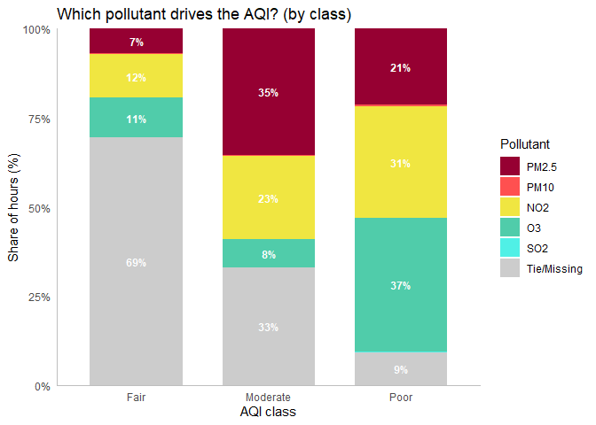<!-- -->

The Poor class (class 4) is dominated by O3 (37%) and NO2 (31%), with
PM2.5 contributing 21%. This is consistent with summer ozone peaks and
traffic-related nitrogen dioxide (NO2).

## Weekly average of AQI across years

``` r
complete_data %>%
  as_tibble() %>%
  mutate(
    Week = floor_date(Start, "week")
  ) %>%
  group_by(Week) %>%
  summarise(AQI = mean(AQI, na.rm = TRUE), .groups = "drop") %>%
  ggplot(aes(Week, AQI)) +
  geom_line(color = "steelblue", linewidth = 0.4, alpha = 0.6) +
  geom_smooth(method = "loess", span = 1, se = FALSE, color = "firebrick", linewidth = 1) +
  scale_x_datetime(date_breaks = "1 year", date_labels = "%Y") +
  scale_y_continuous(
    breaks = 1:4,
    labels = aqi_levels,
    limits = c(1, 4)
  ) +
  labs(
    title = "Weekly average AQI (2017-2024)",
    subtitle = "Red line = LOESS trend",
    x = NULL, y = "AQI level"
  )
```

    ## `geom_smooth()` using formula = 'y ~ x'

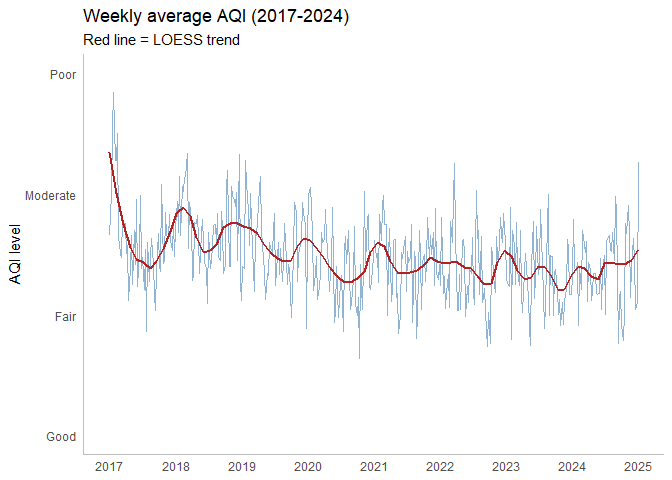<!-- -->

The weekly average plot shows a clear repeating seasonal pattern. AQI
rises during winter months, and falls during spring and summer. LOESS
trend reveals a slight long term improvement in air quality.

At the beginning of 2017, there is a spike in AQI. This was caused by
extremely cold January, which led to increased heating emissions \[1\].

## Outliers in data

Boxplots of pollutant concentrations (µg/m³) show which pollutants drive
extreme AQI values.

``` r
complete_data %>%
  as_tibble() %>%
  select(Start, PM2.5, PM10, NO2, O3, SO2) %>%
  pivot_longer(-Start, names_to = "Pollutant", values_to = "Concentration") %>%
  mutate(Pollutant = factor(Pollutant, levels = c("PM2.5", "PM10", "NO2", "O3", "SO2"))) %>%
  ggplot(aes(Pollutant, Concentration, fill = Pollutant)) +
  geom_boxplot(outlier.size = 0.4, outlier.alpha = 0.3, linewidth = 0.4) +
  facet_wrap(~Pollutant, scales = "free_y", nrow = 1) +
  labs(title = "Pollutant distributions with outliers (2017-2024)", x = NULL, y = "Concentration (µg/m³)") +
  theme(legend.position = "none", axis.text.x = element_blank())
```

    ## Warning: Removed 4718 rows containing non-finite outside the scale range
    ## (`stat_boxplot()`).

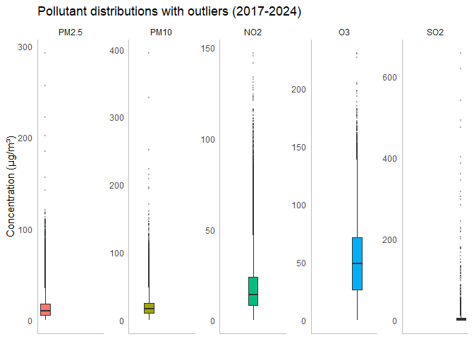<!-- -->

Those readings are real world, validated sensor measurements, not
errors. They are kept in the dataset, as they represent the most
critical air quality events, which are important to capture.

## Pollutant distributions by AQI class

To understand how individual pollutants relate to AQI, we plot their
distributions across the four AQI classes. This should reveal what kind
of relationships (linear/nonlinear) we can expect between each pollutant
and AQI.

``` r
complete_data %>%
  as_tibble() %>%
  select(AQI, PM2.5, NO2, O3, SO2) %>%
  drop_na() %>%
  rename(PM25 = PM2.5) %>%
  mutate(AQI_label = factor(AQI, levels = 1:4, labels = aqi_levels)) %>%
  pivot_longer(c(PM25, NO2, O3, SO2), names_to = "Pollutant", values_to = "Concentration") %>%
  ggplot(aes(AQI_label, Concentration, fill = AQI_label)) +
  geom_boxplot(outlier.size = 0.3, outlier.alpha = 0.2, linewidth = 0.4) +
  facet_wrap(~ Pollutant, scales = "free_y", nrow = 1) +
  scale_fill_manual(values = aqi_colors) +
  labs(
    title = "Pollutant concentration by AQI class",
    x = "AQI Class",
    y = "Concentration (µg/m³)",
    fill = "AQI Class"
  ) +
  theme_minimal(base_size = 12) +
  theme(
    legend.position = "none",
    axis.text.x = element_text(angle = 25, hjust = 1),
    strip.text = element_text(face = "bold"),
    panel.grid.minor = element_blank()
  )
```

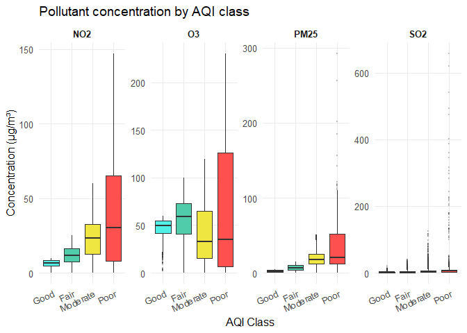<!-- -->

PM2.5 and NO2 shows a monotone increase across AQI classes. However,
O3’s median seems to peak at Fair class, then drops at Moderate and Poor
classes. This suggests that there is a non linear relationship between
O3 and AQI.

## Decomposition and seasonality

STL decomposition of AQI:

``` r
complete_data %>%
  mutate(AQI = na.interp(AQI)) %>%
  model(STL(AQI ~ season("1 year") + season("1 week") + season("1 day"), robust = TRUE)) %>%
  components() %>%
  autoplot(linewidth = 0.001) +
  labs(title = "STL Decomposition of AQI", x = "Time", y = "AQI") + 
  theme(panel.background = element_rect(),
        panel.grid.major = element_line())
```

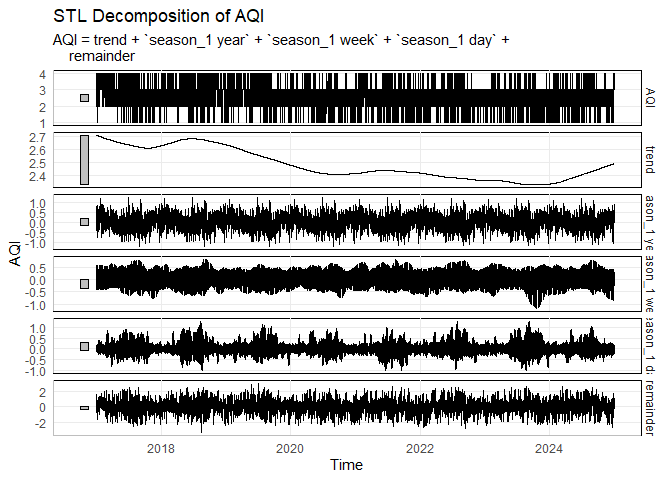<!-- -->

``` r
#separating yaerly and daily seasonality
data_season_year_day <- complete_data %>%
  mutate(AQI = na.interp(AQI)) %>%
  model(STL(AQI ~ trend() + season("1 year") + season("1 day"), robust = TRUE)) %>%
  components()
```

STL decomposition showcase a couple of useful plots that helps
understand the AQI data and how they change over time. The overall trend
is going downwards, with the exception of 2024 year. The yearly and
daily patterns are clearly visible, indicating that data has yearly and
daily seasonality present. On the other hand weekly pattern is looking
fairly random, meaning that the day of the week does not influence AQI
much.

``` r
monthly_aqi <- complete_data %>%
  mutate(AQI = na.interp(AQI)) %>%
  index_by(Month = yearmonth(Start)) %>%
  summarise(AQI = mean(AQI))

monthly_aqi %>%
  gg_subseries(AQI) +
  scale_y_continuous(breaks = 1:4,
                     labels = aqi_levels,
                     limits = c(1, 4)) +
  labs(y = "Mean Monthly AQI", x = "Month",
       title = "Seasonal plot - monthly AQI by year (2017-2024)")
```

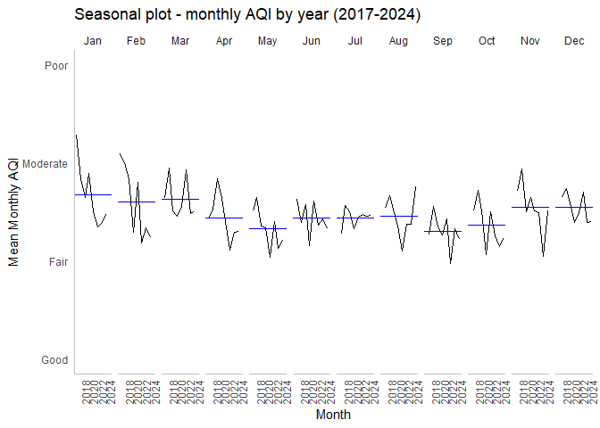<!-- -->

Looking at the blue line that represents mean, the plot shows that AQI
is worse around winter months (November to March), spring and autumn
months have the best air quality, while summer is somewhere in the
middle. This is likely caused by heating in the winter months (by PM2.5)
and in the summer because of the frequent O3 pollution.

``` r
hourly_aqi <- complete_data %>%
  as_tibble() %>%
  mutate(Hour = hour(Start)) %>%
  group_by(Hour) %>%
  summarise(
    Mean  = mean(AQI, na.rm = TRUE),
    .groups = "drop"
  )

hourly_aqi %>%
  ggplot(aes(x = Hour, y = Mean)) +
  geom_hline(yintercept = c(2, 3), linetype = "dashed", color = "gray60") +
  geom_line(color = "steelblue", linewidth = 1.2) +
  scale_y_continuous(
    breaks = 1:4,
    labels = aqi_levels, 
    limits = c(1, 4)
  ) +
  labs(
    title = "Hourly AQI Pattern",
    subtitle = "Average air quality index by hour",
    x = "Hour of Day", y = NULL
  )
```

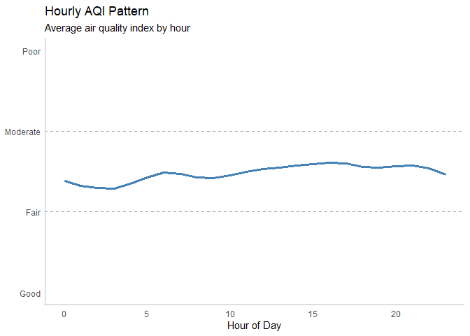<!-- -->

The hourly plot shows that there is a slight peak at around 6am, then
slightly dips down, and around 9-10am it starts climbing again until the
late night hours.

## Autocorrelation

This step should help us understand which lags are the most important
for predicting AQI.

### ACF of AQI with all components (2017-2024)

``` r
complete_data %>%
  ACF(AQI, lag_max = 48 * 7) %>% # up to one week of hourly lags
  autoplot() +
  labs(title = "ACF of AQI (2017-2024)", x = "Lag (hours)", y = "ACF")
```

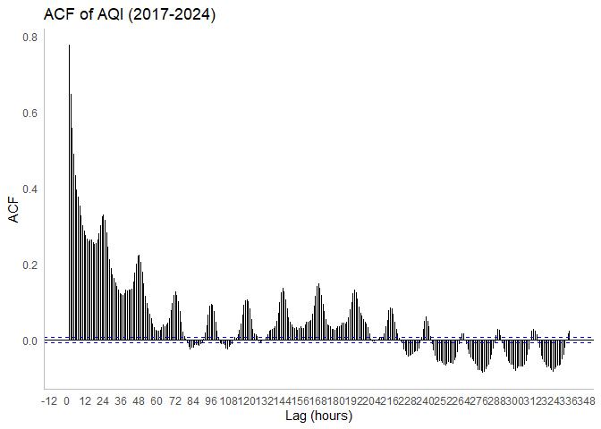<!-- -->

The plot shows that AQI lags slowly decay. Spikes at 24 hour cycles
confirm this daily cycle. There is also a very slight spike at lag 168
(7 days).

### ACF after removing annual + daily seasonality

``` r
data_season_year_day %>%
  ACF(remainder, lag_max = 48 * 7) %>%
  autoplot() +
  labs(title = "ACF of AQI Noise (STL: annual + daily removed)", x = "Lag (hours)", y = "ACF")
```

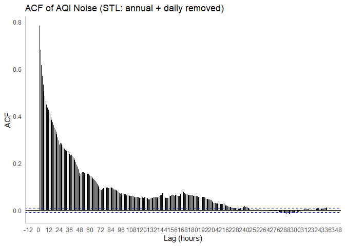<!-- -->

Now that both annual and daily components are removed, the lags decay in
a much smoother manner. The lag 1 stays high, but the 24 hour spike is
gone compared to previous plot.

### Stationarity tests

We run the KPSS and ADF tests to check whether our series is stationary.

``` r
tseries::kpss.test(complete_data$AQI)
```

    ## 
    ##  KPSS Test for Level Stationarity
    ## 
    ## data:  complete_data$AQI
    ## KPSS Level = 18.161, Truncation lag parameter = 20, p-value = 0.01

``` r
tseries::kpss.test(data_season_year_day$remainder)
```

    ## 
    ##  KPSS Test for Level Stationarity
    ## 
    ## data:  data_season_year_day$remainder
    ## KPSS Level = 0.18594, Truncation lag parameter = 20, p-value = 0.1

The KPSS rejects stationarity (H0: stationary), p value \< 0.01 for
original AQI.

The noise after removing yearly and daily seasonality does not reject
null hypothesis.

``` r
tseries::adf.test(na.omit(complete_data$AQI))
```

    ## 
    ##  Augmented Dickey-Fuller Test
    ## 
    ## data:  na.omit(complete_data$AQI)
    ## Dickey-Fuller = -24.738, Lag order = 41, p-value = 0.01
    ## alternative hypothesis: stationary

ADF rejects the unit root (H0: series has a unit root), p value \< 0.01

This should indicate seasonal non-stationarity (trend-stationarity). The
mean is not constant, due to winter peaks and summer troughs, but there
is no drift in the long run (AQI is mean-reverting). Current values
carry genuine information about future values, which justifies using AQI
lags as predictive features.

# Feature Engineering

Now, we transform the time series data into a format suitable for
machine learning models - we basically make it a supervised learning
problem, where the target variable is AQI 24 hours ahead (AQI_p24), and
the features are the current and past values of AQI, pollutants, weather
variables, and time features (hour, month). This allows us to use many
different types of ML models. This is widely supported by existing work
\[3\]\[4\]\[5\]. We decided the lag variables based on autocorrelation
analysis.

``` r
model_features <- complete_data %>%
  as_tibble() %>%
  arrange(Start) %>%
  transmute(
    Start,
    # Target variable
    AQI_p24 = lead(AQI, 24),
    # Autocorrelation lags
    AQI_t   = AQI,
    AQI_t1  = lag(AQI, 1),
    AQI_t2  = lag(AQI, 2),
    AQI_t24 = lag(AQI, 24),
    # Current pollutants
    PM25    = `PM2.5`,
    PM10    = PM10,
    NO2     = NO2,
    O3      = O3,
    SO2     = SO2,
    # Time
    hour    = hour(Start),
    month   = month(Start),
    # Weather
    across(c(Temperature, Humidity, Dew_Point, Rain, Precipitation,
             Snowfall, Weather_Code, Pressure_MSL, Cloud_Cover,
             Cloud_Cover_Low, Cloud_Cover_Mid, Cloud_Cover_High,
             Vapour_Pressure_Def, Wind_Speed, Wind_Direction,
             Wind_Gusts, Soil_Temp_0_7, Soil_Moisture_0_7))
  ) %>%
  drop_na() %>% # remove rows with NA
  # WMO Weather codes are categorical (not ordinal), so we group them into 4 categories based on the weather (we observe 13 codes)
  # This avoids models potentially treating them as ordinal (1-99)
  mutate(Weather_Code = case_when(
    Weather_Code %in% c(0, 1, 2, 3) ~ 1L, # clear / clouds forming
    Weather_Code %in% c(51, 53, 55) ~ 2L, # drizzle
    Weather_Code %in% c(61, 63, 65) ~ 3L, # rain
    Weather_Code %in% c(71, 73, 75) ~ 4L # snow
  ))


# No weather variables (approach 1)
PARTITION_A <- c("AQI_t","AQI_t1","AQI_t2","AQI_t24",
                 "PM25","PM10","NO2","O3","SO2","hour","month")

# All features including weather (approach 2)
PARTITION_B_ALL <- model_features %>%
  select(-Start, -AQI_p24) %>%
  names()
```

## Data Budgeting

``` r
# Split model_features into train / test by year.
train_data <- model_features %>%
  filter(year(Start) <= 2022) %>%
  select(-Start) %>%
  # AQI_p24 is converted to an ordered factor (1-4) for classification.
  mutate(AQI_p24 = factor(AQI_p24, levels = 1:4, ordered = TRUE))

test_data <- model_features %>%
  filter(year(Start) >= 2023) %>%
  select(-Start) %>%
  mutate(AQI_p24 = factor(AQI_p24, levels = 1:4, ordered = TRUE))

cat("Train rows:", nrow(train_data), " | Test rows:", nrow(test_data), "\n")
```

    ## Train rows: 50231  | Test rows: 16634

``` r
# Class distribution per split (imbalance check)
bind_rows(
  train_data %>% count(AQI_p24) %>% mutate(Split = "Train", pct = round(100 * n / sum(n), 1)),
  test_data  %>% count(AQI_p24) %>% mutate(Split = "Test",  pct = round(100 * n / sum(n), 1))
) %>%
  mutate(Label = aqi_levels[as.integer(AQI_p24)]) %>%
  select(Split, Class = AQI_p24, Label, Count = n, `Pct (%)` = pct) %>%
  arrange(Split, Class)
```

    ## # A tibble: 8 × 5
    ##   Split Class Label    Count `Pct (%)`
    ##   <chr> <ord> <chr>    <int>     <dbl>
    ## 1 Test  1     Good      1402       8.4
    ## 2 Test  2     Fair      8626      51.9
    ## 3 Test  3     Moderate  6053      36.4
    ## 4 Test  4     Poor       553       3.3
    ## 5 Train 1     Good      2011       4  
    ## 6 Train 2     Fair     22913      45.6
    ## 7 Train 3     Moderate 22034      43.9
    ## 8 Train 4     Poor      3273       6.5

Class 4 (Poor) makes up 6.5% of the training data and 3.3% of the test
data. All four classes are represented, but Poor is a minority class. We
report per-class recall in every evaluation to make this limitation
transparent.

## Predictor Correlations

To see possible multicollinearity and relationships between main
predictors, we use the pairs plot. A random sample of 3 000 rows is used
(due to performance). We chose a a subset of variables from the dataset,
which to our knowledge should be the most important for predicting AQI.

``` r
# correlation on upper panels
panel.cor <- function(x, y, digits = 2, prefix = "", cex.cor, ...) {
  usr <- par("usr"); on.exit(par(usr))
  par(usr = c(0, 1, 0, 1))
  r     <- cor(x, y, use = "complete.obs")
  r_abs <- abs(r)
  txt   <- format(round(r, digits), nsmall = digits)
  txt   <- paste0(prefix, txt)
  if (missing(cex.cor)) cex.cor <- 0.8 / strwidth(txt)
  col <- if (r >= 0) "firebrick" else "steelblue"
  text(0.5, 0.5, txt, cex = cex.cor * (0.5 + r_abs) / 1.5, col = col)
}

# histogram on the diagonal
panel.hist <- function(x, ...) {
  usr <- par("usr"); on.exit(par(usr))
  par(usr = c(usr[1:2], 0, 1.5))
  h <- hist(x, plot = FALSE)
  breaks <- h$breaks; nB <- length(breaks)
  y <- h$counts; y <- y / max(y)
  rect(breaks[-nB], 0, breaks[-1], y, col = "steelblue", border = "white")
}

pairs_data <- complete_data %>%
  as_tibble() %>%
  rename(PM25 = `PM2.5`) %>% # for clarity
  select(PM25, PM10, NO2, O3, SO2,
         Temperature, Humidity, Wind_Speed, Pressure_MSL) %>%
  drop_na()
set.seed(2026)
pairs_data <- pairs_data %>%
  slice_sample(n = 3000)

pairs(pairs_data,
      lower.panel = panel.smooth,
      upper.panel = panel.cor,
      diag.panel  = panel.hist,
      main = "Pred. relationships and correlations (n = 3 000)")
```

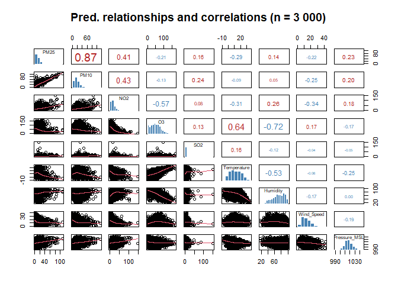<!-- -->

The pairs plot reveals several notable patterns. PM2.5 and PM10 are
strongly correlated (r = 0.87), which indicates that they largely
capture the same signal. NO2 is moderately correlated with PM2.5 and
PM10, as they all peak during cold, stagnant winter episodes when
heating emissions are high and dispersion is low. O3 is negatively
correlated with NO2 (r = -0.57), and does not show a linear relationship
with PM2.5/PM10. Temperature is quite strongly positively correlated
with O3 (r = 0.64) as hot, sunny conditions drive ozone formation.
Humidity is strongly negatively correlated with O3 (r = -0.72). Dry and
sunny conditions drive high ozone.

## Collinearity Analysis (VIF)

Partition B includes all 18 weather features, on top of pollutants
(Partition A). Before any model is fitted, we should check whether we
have multicollinearity among the predictors (whether two predictors
carry almost identical information). This could make our permutation
feature importance in RF unreliable, for example.

We opted to use VIF (Variance Inflation Factor), as it can look at
multivariate relationships among features, while correlation only looks
at pairwise relationships.

``` r
library(car)

vif_func <- function(x) {
  y <- seq_len(nrow(x))
  vif(lm(y ~ ., data = x))
}

x_B <- train_data %>% select(all_of(PARTITION_B_ALL))
vif_initial <- vif_func(x_B)

tibble(Feature = names(vif_initial), VIF = round(vif_initial, 1)) %>%
  arrange(desc(VIF)) %>%
  print(n = 30)
```

    ## # A tibble: 29 × 2
    ##    Feature                 VIF
    ##    <chr>                 <dbl>
    ##  1 Precipitation       60319  
    ##  2 Rain                58421. 
    ##  3 Snowfall             1591. 
    ##  4 Temperature           286. 
    ##  5 Dew_Point             164  
    ##  6 Humidity               42.5
    ##  7 Soil_Temp_0_7          34.9
    ##  8 Vapour_Pressure_Def    16.2
    ##  9 Wind_Gusts             12.8
    ## 10 Wind_Speed             11  
    ## 11 PM25                    6  
    ## 12 PM10                    5.3
    ## 13 O3                      5.3
    ## 14 AQI_t1                  4.5
    ## 15 Cloud_Cover             4.2
    ## 16 AQI_t                   3.8
    ## 17 NO2                     3.4
    ## 18 AQI_t2                  3.1
    ## 19 Cloud_Cover_High        2.6
    ## 20 Soil_Moisture_0_7       2.6
    ## 21 Weather_Code            2.3
    ## 22 Cloud_Cover_Mid         2.1
    ## 23 Cloud_Cover_Low         2  
    ## 24 AQI_t24                 1.4
    ## 25 month                   1.4
    ## 26 Pressure_MSL            1.4
    ## 27 Wind_Direction          1.3
    ## 28 hour                    1.2
    ## 29 SO2                     1.1

From the VIF results, we can see that several features have extreme VIF
values, three above 1000, and two above 100. Now we take a look at
pairwise correlations among the high-VIF features (above 10) to
understand this collinearity better.

``` r
high_vif_features <- c("Rain", "Precipitation", "Snowfall",
                        "Temperature", "Dew_Point", "Soil_Temp_0_7",
                        "Humidity", "Vapour_Pressure_Def",
                        "Wind_Speed", "Wind_Gusts")

cor_hv <- train_data %>%
  select(all_of(high_vif_features)) %>%
  cor(use = "complete.obs")

corrplot(
  cor_hv,
  method = "color", type = "upper", order = "original",
  addCoef.col = "black",
  number.cex = 0.7,
  number.digits = 2,
  tl.cex = 0.75, tl.col = "black",
  col = colorRampPalette(c("steelblue", "white", "firebrick"))(200),
  title = "Correlation for high VIF features",
  mar = c(0, 0, 1.5, 0)
)
```

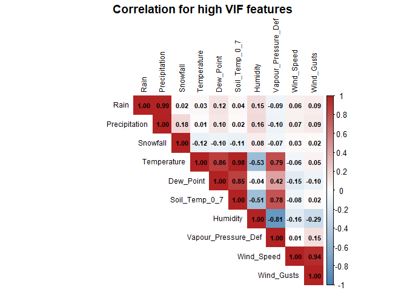<!-- -->

From the plot, there are three groups of features that are highly
correlated with each other.

Precipitation group - Rain and Precipitation are extremely correlated
(0.99). Interestingly, snowfall doesn’t seem strongly correlated with
either of them. This could be because there is not much snowfall in the
area. Temperature group - Temperature, Dew_Point, Soil_Temp_0_7,
Humidity, and Vapour_Pressure_Def all measure very similar aspects. Wind
group - Wind_Speed and Wind_Gusts have a strong correlation (r = 0.94).

We also remove some features based on domain knowledge and previous plot
or VIF results.

``` r
# Features removed based on domain knowledge and VIF results
to_remove <- c(
  "Precipitation", # aggregate of Rain + Snowfall
  "Humidity", # relative humidity is temperature-dependent, Dew_Point can capture moisture
  "Vapour_Pressure_Def", # calculated from Temperature + Humidity (redundant)
  "Soil_Temp_0_7", # Dew_Point captures this
  "Temperature", # collinear with Dew_Point (and Dew_Point correlates better with AQI)
  "Wind_Gusts", # captures transient peaks, Wind_Speed captures average 24-hour pollutant dispersion (r = 0.94)
  "PM10"  # collinear with PM2.5 (r = 0.86) and PM2.5 is weighted more heavily (worse health effect)
)
```

Now we run VIF again after removing the 7 features above, to see the max
VIF.

``` r
PARTITION_B <- setdiff(PARTITION_B_ALL, to_remove)

x_clean <- train_data %>% select(all_of(PARTITION_B))
vif_final <- vif_func(x_clean)

tibble(
  set     = c("Retained", "Dropped", "Max VIF"),
  value   = c(paste(PARTITION_B, collapse = ", "),
              paste(to_remove, collapse = ", "),
              round(max(vif_final), 2))
) %>% print(n = Inf, width = Inf)
```

    ## # A tibble: 3 × 2
    ##   set     
    ##   <chr>   
    ## 1 Retained
    ## 2 Dropped 
    ## 3 Max VIF 
    ##   value                                                                         
    ##   <chr>                                                                         
    ## 1 AQI_t, AQI_t1, AQI_t2, AQI_t24, PM25, NO2, O3, SO2, hour, month, Dew_Point, R…
    ## 2 Precipitation, Humidity, Vapour_Pressure_Def, Soil_Temp_0_7, Temperature, Win…
    ## 3 4.49

We removed 7 features.

The final clean partition has 22 features with max VIF of 4.5, which is
acceptable.

# Modelling

All models are trained on 2017-2022 data and evaluated on 2023-2024.
This split ensures no future observations leak into the training data.

## Metrics

We report overall accuracy, +-1 class accuracy, macro F1 score, and
per-class recall.

We use Macro F1 and Poor Class Recall for model evaluation. Macro F1 was
chosen because of the class imbalance and the importance of predicting
all classes well, not just the majority classes. Model that never
predicts Good or Poor is penalised regardless of how well it handles the
majority classes. It is important to us that we are able to capture as
many as possible of the critical Poor AQI hours, while also maintaining
good performance on the other classes.

``` r
# Macro-averaged F1 (compute F1 per class, then average equally across all 4 classes)
macro_f1 <- function(preds_int, actual_int) {
  f1s <- sapply(1:4, function(k) {
    tp <- sum(preds_int == k & actual_int == k)
    fp <- sum(preds_int == k & actual_int != k)
    fn <- sum(preds_int != k & actual_int == k)
    if (tp == 0) return(0)
    precision <- tp / (tp + fp)
    recall <- tp / (tp + fn)
    2 * precision * recall / (precision + recall)
  })
  round(mean(f1s), 4)
}

# Metrics helper function 
compute_metrics <- function(preds, actual) {
  keep   <- !is.na(actual) # can occur due to lags
  preds  <- preds[keep]
  actual <- actual[keep]
  tibble(
    `Acc (%)` = round(100 * mean(preds == actual), 2),
    `+-1 Class Acc (%)` = round(100 * mean(abs(preds - actual) <= 1), 2),
    `Macro F1` = macro_f1(preds, actual),
    `Poor Recall (%)` = round(100 * mean(preds[actual == 4] == 4), 2),
  )
}

# Recall per class
compute_class_recall <- function(preds, actual) {
  keep   <- !is.na(actual)
  preds  <- preds[keep]
  actual <- actual[keep]
  tibble(Class = 1:4, Label = aqi_levels) %>%
    mutate(
      Actual_n = map_int(Class, \(k) sum(actual == k)),
      Pred_n = map_int(Class, \(k) sum(preds  == k)),
      `Recall (%)` = map_dbl(Class, \(k) {
        n <- sum(actual == k)
        if (n == 0) NA_real_ else round(100 * mean(preds[actual == k] == k), 1)
      })
    )
}

# Confusion matrix heatmap (actual and preds are integer vectors 1-4)
plot_confusion_matrix <- function(actual, preds, title) {
  tibble(Actual = actual, Predicted = preds) %>%
    mutate(
      Actual = factor(Actual, levels = 1:4, labels = aqi_levels),
      Predicted = factor(Predicted, levels = 1:4, labels = aqi_levels)
    ) %>%
    count(Actual, Predicted) %>%
    complete(Actual, Predicted, fill = list(n = 0)) %>%
    mutate(Recall = n / sum(n), .by = Actual) %>%
    ggplot(aes(Predicted, Actual, fill = Recall)) +
    geom_tile(color = "white", linewidth = 0.5) +
    geom_text(aes(label = if_else(n > 0, sprintf("%.0f%%\n(n=%d)", Recall * 100, n), "")),
              size = 2.8, lineheight = 1.2) +
    scale_fill_gradient(low = "white", high = "steelblue",
                        labels = scales::percent, limits = c(0, 1)) +
    scale_x_discrete(position = "top") +
    scale_y_discrete(limits = rev(aqi_levels)) +
    labs(
      title    = title,
      subtitle = "Each cell = % of true class predicted as that column",
      x = "Predicted class", y = "True (Actual) class", fill = "Recall"
    ) +
    theme_minimal()
}
```

## Scenario 1 (Three methods across two feature approaches) + Scenario 2 (3 Parametric and 3 Non-parametric models)

We use the same two feature partitions for all models for a fair
comparison of the added value of weather features across different
modeling techniques. Each method is evaluated on two feature sets:

- **Partition A** - AQI lags + current pollutants + time
- **Partition B** - All features including weather variables

Comparing the two partitions tests whether current weather conditions
add predictive value beyond pollutant lags and time features.

We also compare 3 parametric models and 3 non-parametric models
(Scenario 2).

### Random Forest

We include the Random Forest (RF) model because it handles non-linear
relationships well. During EDA, we observed non-linear relationships
between some predictors and AQI (e.g. O3 vs AQI).

Single decision trees are prone to overfitting, but RF builds an
ensemble of many trees on random subsets of data and features, which
reduces variance and improves generalization.

This model has some limitations, though: - It cannot extrapolate beyond
the range of training data, so it may struggle with extreme values not
seen during training. - It is essentially a “black box”, so
interpretability is limited compared to simpler models.

We address the class imbalance by using inverse-frequency class weights.
During training, misclassifying a minority class (Good, Poor) is
penalized more than misclassifying a majority class (Fair, Moderate).
This improves recall for Poor AQI hours, which are critical to be able
to predict. Other methods include undersampling/oversampling, but those
methods essentially throw away data or create non-existing ones.

``` r
library(ranger)

RF_NUM_TREES <- 500 # OOB error stabilises before 500 trees
RF_MAX_DEPTH <- NULL  # NULL = fully grown trees; limit showed no val F1 gain
RF_N_THREADS <- max(1, parallel::detectCores() - 1)
RF_SEED <- 2026
RF_WEIGHT_POWER <- 1.2 # exponent on inverse-frequency weights, tried {0.5, 0.6, ..., 3.0}
# 1.2: best Poor recall / accuracy tradeoff

# other hyperparameters are tuned with grid search (mtry, min_node_size)
```

``` r
# Computes inverse-frequency case weights for a training set (equivalent to sklearn class_weight="balanced").
# Each sample is weighted by (1 / count_of_its_class)^power.
# power>1 widens the gap between rare and common classes
compute_class_weights <- function(train_data, power = RF_WEIGHT_POWER) {
  class_counts <- table(train_data$AQI_p24)
  weights <- (1 / as.numeric(class_counts))^power
  weights[as.integer(train_data$AQI_p24)]
}

# Fit RF
fit_rf <- function(train_data, partition,
                   num_trees = RF_NUM_TREES,
                   mtry = NULL, # default (sqrt(p)), override with grid value
                   min_node_size = 1, # override with grid value
                   max_depth = RF_MAX_DEPTH,
                   n_threads = RF_N_THREADS,
                   seed = RF_SEED) {

  train_subset <- train_data %>% select(all_of(c(partition, "AQI_p24")))
  weights <- compute_class_weights(train_subset)
  ranger(
    AQI_p24 ~ .,
    data = train_subset,
    num.trees = num_trees,
    mtry = mtry,
    importance = "permutation",
    min.node.size = min_node_size,
    max.depth = max_depth,
    num.threads = n_threads,
    seed = seed,
    case.weights = weights
  )
}

# Returns integer vectors of actual and predicted classes for a fitted RF
predict_rf <- function(model, test_data, partition) {
  test_features <- test_data %>% select(all_of(partition))
  actual <- as.integer(test_data$AQI_p24)
  preds  <- as.integer(predict(model, data = test_features)$predictions)
  list(actual = actual, preds = preds)
}

library(vip)

eval_rf <- function(model, test_data, partition) {
  p <- predict_rf(model, test_data, partition)
  compute_metrics(p$preds, p$actual)
}

class_recall_rf <- function(model, test_data, partition) {
  p <- predict_rf(model, test_data, partition)
  compute_class_recall(p$preds, p$actual)
}

# Runs grid search over mtry and min_node_size for a partition
# Returns a tibble with train_f1, val_f1, val_acc and overfitting gap
run_rf_grid <- function(partition) {
  grid <- expand.grid(
    mtry = c(2, 3, 5, 7, 10),
    min_node_size = c(1, 3, 5, 10, 20)
  )

  pmap(grid, function(mtry, min_node_size) {
    m <- fit_rf(rf_train_grid, partition,
                   mtry = mtry, min_node_size = min_node_size)
    p_tr <- predict_rf(m, rf_train_grid, partition)
    p_v <- predict_rf(m, rf_val_data,   partition)

    tibble(
      mtry = mtry,
      min_node_size = min_node_size,
      train_f1 = macro_f1(p_tr$preds, p_tr$actual),
      val_f1 = macro_f1(p_v$preds,  p_v$actual),
      val_acc = round(100 * mean(p_v$preds == p_v$actual), 2),
      gap = train_f1 - val_f1
    )
  }) %>% list_rbind()
}

# Best combo - highest val_f1, then smallest overfitting gap, then min_node_size
best_rf_combo <- function(grid_results) {
  grid_results %>%
    arrange(desc(val_f1), gap, min_node_size) %>%
    slice(1)
}
```

#### Grid Search

`mtry` - number of features randomly considered at each split. Lower
values increase tree diversity. Default is square root of number of
features. `min.node.size` - minimum number of samples required to form a
leaf. Larger values produce shallower trees, reducing variance and
improving minority-class generalization. `num.trees` - fixed at 500, as
adding more trees in RF never causes overfitting (only reduces
variance), so it does not need to be grid-searched. OOB error stabilises
well before 500.

We sweep `mtry` for {2, 3, 5, 7, 10} and `min.node.size` for {1, 3, 5,
10, 20} separately for each partition, using a temporal split (train \<=
2021, validate 2022). Both partitions use inverse-frequency class
weights.

``` r
# temporal split
rf_train_grid <- model_features %>% filter(year(Start) <= 2021)
rf_val_data   <- model_features %>% filter(year(Start) == 2022)

#grid_A <- run_rf_grid(PARTITION_A)
#grid_B <- run_rf_grid(PARTITION_B)

#best_A <- best_rf_combo(grid_A)
#best_B <- best_rf_combo(grid_B)

#cat("=== Best Partition A ===\n"); print(best_A)
#cat("\n=== Best Partition B ===\n"); print(best_B)
```

From the grid search results, we can see the results for each
partition - which hyperparameters achieved the best validation F1, and
what was the overfitting gap (train F1 - val F1).

For Partition B, `mtry = 3` and `min_node_size = 20` achieves the best
validation macro F1 with the lowest overfitting gap. Higher `mtry`
values inflate training F1 without improving validation performance. For
Partition A (pollutants only), the optimal is `mtry = 2` and
`min_node_size = 20`.

``` r
# Set per-partition hyperparameters from grid results
RF_MTRY_A <- 2 # best_A$mtry
RF_MIN_NODE_SIZE_A <- 20 # best_A$min_node_size
RF_MTRY_B <- 3 # best_B$mtry
RF_MIN_NODE_SIZE_B <- 20 # best_B$min_node_size
```

``` r
rf_A <- fit_rf(train_data, PARTITION_A, mtry = RF_MTRY_A, min_node_size = RF_MIN_NODE_SIZE_A)
rf_B <- fit_rf(train_data, PARTITION_B, mtry = RF_MTRY_B, min_node_size = RF_MIN_NODE_SIZE_B)
```

Overall performance on the 2023-2024 test set:

``` r
evals_RF <- list(
  "A - pollutants only" = eval_rf(rf_A, test_data, PARTITION_A),
  "B - all features" = eval_rf(rf_B, test_data, PARTITION_B)
)

evals_RF %>%
  list_rbind(names_to = "Partition")
```

    ## # A tibble: 2 × 5
    ##   Partition           `Acc (%)` `+-1 Class Acc (%)` `Macro F1` `Poor Recall (%)`
    ##   <chr>                   <dbl>               <dbl>      <dbl>             <dbl>
    ## 1 A - pollutants only      52.0                92.3      0.419              58.8
    ## 2 B - all features         60.0                96.9      0.467              49.6

OOB F1 (each row predicted only by trees that never saw it) is close to
test F1 (no overfitting).

``` r
oob_preds <- rf_B$predictions
valid_oob  <- !is.na(oob_preds)

tibble(
  set = c("Train in-sample (biased)", "OOB (unbiased)", "Test 2023-24"),
  macro_f1 = c(
    macro_f1(as.integer(predict(rf_B, data = train_data %>% select(all_of(c(PARTITION_B, "AQI_p24"))))$predictions), as.integer(train_data$AQI_p24)),
    macro_f1(as.integer(oob_preds[valid_oob]), as.integer(train_data$AQI_p24[valid_oob])),
    eval_rf(rf_B, test_data, PARTITION_B)$`Macro F1`
  )
)
```

    ## # A tibble: 3 × 2
    ##   set                      macro_f1
    ##   <chr>                       <dbl>
    ## 1 Train in-sample (biased)    0.841
    ## 2 OOB (unbiased)              0.526
    ## 3 Test 2023-24                0.467

Per-class recall:

``` r
cat("--- Partition A ---\n")
```

    ## --- Partition A ---

``` r
class_recall_rf(rf_A, test_data, PARTITION_A) %>% print()
```

    ## # A tibble: 4 × 5
    ##   Class Label    Actual_n Pred_n `Recall (%)`
    ##   <int> <chr>       <int>  <int>        <dbl>
    ## 1     1 Good         1402   2006         30.7
    ## 2     2 Fair         8626   8177         60.2
    ## 3     3 Moderate     6053   4925         44.5
    ## 4     4 Poor          553   1526         58.8

``` r
cat("\n--- Partition B ---\n")
```

    ## 
    ## --- Partition B ---

``` r
class_recall_rf(rf_B, test_data, PARTITION_B) %>% print()
```

    ## # A tibble: 4 × 5
    ##   Class Label    Actual_n Pred_n `Recall (%)`
    ##   <int> <chr>       <int>  <int>        <dbl>
    ## 1     1 Good         1402    647         18.9
    ## 2     2 Fair         8626  10088         74.9
    ## 3     3 Moderate     6053   5003         49.4
    ## 4     4 Poor          553    896         49.7

#### Confusion matrix

``` r
preds_B <- predict_rf(rf_B, test_data, PARTITION_B)
actual_cls <- preds_B$actual
pred_cls <- preds_B$preds
act_pred_tb <- tibble(Actual = actual_cls, Predicted = pred_cls)

plot_confusion_matrix(actual_cls, pred_cls, "Confusion Matrix: RF Partition B")
```

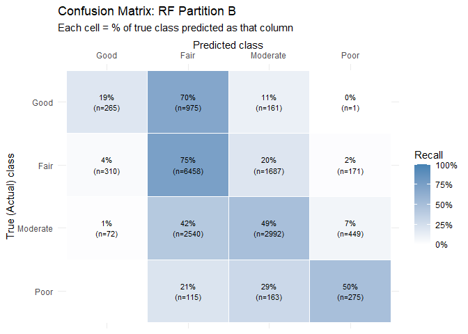<!-- -->

The confusion matrix shows recall per class on the diagonal. The model
is strong for Fair (75%) and Moderate (49%). With class weighting, Poor
recall rises to **50%**. Most misclassifications are adjacent-class
(+-1) errors, for example, Poor predicted as Moderate, or Good predicted
as Fair.

#### Predicted vs. actual class distribution

``` r
act_pred_tb %>%
  pivot_longer(c(Actual, Predicted), names_to = "Type", values_to = "Class") %>%
  count(Type, Class) %>%
  mutate(Label = factor(aqi_levels[Class], levels = aqi_levels)) %>%
  complete(Type, Label, fill = list(n = 0)) %>%
  ggplot(aes(Label, n, fill = Type)) +
  geom_col(position = "dodge") +
  scale_fill_manual(values = c("Actual" = "steelblue", "Predicted" = "tomato")) +
  scale_y_continuous(labels = scales::comma) +
  labs(
    title = "Predicted vs. actual class distribution (test set 2023-2024)",
    x = NULL, y = "Count", fill = NULL
  ) +
  theme_minimal()
```

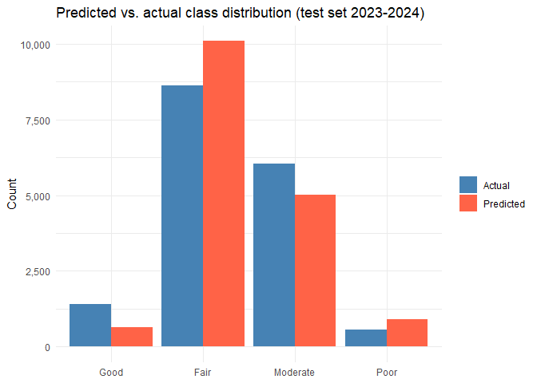<!-- -->

The model over-predicts Fair and under-predicts Good and Moderate.

#### One vs Rest ROC and AUC

One VS Rest ROC (OvR) allows us to see how tell the model separates each
class from the others. The `ranger` package doesn’t provide probability
estimates without `probability = TRUE`, so we opted to train a separate
probability forest for this evaluation. All parameters and
hyperparameters are kept the same as the original RF to ensure a fair
comparison.

``` r
# Probability forest
rf_B_prob <- ranger(
  AQI_p24 ~ .,
  data = train_data %>% select(all_of(c(PARTITION_B, "AQI_p24"))),
  num.trees = RF_NUM_TREES,
  mtry = RF_MTRY_B,
  min.node.size = RF_MIN_NODE_SIZE_B,
  num.threads = RF_N_THREADS,
  seed = RF_SEED,
  case.weights = compute_class_weights(train_data),
  probability = TRUE # outputs probabilities instead of class labels
)
```

``` r
library(pROC)

prob_matrix <- predict(rf_B_prob, data = test_data)$predictions

# OVR ROC
roc_list <- map(1:4, function(k) { # loop over aqi
  binary <- as.integer(actual_cls == k) # 1 for class k, 0 for others
  if (length(unique(binary)) < 2) return(NULL)   # skip if no positives in test
  roc(binary, prob_matrix[, k], quiet = TRUE)
})

# tidy data frame of all ROC curves for plotting (for ggplot)
# bit more complex, but allows us to use more pretty ggplot with ordering
roc_df <- map(1:4, function(k) {
  if (is.null(roc_list[[k]])) return(NULL)
  coords_df <- pROC::coords(roc_list[[k]], "all", ret = c("fpr", "tpr")) # get FPR and TPR for all thresholds
  coords_df$class <- aqi_levels[k] # label for the class
  coords_df$auc <- round(pROC::auc(roc_list[[k]]), 3) # AUC for the class for legend
  coords_df
}) %>% list_rbind()

roc_df %>%
  mutate(label = paste0(class, "  (AUC=", auc, ")"), # label for the legend
         label = factor(label, levels = unique(label[order(auc, decreasing = TRUE)]))) %>%
  ggplot(aes(fpr, tpr, color = label)) +
  geom_line(linewidth = 0.8) +
  geom_abline(slope = 1, intercept = 0, linetype = "dashed", color = "grey50") +
  scale_color_brewer(palette = "Dark2") + # color palette
  labs(
    title = "One VS Rest ROC (RF Partition B weighted)",
    x = "False Positive Rate", y = "True Positive Rate", color = "Class (AUC)"
  ) +
  theme_minimal()
```

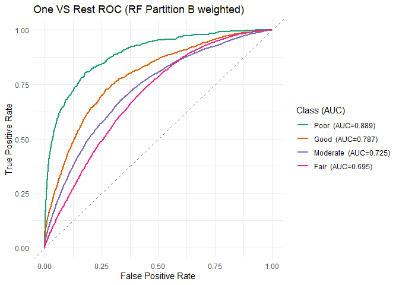<!-- -->

The strongest class is **Poor (AUC = 0.889)**, meaning the model
reliably separates poor air quality from safe conditions. Good is also
well separated (AUC = 0.787). Moderate and Fair, being the dominant
classes, are harder to distinguish from each other: AUC = 0.725 and
0.695, respectively.

### XGBoost

This ensemble method builds trees sequentially, as opposed to RF which
builds trees independently in parallel. New trees correct the residual
errors of all previous trees combined. This allows XGBoost to learn from
its mistakes at each step. The justification for selecting this model is
the same as for RF, that there are non linear relationships between
predictors and AQI, which linear models cannot capture. In addition,
boosting can reduce systematic bias, which is likely present at the
Moderate/Poor boundary due to borderline observations that are hard to
classify. By iteratively focusing on residual errors, boosting can
improve performance on these hard cases, which may improve recall for
the critical Poor class.

We include the same inverse-frequency class weights as in RF to address
class imbalance. XGBoost thus serves as a strong alternative to RF,
allowing direct comparison.

``` r
library(xgboost)

XGB_BOOSTER <- "gbtree" # for structured data
XGB_OBJECTIVE <- "multi:softmax" # multi-class classification with integer labels

XGB_ETA <- 0.1 # learning rate
XGB_SUBSAMPLE <- 0.8 # 80% of rows per tree
XGB_COLSAMPLE <- 0.8 # 80% of features per tree
XGB_WEIGHT_POWER <- 0.8 # exponent on inverse-frequency weights (same logic as RF)
XGB_NTHREAD <- max(1, parallel::detectCores() - 1)
```

#### Hyperparameter tuning - Grid search

Key hyperparameters for XGBoost include:

- `nrounds`: number of boosting rounds (trees). More rounds can improve
  performance but risk overfitting.
- `max_depth`: maximum depth of each tree. Shallower trees = weaker
  learners, less overfitting.
- `min_child_weight`: minimum number of samples required in a leaf node.
  Higher values reduce overfitting.
- `eta` (learning rate): step size at each boosting iteration. Smaller
  eta requires more rounds but reduces overfitting.
- `subsample` and `colsample_bytree`: fractions of rows and features
  sampled per tree.

We use grid search (train on \<= 2021, validate on 2022) to find the
best combination of `nrounds`, `max_depth`, and `min_child_weight`.

Grid search sweeps: - `max_depth` {3, 4, 5, 6} - `nrounds` {100, 200,
300, 500} - `min_child_weight` {1, 10}

``` r
# converts the tibble to a dmatrix
create_dmatrix <- function(data, partition) {
  X <- data %>% 
    select(all_of(partition)) %>% 
    as.matrix()

  # AQI_p24 is ord (1-4), XGB requires 0 based int labels
  y <- as.integer(data$AQI_p24) - 1L

  xgb.DMatrix(X, label = y)
}

dtrain_A <- create_dmatrix(train_data, PARTITION_A)
dtrain_B <- create_dmatrix(train_data, PARTITION_B)
dtest_A <- create_dmatrix(test_data,  PARTITION_A)
dtest_B <- create_dmatrix(test_data,  PARTITION_B)

xgb_params <- list(
  booster = XGB_BOOSTER,
  objective = XGB_OBJECTIVE,
  num_class = 4L,
  eta = XGB_ETA,
  subsample = XGB_SUBSAMPLE,
  colsample_bytree = XGB_COLSAMPLE,
  eval_metric = "mlogloss",
  nthread = XGB_NTHREAD
)

# inverse-frequency class weights (XGBoost normalized)
compute_class_weights_xgb <- function(data, power) {
  class_counts <- table(data$AQI_p24)
  w_raw <- (1 / as.numeric(class_counts))^power
  w_per_row <- w_raw[as.integer(data$AQI_p24)]
  w_per_row / mean(w_per_row)
}
```

``` r
set.seed(2026)
train_grid <- model_features %>% filter(year(Start) <= 2021)
val_data <- model_features %>% filter(year(Start) == 2022)

param_grid <- expand.grid(
  max_depth = c(3, 4, 5, 6),
  nrounds = c(100, 200, 300, 500),
  min_child_weight = c(1, 10)
)

run_xgb_grid <- function(partition) {
  dval_gs <- create_dmatrix(val_data, partition)
  dtrain_grid <- create_dmatrix(train_grid, partition)
  w_grid <- compute_class_weights_xgb(train_grid, XGB_WEIGHT_POWER)
  setinfo(dtrain_grid, "weight", w_grid)

  pmap(param_grid, function(max_depth, nrounds, min_child_weight) {
    p <- modifyList(xgb_params, list(max_depth = max_depth, min_child_weight = min_child_weight))
    m <- xgb.train(params = p, data = dtrain_grid, nrounds = nrounds, verbose = 0)

    preds_tr <- as.integer(predict(m, dtrain_grid)) + 1L
    preds_v  <- as.integer(predict(m, dval_gs)) + 1L

    tibble(
      max_depth = max_depth,
      nrounds = nrounds,
      min_child_weight = min_child_weight,
      train_f1 = macro_f1(preds_tr, as.integer(train_grid$AQI_p24)),
      val_f1 = macro_f1(preds_v,  as.integer(val_data$AQI_p24)),
      val_acc = round(100 * mean(preds_v == as.integer(val_data$AQI_p24)), 2),
      gap = train_f1 - val_f1
    )
  }) %>% list_rbind()
}

# We commented out grid search as it already found the best hyperparameters
#grid_A <- run_xgb_grid(PARTITION_A)
#grid_B <- run_xgb_grid(PARTITION_B)

#cat("=== Best Partition A ===\n")
#best_A <- grid_A %>% arrange(desc(val_f1), gap, nrounds, max_depth) %>% slice(1) %>% print()
#cat("\n=== Best Partition B ===\n")
#best_B <- grid_B %>% arrange(desc(val_f1), gap, nrounds, max_depth) %>% slice(1) %>% print()
```

``` r
# Set per-partition hyperparameters from grid results (mirrors RF structure)
XGB_MAX_DEPTH_A <- 5  # best_A$max_depth
XGB_MIN_CHILD_WEIGHT_A <- 10  # best_A$min_child_weight
XGB_NROUNDS_A <- 100 # best_A$nrounds

XGB_MAX_DEPTH_B <- 6  # best_B$max_depth
XGB_MIN_CHILD_WEIGHT_B <- 10  # best_B$min_child_weight
XGB_NROUNDS_B <- 100 # best_B$nrounds

xgb_params_A <- modifyList(xgb_params, list(max_depth = XGB_MAX_DEPTH_A, min_child_weight = XGB_MIN_CHILD_WEIGHT_A))
xgb_params_B <- modifyList(xgb_params, list(max_depth = XGB_MAX_DEPTH_B, min_child_weight = XGB_MIN_CHILD_WEIGHT_B))
```

We also calculate the overfitting gap (train F1 - val F1) for each
combination. The best hyperparameters per partition are printed above
and applied to `xgb_params_A` / `xgb_params_B` for the final models.

#### Fitting the model

``` r
fit_xgb <- function(dtrain, nrounds, params) {
  w <- compute_class_weights_xgb(train_data, power = XGB_WEIGHT_POWER)
  setinfo(dtrain, "weight", w)
  xgb.train(params = params, data = dtrain, nrounds = nrounds, verbose = 0)
}

predict_xgb <- function(model, dtest, test_data) {
  preds  <- as.integer(predict(model, dtest)) + 1L  # XGBoost outputs 0-based labels
  actual <- as.integer(test_data$AQI_p24)
  list(actual = actual, preds = preds)
}

eval_xgb <- function(model, dtest, test_data) {
  p <- predict_xgb(model, dtest, test_data)
  compute_metrics(p$preds, p$actual)
}

class_recall_xgb <- function(model, dtest, test_data) {
  p <- predict_xgb(model, dtest, test_data)
  compute_class_recall(p$preds, p$actual)
}

xgb_A <- fit_xgb(dtrain_A, nrounds = XGB_NROUNDS_A, params = xgb_params_A)
xgb_B <- fit_xgb(dtrain_B, nrounds = XGB_NROUNDS_B, params = xgb_params_B)
```

#### Evaluation

``` r
list(
  "A - pollutants only" = eval_xgb(xgb_A, dtest_A, test_data),
  "B - all features" = eval_xgb(xgb_B, dtest_B, test_data)
) %>%
  list_rbind(names_to = "Partition")
```

    ## # A tibble: 2 × 5
    ##   Partition           `Acc (%)` `+-1 Class Acc (%)` `Macro F1` `Poor Recall (%)`
    ##   <chr>                   <dbl>               <dbl>      <dbl>             <dbl>
    ## 1 A - pollutants only      51.4                92.2      0.432              57.7
    ## 2 B - all features         56.8                95.5      0.476              51.9

``` r
cat("--- Partition A ---\n")
```

    ## --- Partition A ---

``` r
class_recall_xgb(xgb_A, dtest_A, test_data) %>% print()
```

    ## # A tibble: 4 × 5
    ##   Class Label    Actual_n Pred_n `Recall (%)`
    ##   <int> <chr>       <int>  <int>        <dbl>
    ## 1     1 Good         1402   2701         42.2
    ## 2     2 Fair         8626   7416         55.4
    ## 3     3 Moderate     6053   5133         47.3
    ## 4     4 Poor          553   1384         57.7

``` r
cat("\n--- Partition B ---\n")
```

    ## 
    ## --- Partition B ---

``` r
class_recall_xgb(xgb_B, dtest_B, test_data) %>% print()
```

    ## # A tibble: 4 × 5
    ##   Class Label    Actual_n Pred_n `Recall (%)`
    ##   <int> <chr>       <int>  <int>        <dbl>
    ## 1     1 Good         1402   2060         42.8
    ## 2     2 Fair         8626   8515         64.2
    ## 3     3 Moderate     6053   5058         49.8
    ## 4     4 Poor          553   1001         51.9

Partition B (all features) achieves higher Macro F1 than Partition A
(pollutants only). Class weighting significantly improves recall for the
Poor class at the cost of overall accuracy.

#### Confusion matrix

``` r
p_xgb <- predict_xgb(xgb_B, dtest_B, test_data)
plot_confusion_matrix(p_xgb$actual, p_xgb$preds, "Confusion Matrix: XGBoost Partition B")
```

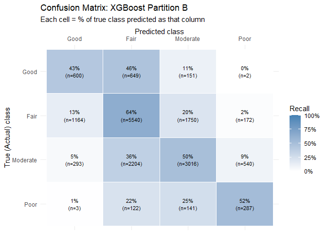<!-- -->

Importance calculation for later comparison.

``` r
xgb_pred_wrapper <- function(object, newdata) {
  dm <- xgb.DMatrix(as.matrix(newdata))
  preds <- as.integer(predict(object, dm)) + 1L
  factor(as.character(preds), levels = c("1", "2", "3", "4"))
}

# XGBoost permutation importance (on test set)
set.seed(2026)
xgb_imp_perm_B <- vi(
  object = xgb_B,
  method = "permute",
  train = test_data %>% select(all_of(PARTITION_B)),
  target = test_data$AQI_p24,
  metric = "accuracy",
  pred_wrapper = xgb_pred_wrapper,
  nsim = 5
)
```

### k-Nearest Neighbours (kNN)

kNN is a distance based method. We use Euclidean distance to find the k
closest training observations to each test observation, then classifies
the test observation based on the majority class among those neighbors.
kNN has the assumption that similar points can be found near one
another.

This model assumes meaningful distances between feature vectors, so all
numeric features are z-score scaled to ensure no single feature
dominates the distance calculation.

``` r
library(kknn) # weighted kNN

KNN_DISTANCE <- 2 # p=2 = Euclidean distance
KNN_TUNE_N <- 5000 # training rows used for LOO-CV tuning
KNN_KMAX <- 100 # upper bound for k search
```

#### Hyperparameter Tuning

We do LOOCV (Leave One Out Cross Validation) for k = 1 to KNN_KMAX to
find the optimal k and kernel.

``` r
# subsample for tuning
set.seed(2026)
tune_sample_idx <- sample(nrow(train_data), KNN_TUNE_N)

# kernels to try
kernels <- c("rectangular", "triangular", "epanechnikov")

# tuning
tune_knn_cv <- function(partition) {
  s <- train_data[tune_sample_idx, ] %>% select(all_of(c(partition, "AQI_p24")))
  train.kknn(AQI_p24 ~ ., data = s, kmax = KNN_KMAX,
             kernel = kernels,
             distance = KNN_DISTANCE, scale = TRUE)
}

cv_knn_A <- tune_knn_cv(PARTITION_A)
cv_knn_B <- tune_knn_cv(PARTITION_B)
```

``` r
KNN_K_A      <- cv_knn_A$best.parameters$k
KNN_KERNEL_A <- cv_knn_A$best.parameters$kernel
KNN_K_B      <- cv_knn_B$best.parameters$k
KNN_KERNEL_B <- cv_knn_B$best.parameters$kernel

cat("Best A: k=", KNN_K_A, " kernel=", KNN_KERNEL_A, "\n")
```

    ## Best A: k= 26  kernel= triangular

``` r
cat("Best B: k=", KNN_K_B, " kernel=", KNN_KERNEL_B, "\n")
```

    ## Best B: k= 20  kernel= triangular

The triangular kernel wins for both partitions, with k = 26 for
Partition A and k = 20 for Partition B.

The triangular kernel assigns higher weights to closer neighbors, and
lower weights to farther neighbors.

#### Running KNN and Evaluation

Since KNN is a lazy learner, there is no separate fit (training) step,
and it stores no parameters. It requires training set at inference time.

``` r
fit_knn <- function(train_data, test_data, partition, k, kernel,
                    distance = KNN_DISTANCE) {
  train_sub <- train_data %>% select(all_of(c(partition, "AQI_p24")))
  test_sub  <- test_data  %>% select(all_of(c(partition, "AQI_p24")))
  kknn(AQI_p24 ~ .,
       train = train_sub,
       test  = test_sub,
       k = k,
       distance = distance,
       kernel = kernel,
       scale = TRUE)  # scaling due to kNN sensitivity
}

predict_knn <- function(knn_fit, test_data) {
  preds  <- as.integer(fitted(knn_fit))
  actual <- as.integer(test_data$AQI_p24)
  list(actual = actual, preds = preds)
}

eval_knn <- function(knn_fit, test_data) {
  p <- predict_knn(knn_fit, test_data)
  compute_metrics(p$preds, p$actual)
}

class_recall_knn <- function(knn_fit, test_data) {
  p <- predict_knn(knn_fit, test_data)
  compute_class_recall(p$preds, p$actual)
}
```

``` r
knn_A <- fit_knn(train_data, test_data, PARTITION_A, k = KNN_K_A, kernel = KNN_KERNEL_A)
knn_B <- fit_knn(train_data, test_data, PARTITION_B, k = KNN_K_B, kernel = KNN_KERNEL_B)

list(
  "A - pollutants only" = eval_knn(knn_A, test_data),
  "B - all features"    = eval_knn(knn_B, test_data)
) %>%
  list_rbind(names_to = "Partition")
```

    ## # A tibble: 2 × 5
    ##   Partition           `Acc (%)` `+-1 Class Acc (%)` `Macro F1` `Poor Recall (%)`
    ##   <chr>                   <dbl>               <dbl>      <dbl>             <dbl>
    ## 1 A - pollutants only      57.0                97.3      0.338               4.7
    ## 2 B - all features         57.9                97.5      0.369              11.4

``` r
cat("--- Partition A ---\n")
```

    ## --- Partition A ---

``` r
class_recall_knn(knn_A, test_data) %>% print()
```

    ## # A tibble: 4 × 5
    ##   Class Label    Actual_n Pred_n `Recall (%)`
    ##   <int> <chr>       <int>  <int>        <dbl>
    ## 1     1 Good         1402    153          4.9
    ## 2     2 Fair         8626   9922         70.6
    ## 3     3 Moderate     6053   6470         54.6
    ## 4     4 Poor          553     89          4.7

``` r
cat("\n--- Partition B ---\n")
```

    ## 
    ## --- Partition B ---

``` r
class_recall_knn(knn_B, test_data) %>% print()
```

    ## # A tibble: 4 × 5
    ##   Class Label    Actual_n Pred_n `Recall (%)`
    ##   <int> <chr>       <int>  <int>        <dbl>
    ## 1     1 Good         1402    169          5.3
    ## 2     2 Fair         8626   9925         71.1
    ## 3     3 Moderate     6053   6389         55.6
    ## 4     4 Poor          553    151         11.4

Partition B overperforms A in Macro F1 slightly (0.338 vs 0.369), which
again suggests that weather features add predictive value beyond
pollutant lags. Both partitions achieve \>= 97% +-1 class accuracy,
meaning that when the model is wrong it is almost always off by just one
AQI category.

Compared to RF, kNN does not offer class weight parameter. This means
that kNN is affected by class imbalance more severely, as the imbalance
directly shapes its predictions (model almost never outputs Good or
Poor).

We also tried oversampling the training data, which helped for Poor
recall, but overall accuracy dropped significantly (to 47.1%), along
with +-1 accuracy. We opted not to include that model, as the trade off
is worse than the class weighting approach used for RF.

#### Confusion matrix

``` r
p_knn <- predict_knn(knn_B, test_data)
plot_confusion_matrix(p_knn$actual, p_knn$preds, "Confusion Matrix: kNN Partition B")
```

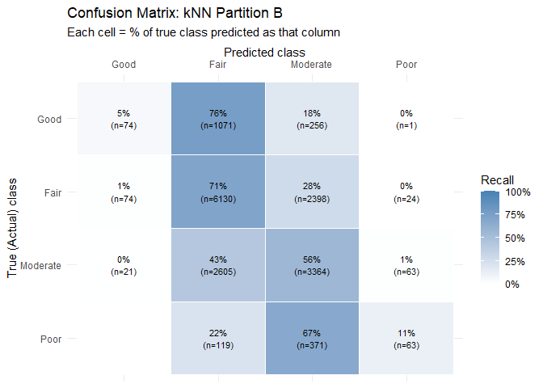<!-- -->

### Ordinal regression

When it comes to the parametric model, one of the criteria for choosing
specific model is the nature of target variable. As the AQI is
categorical variable, we need to choose models that do respect this. AQI
is also ordinal variable, which restricts the options even more. This is
why the first parametric model chosen for AQI prediction is ordinal
regression, even though the underlying proportional assumption will be
likely violated.

``` r
# tried out different weight powers, this one has best performance
ORDINAL_WEIGHT_POWER <- 0.7 # 0 = no reweighting, 1 = fully balanced

# polr() treats weights as frequency weights (each row counts as w observations)
# Weights must sum to nrow(train_subset) so the effective sample size equals the actual sample size.
compute_class_weights_param <- function(train_data, power = ORDINAL_WEIGHT_POWER) {
  class_counts <- table(train_data$AQI_p24)
  w_raw     <- (1 / as.numeric(class_counts))^power
  w_per_row <- w_raw[as.integer(as.character(train_data$AQI_p24))]
  # Normalize so weights sum to n (preserves effective sample size)
  w_per_row / sum(w_per_row) * nrow(train_data)
}

fit_ordinal <- function(train_data, partition) {
  train_subset_ordinal <- train_data %>% select(all_of(c(partition, "AQI_p24")))
  polr(AQI_p24 ~ ., data = train_subset_ordinal, Hess = TRUE,
       weights = compute_class_weights_param(train_subset_ordinal),
       method = "logistic")
}

ordinal_A <- fit_ordinal(train_data, PARTITION_A)
ordinal_B <- fit_ordinal(train_data, PARTITION_B)
```

#### Assumption check: Proportional Odds (Brant test)

The core assumption of ordinal regression is proportional odds, that
every predictor shifts the odds of being in worse AQI classes by the
same amount.

``` r
cat("=== Brant test ===\n")
```

    ## === Brant test ===

``` r
poTest(ordinal_A)
```

    ## 
    ## Tests for Proportional Odds
    ## polr(formula = AQI_p24 ~ ., data = train_subset_ordinal, weights = compute_class_weights_param(train_subset_ordinal), 
    ##     Hess = TRUE, method = "logistic")
    ## 
    ##           b[polr]     b[>1]     b[>2]     b[>3] Chisquare df Pr(>Chisq)    
    ## Overall                                           2663.37 22    < 2e-16 ***
    ## AQI_t    5.66e-01  1.62e-01  5.04e-01  4.24e-01     70.66  2    4.5e-16 ***
    ## AQI_t1   2.82e-01  6.45e-02  2.45e-01  2.83e-01     19.34  2    6.3e-05 ***
    ## AQI_t2   1.55e-01  1.13e-01  1.43e-01  7.65e-02      3.85  2      0.146    
    ## AQI_t24  3.17e-01  1.97e-01  2.95e-01  3.76e-01     34.21  2    3.7e-08 ***
    ## PM25     3.93e-02  9.19e-02  5.80e-02  2.96e-02    272.94  2    < 2e-16 ***
    ## PM10    -8.04e-03 -8.58e-03 -9.92e-03 -6.23e-03      4.77  2      0.092 .  
    ## NO2      2.94e-02  6.29e-02  2.32e-02  4.05e-02    353.90  2    < 2e-16 ***
    ## O3       1.81e-02  2.53e-02  1.20e-02  2.76e-02    641.66  2    < 2e-16 ***
    ## SO2     -2.64e-03  3.03e-02 -6.21e-03 -1.45e-03     93.09  2    < 2e-16 ***
    ## hour     2.41e-02  2.84e-02  1.95e-02  3.60e-02     60.18  2    8.5e-14 ***
    ## month   -1.15e-02 -4.88e-02  3.16e-03 -3.98e-02    169.73  2    < 2e-16 ***
    ## ---
    ## Signif. codes:  0 '***' 0.001 '**' 0.01 '*' 0.05 '.' 0.1 ' ' 1

``` r
poTest(ordinal_B)
```

    ## 
    ## Tests for Proportional Odds
    ## polr(formula = AQI_p24 ~ ., data = train_subset_ordinal, weights = compute_class_weights_param(train_subset_ordinal), 
    ##     Hess = TRUE, method = "logistic")
    ## 
    ##                     b[polr]     b[>1]     b[>2]     b[>3] Chisquare df
    ## Overall                                                     3104.36 44
    ## AQI_t              4.97e-01  1.19e-01  4.35e-01  3.80e-01     53.18  2
    ## AQI_t1             2.62e-01  4.01e-02  2.30e-01  2.79e-01     20.34  2
    ## AQI_t2             1.24e-01  1.03e-01  1.18e-01  6.66e-02      2.04  2
    ## AQI_t24            3.71e-01  2.27e-01  3.61e-01  4.20e-01     39.95  2
    ## PM25               2.09e-02  6.12e-02  3.45e-02  2.01e-02    163.16  2
    ## NO2                2.91e-02  6.02e-02  2.37e-02  3.56e-02    218.00  2
    ## O3                 2.41e-02  3.08e-02  1.90e-02  2.88e-02    232.11  2
    ## SO2                2.72e-03  6.34e-02 -1.50e-03  5.90e-04    146.71  2
    ## hour               2.31e-02  2.66e-02  1.69e-02  3.97e-02     95.46  2
    ## month              1.23e-02 -3.94e-02  3.12e-02 -2.50e-02    221.92  2
    ## Dew_Point         -3.27e-02 -4.70e-02 -4.38e-02 -1.08e-02    138.10  2
    ## Rain              -2.30e-01 -1.31e-01 -1.10e-01 -2.58e-01      3.64  2
    ## Snowfall           7.56e-01  5.18e+00  8.70e-01 -5.41e-01     20.62  2
    ## Weather_Code       1.02e-01 -1.13e-02  4.09e-02  2.79e-01     34.08  2
    ## Pressure_MSL       4.55e-02  5.94e-02  5.15e-02  3.67e-02     62.69  2
    ## Cloud_Cover       -2.72e-03 -2.18e-03 -2.63e-03 -3.32e-03      1.24  2
    ## Cloud_Cover_Low    2.61e-03  2.21e-03  3.11e-03  1.40e-03      7.50  2
    ## Cloud_Cover_Mid   -2.08e-03 -1.63e-03 -2.47e-03 -1.20e-03      5.55  2
    ## Cloud_Cover_High  -1.24e-03 -1.22e-03 -9.38e-04 -2.40e-03      5.01  2
    ## Wind_Speed        -2.62e-02 -1.82e-02 -3.07e-02 -2.23e-02     26.69  2
    ## Wind_Direction    -3.35e-04 -1.08e-03 -4.85e-04  6.39e-04     76.02  2
    ## Soil_Moisture_0_7  1.60e+00  2.41e+00  1.92e+00  2.58e-01     47.68  2
    ##                   Pr(>Chisq)    
    ## Overall              < 2e-16 ***
    ## AQI_t                2.8e-12 ***
    ## AQI_t1               3.8e-05 ***
    ## AQI_t2                 0.361    
    ## AQI_t24              2.1e-09 ***
    ## PM25                 < 2e-16 ***
    ## NO2                  < 2e-16 ***
    ## O3                   < 2e-16 ***
    ## SO2                  < 2e-16 ***
    ## hour                 < 2e-16 ***
    ## month                < 2e-16 ***
    ## Dew_Point            < 2e-16 ***
    ## Rain                   0.162    
    ## Snowfall             3.3e-05 ***
    ## Weather_Code         4.0e-08 ***
    ## Pressure_MSL         2.4e-14 ***
    ## Cloud_Cover            0.539    
    ## Cloud_Cover_Low        0.024 *  
    ## Cloud_Cover_Mid        0.062 .  
    ## Cloud_Cover_High       0.081 .  
    ## Wind_Speed           1.6e-06 ***
    ## Wind_Direction       < 2e-16 ***
    ## Soil_Moisture_0_7    4.4e-11 ***
    ## ---
    ## Signif. codes:  0 '***' 0.001 '**' 0.01 '*' 0.05 '.' 0.1 ' ' 1

H0: parallel regression assumption holds. Rejection (p \< 0.05) means
that predictor’s effect differs across categories. As we can see in the
output, most of the predictors violate this assumption, making the
modeled probabilities unreliable for AQI categories.

#### Coefficient table

As the PO assumption is violated, we cannot interpret the coefficents
exactly, but they still provide some general direction how the variable
influence the outcome. For example, in model ordinal_B, AQI_t (today
value) for every one-unit increase, the prediction moves to the worse
categories as oposed to the better ones by 0.5. It can be also explained
in odds ratio, when we take the exponentiation of the coefficents.
Increasing AQI makes the odds 1.64 times higher compared to better
categories.

``` r
cat("=== Partition A ===\n"); print(summary(ordinal_A))
```

    ## === Partition A ===

    ## Call:
    ## polr(formula = AQI_p24 ~ ., data = train_subset_ordinal, weights = compute_class_weights_param(train_subset_ordinal), 
    ##     Hess = TRUE, method = "logistic")
    ## 
    ## Coefficients:
    ##             Value Std. Error t value
    ## AQI_t    0.566070  0.0236017  23.984
    ## AQI_t1   0.281706  0.0263924  10.674
    ## AQI_t2   0.155262  0.0218561   7.104
    ## AQI_t24  0.317231  0.0143256  22.144
    ## PM25     0.039333  0.0015384  25.568
    ## PM10    -0.008045  0.0012445  -6.464
    ## NO2      0.029422  0.0010010  29.393
    ## O3       0.018151  0.0004313  42.083
    ## SO2     -0.002644  0.0010885  -2.429
    ## hour     0.024143  0.0012931  18.670
    ## month   -0.011554  0.0026860  -4.302
    ## 
    ## Intercepts:
    ##     Value    Std. Error t value 
    ## 1|2   3.2188   0.0514    62.5833
    ## 2|3   5.3338   0.0544    98.1179
    ## 3|4   7.4812   0.0596   125.5231
    ## 
    ## Residual Deviance: 110895.99 
    ## AIC: 110923.99

``` r
cat("\n=== Partition B ===\n"); print(summary(ordinal_B))
```

    ## 
    ## === Partition B ===

    ## Call:
    ## polr(formula = AQI_p24 ~ ., data = train_subset_ordinal, weights = compute_class_weights_param(train_subset_ordinal), 
    ##     Hess = TRUE, method = "logistic")
    ## 
    ## Coefficients:
    ##                        Value Std. Error  t value
    ## AQI_t              0.4970169  2.395e-02   20.755
    ## AQI_t1             0.2617889  2.665e-02    9.822
    ## AQI_t2             0.1235770  2.214e-02    5.582
    ## AQI_t24            0.3711354  1.455e-02   25.512
    ## PM25               0.0209099  1.066e-03   19.612
    ## NO2                0.0290511  1.058e-03   27.447
    ## O3                 0.0241096  4.763e-04   50.619
    ## SO2                0.0027220  1.390e-03    1.959
    ## hour               0.0231329  1.317e-03   17.564
    ## month              0.0123372  2.923e-03    4.221
    ## Dew_Point         -0.0327118  1.546e-03  -21.160
    ## Rain              -0.2303853  3.029e-02   -7.606
    ## Snowfall           0.7564327  1.653e-03  457.609
    ## Weather_Code       0.1017981  2.046e-02    4.975
    ## Pressure_MSL       0.0455074  6.908e-05  658.772
    ## Cloud_Cover       -0.0027255  4.392e-04   -6.206
    ## Cloud_Cover_Low    0.0026061  3.385e-04    7.698
    ## Cloud_Cover_Mid   -0.0020844  3.178e-04   -6.558
    ## Cloud_Cover_High  -0.0012440  3.273e-04   -3.801
    ## Wind_Speed        -0.0261541  1.530e-03  -17.093
    ## Wind_Direction    -0.0003351  9.117e-05   -3.676
    ## Soil_Moisture_0_7  1.5991842  7.218e-04 2215.514
    ## 
    ## Intercepts:
    ##     Value        Std. Error   t value     
    ## 1|2      49.2949       0.0000 1280941.9330
    ## 2|3      51.5601       0.0159    3246.1959
    ## 3|4      53.8193       0.0223    2414.0071
    ## 
    ## Residual Deviance: 106666.86 
    ## AIC: 106716.86

``` r
cat("\n=== Partition B - odds ratio ===\n"); print(exp(ordinal_B$coefficients))
```

    ## 
    ## === Partition B - odds ratio ===

    ##             AQI_t            AQI_t1            AQI_t2           AQI_t24 
    ##         1.6438102         1.2992522         1.1315371         1.4493793 
    ##              PM25               NO2                O3               SO2 
    ##         1.0211301         1.0294772         1.0244026         1.0027257 
    ##              hour             month         Dew_Point              Rain 
    ##         1.0234026         1.0124137         0.9678174         0.7942275 
    ##          Snowfall      Weather_Code      Pressure_MSL       Cloud_Cover 
    ##         2.1306620         1.1071599         1.0465588         0.9972782 
    ##   Cloud_Cover_Low   Cloud_Cover_Mid  Cloud_Cover_High        Wind_Speed 
    ##         1.0026095         0.9979178         0.9987567         0.9741849 
    ##    Wind_Direction Soil_Moisture_0_7 
    ##         0.9996650         4.9489932

#### Performance evaluation

The overall performance and class recall metrics. Model B is better
looking at the macro F1 score, even though it has lower recall for poor
class.

``` r
predict_ordinal <- function(model, test_data, partition) {
  test_features <- test_data %>% select(all_of(partition))
  actual <- as.integer(as.character(test_data$AQI_p24))
  preds  <- as.integer(as.character(predict(model, newdata = test_features)))
  list(actual = actual, preds = preds)
}

eval_ordinal <- function(model, test_data, partition) {
  p <- predict_ordinal(model, test_data, partition)
  compute_metrics(p$preds, p$actual)
}

class_recall_ordinal <- function(model, test_data, partition) {
  p <- predict_ordinal(model, test_data, partition)
  compute_class_recall(p$preds, p$actual)
}

list(
  "A - pollutants only" = eval_ordinal(ordinal_A, test_data, PARTITION_A),
  "B - all features"    = eval_ordinal(ordinal_B, test_data, PARTITION_B)
) %>%
  list_rbind(names_to = "Partition")
```

    ## # A tibble: 2 × 5
    ##   Partition           `Acc (%)` `+-1 Class Acc (%)` `Macro F1` `Poor Recall (%)`
    ##   <chr>                   <dbl>               <dbl>      <dbl>             <dbl>
    ## 1 A - pollutants only      52.5                95.9      0.428              42.9
    ## 2 B - all features         55.3                97.0      0.460              38.9

``` r
cat("--- Partition A ---\n")
```

    ## --- Partition A ---

``` r
class_recall_ordinal(ordinal_A, test_data, PARTITION_A) %>% print()
```

    ## # A tibble: 4 × 5
    ##   Class Label    Actual_n Pred_n `Recall (%)`
    ##   <int> <chr>       <int>  <int>        <dbl>
    ## 1     1 Good         1402   1627         29.3
    ## 2     2 Fair         8626   9026         62.6
    ## 3     3 Moderate     6053   5191         44.3
    ## 4     4 Poor          553    790         42.9

``` r
cat("\n--- Partition B ---\n")
```

    ## 
    ## --- Partition B ---

``` r
class_recall_ordinal(ordinal_B, test_data, PARTITION_B) %>% print()
```

    ## # A tibble: 4 × 5
    ##   Class Label    Actual_n Pred_n `Recall (%)`
    ##   <int> <chr>       <int>  <int>        <dbl>
    ## 1     1 Good         1402   1872         39.7
    ## 2     2 Fair         8626   8886         63.9
    ## 3     3 Moderate     6053   5212         48.2
    ## 4     4 Poor          553    664         38.9

#### Confusion matrix

``` r
p_ord <- predict_ordinal(ordinal_B, test_data, PARTITION_B)
plot_confusion_matrix(p_ord$actual, p_ord$preds, "Confusion Matrix: Ordinal Regression Partition B")
```

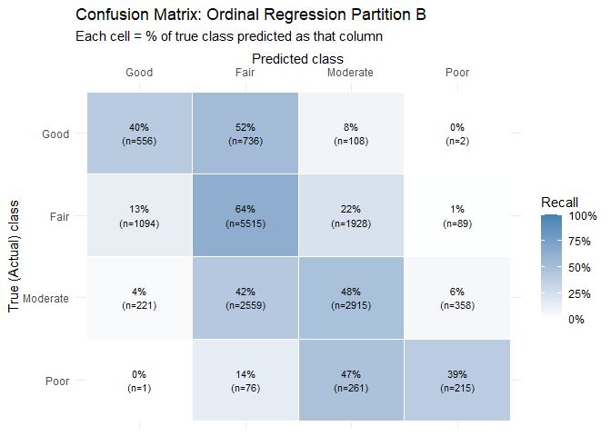<!-- -->

# Partial Proportional Odds

As the ordinal regression did not satisfy PO assumption, it is possible
to use partial proportional odds model which relaxes this assumption on
predictors that violates it. The coefficients for predictors like this
are fitted for each category separately while the ones that satisfy the
PO will keep it same accross categories. These decisions about the the
predictors were based on the Brant test above.

``` r
library(VGAM)
fit_partial <- function(train_data, partition, po_predictors) {
  train_subset_partial <- train_data %>% select(all_of(c(partition, "AQI_p24")))
  formula <- as.formula(paste("TRUE ~ -1 +", paste(po_predictors, collapse = " + ")))
  vglm(AQI_p24 ~ ., data = train_subset_partial,
       family = cumulative(parallel = formula),
       weights = compute_class_weights_param(train_subset_partial))
}
po_predictors_A <- c("AQI_t2", "PM10")
partial_A <- fit_partial(train_data, PARTITION_A, po_predictors_A)
```

    ## Warning in Deviance.categorical.data.vgam(mu = mu, y = y, w = w, residuals =
    ## residuals, : fitted values close to 0 or 1

    ## Warning in eval(slot(family, "deriv")): some probabilities are very close to 0

    ## Warning in Deviance.categorical.data.vgam(mu = mu, y = y, w = w, residuals =
    ## residuals, : fitted values close to 0 or 1
    ## Warning in Deviance.categorical.data.vgam(mu = mu, y = y, w = w, residuals =
    ## residuals, : fitted values close to 0 or 1

    ## Warning in slot(family, "validparams")(eta, y, extra = extra): It seems that
    ## the nonparallelism assumption has resulted in intersecting linear/additive
    ## predictors. Try propodds() or fitting a partial nonproportional odds model or
    ## choosing some other link function, etc.

    ## Warning in Deviance.categorical.data.vgam(mu = mu, y = y, w = w, residuals =
    ## residuals, : fitted values close to 0 or 1

    ## Warning in slot(family, "validparams")(eta, y, extra = extra): It seems that
    ## the nonparallelism assumption has resulted in intersecting linear/additive
    ## predictors. Try propodds() or fitting a partial nonproportional odds model or
    ## choosing some other link function, etc.

    ## Warning in Deviance.categorical.data.vgam(mu = mu, y = y, w = w, residuals =
    ## residuals, : fitted values close to 0 or 1

    ## Warning in slot(family, "validparams")(eta, y, extra = extra): It seems that
    ## the nonparallelism assumption has resulted in intersecting linear/additive
    ## predictors. Try propodds() or fitting a partial nonproportional odds model or
    ## choosing some other link function, etc.

    ## Warning in Deviance.categorical.data.vgam(mu = mu, y = y, w = w, residuals =
    ## residuals, : fitted values close to 0 or 1

    ## Warning in slot(family, "validparams")(eta, y, extra = extra): It seems that
    ## the nonparallelism assumption has resulted in intersecting linear/additive
    ## predictors. Try propodds() or fitting a partial nonproportional odds model or
    ## choosing some other link function, etc.

    ## Warning in Deviance.categorical.data.vgam(mu = mu, y = y, w = w, residuals =
    ## residuals, : fitted values close to 0 or 1

    ## Warning in slot(family, "validparams")(eta, y, extra = extra): It seems that
    ## the nonparallelism assumption has resulted in intersecting linear/additive
    ## predictors. Try propodds() or fitting a partial nonproportional odds model or
    ## choosing some other link function, etc.

    ## Warning in Deviance.categorical.data.vgam(mu = mu, y = y, w = w, residuals =
    ## residuals, : fitted values close to 0 or 1

    ## Warning in slot(family, "validparams")(eta, y, extra = extra): It seems that
    ## the nonparallelism assumption has resulted in intersecting linear/additive
    ## predictors. Try propodds() or fitting a partial nonproportional odds model or
    ## choosing some other link function, etc.

    ## Warning in Deviance.categorical.data.vgam(mu = mu, y = y, w = w, residuals =
    ## residuals, : fitted values close to 0 or 1

    ## Warning in slot(family, "validparams")(eta, y, extra = extra): It seems that
    ## the nonparallelism assumption has resulted in intersecting linear/additive
    ## predictors. Try propodds() or fitting a partial nonproportional odds model or
    ## choosing some other link function, etc.

    ## Warning in Deviance.categorical.data.vgam(mu = mu, y = y, w = w, residuals =
    ## residuals, : fitted values close to 0 or 1

    ## Warning in slot(family, "validparams")(eta, y, extra = extra): It seems that
    ## the nonparallelism assumption has resulted in intersecting linear/additive
    ## predictors. Try propodds() or fitting a partial nonproportional odds model or
    ## choosing some other link function, etc.

    ## Warning in Deviance.categorical.data.vgam(mu = mu, y = y, w = w, residuals =
    ## residuals, : fitted values close to 0 or 1

    ## Warning in slot(family, "validparams")(eta, y, extra = extra): It seems that
    ## the nonparallelism assumption has resulted in intersecting linear/additive
    ## predictors. Try propodds() or fitting a partial nonproportional odds model or
    ## choosing some other link function, etc.

    ## Warning in Deviance.categorical.data.vgam(mu = mu, y = y, w = w, residuals =
    ## residuals, : fitted values close to 0 or 1

    ## Warning in slot(family, "validparams")(eta, y, extra = extra): It seems that
    ## the nonparallelism assumption has resulted in intersecting linear/additive
    ## predictors. Try propodds() or fitting a partial nonproportional odds model or
    ## choosing some other link function, etc.

    ## Warning in Deviance.categorical.data.vgam(mu = mu, y = y, w = w, residuals =
    ## residuals, : fitted values close to 0 or 1

    ## Warning in slot(family, "validparams")(eta, y, extra = extra): It seems that
    ## the nonparallelism assumption has resulted in intersecting linear/additive
    ## predictors. Try propodds() or fitting a partial nonproportional odds model or
    ## choosing some other link function, etc.

    ## Warning in Deviance.categorical.data.vgam(mu = mu, y = y, w = w, residuals =
    ## residuals, : fitted values close to 0 or 1

    ## Warning in slot(family, "validparams")(eta, y, extra = extra): It seems that
    ## the nonparallelism assumption has resulted in intersecting linear/additive
    ## predictors. Try propodds() or fitting a partial nonproportional odds model or
    ## choosing some other link function, etc.

    ## Warning in Deviance.categorical.data.vgam(mu = mu, y = y, w = w, residuals =
    ## residuals, : fitted values close to 0 or 1

    ## Warning in slot(family, "validparams")(eta, y, extra = extra): It seems that
    ## the nonparallelism assumption has resulted in intersecting linear/additive
    ## predictors. Try propodds() or fitting a partial nonproportional odds model or
    ## choosing some other link function, etc.

    ## Warning in Deviance.categorical.data.vgam(mu = mu, y = y, w = w, residuals =
    ## residuals, : fitted values close to 0 or 1

    ## Warning in slot(family, "validparams")(eta, y, extra = extra): It seems that
    ## the nonparallelism assumption has resulted in intersecting linear/additive
    ## predictors. Try propodds() or fitting a partial nonproportional odds model or
    ## choosing some other link function, etc.

    ## Warning in Deviance.categorical.data.vgam(mu = mu, y = y, w = w, residuals =
    ## residuals, : fitted values close to 0 or 1

    ## Warning in slot(family, "validparams")(eta, y, extra = extra): It seems that
    ## the nonparallelism assumption has resulted in intersecting linear/additive
    ## predictors. Try propodds() or fitting a partial nonproportional odds model or
    ## choosing some other link function, etc.

    ## Warning in Deviance.categorical.data.vgam(mu = mu, y = y, w = w, residuals =
    ## residuals, : fitted values close to 0 or 1

    ## Warning in slot(family, "validparams")(eta, y, extra = extra): It seems that
    ## the nonparallelism assumption has resulted in intersecting linear/additive
    ## predictors. Try propodds() or fitting a partial nonproportional odds model or
    ## choosing some other link function, etc.

    ## Warning in Deviance.categorical.data.vgam(mu = mu, y = y, w = w, residuals =
    ## residuals, : fitted values close to 0 or 1

    ## Warning in slot(family, "validparams")(eta, y, extra = extra): It seems that
    ## the nonparallelism assumption has resulted in intersecting linear/additive
    ## predictors. Try propodds() or fitting a partial nonproportional odds model or
    ## choosing some other link function, etc.

    ## Warning in Deviance.categorical.data.vgam(mu = mu, y = y, w = w, residuals =
    ## residuals, : fitted values close to 0 or 1

    ## Warning in slot(family, "validparams")(eta, y, extra = extra): It seems that
    ## the nonparallelism assumption has resulted in intersecting linear/additive
    ## predictors. Try propodds() or fitting a partial nonproportional odds model or
    ## choosing some other link function, etc.

    ## Warning in Deviance.categorical.data.vgam(mu = mu, y = y, w = w, residuals =
    ## residuals, : fitted values close to 0 or 1

    ## Warning in slot(family, "validparams")(eta, y, extra = extra): It seems that
    ## the nonparallelism assumption has resulted in intersecting linear/additive
    ## predictors. Try propodds() or fitting a partial nonproportional odds model or
    ## choosing some other link function, etc.

    ## Warning in vglm.fitter(x = x, y = y, w = w, offset = offset, Xm2 = Xm2, :
    ## iterations terminated because half-step sizes are very small

    ## Warning in vglm.fitter(x = x, y = y, w = w, offset = offset, Xm2 = Xm2, : some
    ## quantities such as z, residuals, SEs may be inaccurate due to convergence at a
    ## half-step

    ## Warning in log(prob): NaNs produced

``` r
#po_predictors_B <- c("AQI_t2", "Rain", "Cloud_Cover", "Cloud_Cover_Mid", "Cloud_Cover_High")
#partial_B <- fit_partial(train_data, PARTITION_B, po_predictors_B)
summary(partial_A)
```

    ## 
    ## Call:
    ## vglm(formula = AQI_p24 ~ ., family = cumulative(parallel = formula), 
    ##     data = train_subset_partial, weights = compute_class_weights_param(train_subset_partial))
    ## 
    ## Coefficients: 
    ##                 Estimate Std. Error    z value Pr(>|z|)    
    ## (Intercept):1  2.061e+00  5.650e-02  3.647e+01   <2e-16 ***
    ## (Intercept):2  3.709e+00  2.667e-06  1.390e+06   <2e-16 ***
    ## (Intercept):3  6.309e+00  2.534e-06  2.490e+06   <2e-16 ***
    ## AQI_t:1       -5.261e-01  2.670e-02 -1.970e+01   <2e-16 ***
    ## AQI_t:2       -5.235e-01  5.168e-07 -1.013e+06   <2e-16 ***
    ## AQI_t:3       -2.871e-01  5.645e-07 -5.087e+05   <2e-16 ***
    ## AQI_t1:1      -2.550e-01  2.581e-02 -9.880e+00   <2e-16 ***
    ## AQI_t1:2      -2.427e-01  1.817e-07 -1.336e+06   <2e-16 ***
    ## AQI_t1:3      -1.327e-01  2.269e-07 -5.845e+05   <2e-16 ***
    ## AQI_t2        -1.466e-01  1.363e-07 -1.076e+06   <2e-16 ***
    ## AQI_t24:1     -2.092e-01  7.280e-03 -2.873e+01   <2e-16 ***
    ## AQI_t24:2     -2.449e-01  1.260e-07 -1.944e+06   <2e-16 ***
    ## AQI_t24:3     -2.639e-01  1.428e-07 -1.848e+06   <2e-16 ***
    ## PM25:1        -1.025e-02  4.343e-05 -2.360e+02   <2e-16 ***
    ## PM25:2        -2.204e-02  7.666e-09 -2.875e+06   <2e-16 ***
    ## PM25:3        -3.217e-02  8.152e-09 -3.946e+06   <2e-16 ***
    ## PM10           4.456e-03  4.264e-09  1.045e+06   <2e-16 ***
    ## NO2:1         -1.347e-02  1.325e-03 -1.016e+01   <2e-16 ***
    ## NO2:2         -7.709e-03  1.008e-08 -7.645e+05   <2e-16 ***
    ## NO2:3         -3.994e-02  9.307e-09 -4.292e+06   <2e-16 ***
    ## O3:1          -8.422e-03  5.063e-04 -1.664e+01   <2e-16 ***
    ## O3:2          -4.922e-03  6.970e-09 -7.061e+05   <2e-16 ***
    ## O3:3          -2.749e-02  6.623e-09 -4.151e+06   <2e-16 ***
    ## SO2:1         -5.805e-03  2.725e-03 -2.130e+00   0.0332 *  
    ## SO2:2          3.927e-03  5.642e-09  6.960e+05   <2e-16 ***
    ## SO2:3          3.377e-03  5.477e-09  6.165e+05   <2e-16 ***
    ## hour:1        -3.121e-02  1.422e-03 -2.194e+01   <2e-16 ***
    ## hour:2        -1.661e-02  2.815e-08 -5.901e+05   <2e-16 ***
    ## hour:3        -1.643e-02  3.271e-08 -5.024e+05   <2e-16 ***
    ## month:1        4.835e-02  3.340e-03  1.447e+01   <2e-16 ***
    ## month:2        5.810e-04  5.754e-08  1.010e+04   <2e-16 ***
    ## month:3        7.755e-03  6.785e-08  1.143e+05   <2e-16 ***
    ## ---
    ## Signif. codes:  0 '***' 0.001 '**' 0.01 '*' 0.05 '.' 0.1 ' ' 1
    ## 
    ## Names of linear predictors: logitlink(P[Y<=1]), logitlink(P[Y<=2]), 
    ## logitlink(P[Y<=3])
    ## 
    ## Residual deviance: 147460.2 on 150661 degrees of freedom
    ## 
    ## Log-likelihood: NA on 150661 degrees of freedom
    ## 
    ## Number of Fisher scoring iterations: 2 
    ## 
    ## 
    ## Exponentiated coefficients:
    ##   AQI_t:1   AQI_t:2   AQI_t:3  AQI_t1:1  AQI_t1:2  AQI_t1:3    AQI_t2 AQI_t24:1 
    ## 0.5909249 0.5924389 0.7504154 0.7749009 0.7844924 0.8757656 0.8636364 0.8112485 
    ## AQI_t24:2 AQI_t24:3    PM25:1    PM25:2    PM25:3      PM10     NO2:1     NO2:2 
    ## 0.7827782 0.7680378 0.9898019 0.9781971 0.9683462 1.0044663 0.9866178 0.9923204 
    ##     NO2:3      O3:1      O3:2      O3:3     SO2:1     SO2:2     SO2:3    hour:1 
    ## 0.9608438 0.9916135 0.9950904 0.9728822 0.9942122 1.0039344 1.0033823 0.9692722 
    ##    hour:2    hour:3   month:1   month:2   month:3 
    ## 0.9835259 0.9837001 1.0495403 1.0005812 1.0077856

After running both of these models, some issues became clear. The
partial A model has a lot of warnings and the B one did not even
converge to the solution. The reason why is this the case, is that some
of our predictors has different impacts on each AQI class, making the
model predict impossible probabilities such as negatives. This breaks
the ordering of cumulative model.

It is possible to evaluate model A, as it did converge in the end,
making it usable for predictions. The coefficent can be interpreted
similarly as explained in ordered regression and multinomial regression
(below) sections.

``` r
predict_partial <- function(model, test_data, partition) {
  test_features <- test_data %>% select(all_of(partition))
  actual <- as.integer(test_data$AQI_p24)
  probs  <- predictvglm(model, newdata = test_features, type = "response")
  preds  <- max.col(probs)
  list(actual = actual, preds = preds)
}

eval_partial <- function(model, test_data, partition) {
  p <- predict_partial(model, test_data, partition)
  compute_metrics(p$preds, p$actual)
}

class_recall_partial <- function(model, test_data, partition) {
  p <- predict_partial(model, test_data, partition)
  compute_class_recall(p$preds, p$actual)
}

list(
  "A - pollutants only" = eval_partial(partial_A, test_data, PARTITION_A)
) %>%
  list_rbind(names_to = "Partition")
```

    ## # A tibble: 1 × 5
    ##   Partition           `Acc (%)` `+-1 Class Acc (%)` `Macro F1` `Poor Recall (%)`
    ##   <chr>                   <dbl>               <dbl>      <dbl>             <dbl>
    ## 1 A - pollutants only      46.2                89.9      0.386              67.3

``` r
cat("--- Partition A ---\n")
```

    ## --- Partition A ---

``` r
class_recall_partial(partial_A, test_data, PARTITION_A) %>% print()
```

    ## # A tibble: 4 × 5
    ##   Class Label    Actual_n Pred_n `Recall (%)`
    ##   <int> <chr>       <int>  <int>        <dbl>
    ## 1     1 Good         1402   2979         45.7
    ## 2     2 Fair         8626   7281         52.8
    ## 3     3 Moderate     6053   4098         35  
    ## 4     4 Poor          553   2276         67.3

### Multinomial regression

The partial proportional odds model is very close to the full
multinomial regression as only two features are fulfilling the PO
assumption. It also solves the issue with negative probabilities, as
multinomial regression treats every class independently.

``` r
MULTINOMIAL_WEIGHT_POWER <- 0.7 # 0 = no reweighting, 1 = fully balanced

fit_multinom <- function(train_data, partition) {
  train_subset_multinom <- train_data %>% select(all_of(c(partition, "AQI_p24")))
  train_subset_multinom$AQI_p24 <- as.factor(as.character(train_subset_multinom$AQI_p24))
  vglm(AQI_p24 ~ ., data = train_subset_multinom,
            family = multinomial(refLevel = 1),
            model = TRUE,
            weights = compute_class_weights_param(train_subset_multinom, power = MULTINOMIAL_WEIGHT_POWER))
}


multinomial_A <- fit_multinom(train_data, PARTITION_A)
summary(multinomial_A)
```

    ## 
    ## Call:
    ## vglm(formula = AQI_p24 ~ ., family = multinomial(refLevel = 1), 
    ##     data = train_subset_multinom, weights = compute_class_weights_param(train_subset_multinom, 
    ##         power = MULTINOMIAL_WEIGHT_POWER), model = TRUE)
    ## 
    ## Coefficients: 
    ##                 Estimate Std. Error z value Pr(>|z|)    
    ## (Intercept):1 -1.930e+00  9.488e-02 -20.338  < 2e-16 ***
    ## (Intercept):2 -4.754e+00  1.048e-01 -45.345  < 2e-16 ***
    ## (Intercept):3 -1.007e+01  1.303e-01 -77.326  < 2e-16 ***
    ## AQI_t:1       -1.365e-02  4.160e-02  -0.328 0.742904    
    ## AQI_t:2        3.755e-01  4.453e-02   8.432  < 2e-16 ***
    ## AQI_t:3        5.616e-01  5.285e-02  10.627  < 2e-16 ***
    ## AQI_t1:1      -2.182e-02  4.370e-02  -0.499 0.617547    
    ## AQI_t1:2       1.511e-01  4.716e-02   3.204 0.001355 ** 
    ## AQI_t1:3       3.400e-01  5.738e-02   5.925 3.11e-09 ***
    ## AQI_t2:1       7.323e-02  3.679e-02   1.990 0.046545 *  
    ## AQI_t2:2       1.783e-01  3.965e-02   4.497 6.90e-06 ***
    ## AQI_t2:3       1.725e-01  4.763e-02   3.621 0.000293 ***
    ## AQI_t24:1      9.534e-02  2.383e-02   4.002 6.29e-05 ***
    ## AQI_t24:2      2.904e-01  2.561e-02  11.338  < 2e-16 ***
    ## AQI_t24:3      5.599e-01  3.109e-02  18.010  < 2e-16 ***
    ## PM25:1         6.587e-02  3.926e-03  16.778  < 2e-16 ***
    ## PM25:2         1.103e-01  4.012e-03  27.484  < 2e-16 ***
    ## PM25:3         1.289e-01  4.225e-03  30.498  < 2e-16 ***
    ## PM10:1        -5.076e-03  2.391e-03  -2.123 0.033785 *  
    ## PM10:2        -1.296e-02  2.504e-03  -5.177 2.26e-07 ***
    ## PM10:3        -1.680e-02  2.753e-03  -6.101 1.05e-09 ***
    ## NO2:1          5.832e-02  2.539e-03  22.970  < 2e-16 ***
    ## NO2:2          6.192e-02  2.557e-03  24.212  < 2e-16 ***
    ## NO2:3          1.011e-01  2.789e-03  36.245  < 2e-16 ***
    ## O3:1           2.280e-02  9.090e-04  25.083  < 2e-16 ***
    ## O3:2           2.224e-02  9.337e-04  23.821  < 2e-16 ***
    ## O3:3           5.000e-02  1.073e-03  46.617  < 2e-16 ***
    ## SO2:1          3.523e-02  4.829e-03   7.296 2.96e-13 ***
    ## SO2:2          2.612e-02  4.913e-03   5.318 1.05e-07 ***
    ## SO2:3          2.902e-02  4.958e-03   5.853 4.84e-09 ***
    ## hour:1         2.356e-02  2.131e-03  11.057  < 2e-16 ***
    ## hour:2         3.142e-02  2.288e-03  13.734  < 2e-16 ***
    ## hour:3         6.119e-02  2.946e-03  20.768  < 2e-16 ***
    ## month:1       -5.777e-02  4.912e-03 -11.761  < 2e-16 ***
    ## month:2       -3.640e-02  5.162e-03  -7.052 1.76e-12 ***
    ## month:3       -7.948e-02  6.378e-03 -12.461  < 2e-16 ***
    ## ---
    ## Signif. codes:  0 '***' 0.001 '**' 0.01 '*' 0.05 '.' 0.1 ' ' 1
    ## 
    ## Names of linear predictors: log(mu[,2]/mu[,1]), log(mu[,3]/mu[,1]), 
    ## log(mu[,4]/mu[,1])
    ## 
    ## Residual deviance: 108359.2 on 150657 degrees of freedom
    ## 
    ## Log-likelihood: -54179.59 on 150657 degrees of freedom
    ## 
    ## Number of Fisher scoring iterations: 7 
    ## 
    ## 
    ## Reference group is level  1  of the response

``` r
multinomial_B <- fit_multinom(train_data, PARTITION_B)
summary(multinomial_B)
```

    ## 
    ## Call:
    ## vglm(formula = AQI_p24 ~ ., family = multinomial(refLevel = 1), 
    ##     data = train_subset_multinom, weights = compute_class_weights_param(train_subset_multinom, 
    ##         power = MULTINOMIAL_WEIGHT_POWER), model = TRUE)
    ## 
    ## Coefficients: 
    ##                       Estimate Std. Error z value Pr(>|z|)    
    ## (Intercept):1       -4.512e+01  2.315e+00 -19.487  < 2e-16 ***
    ## (Intercept):2       -8.709e+01  2.532e+00 -34.396  < 2e-16 ***
    ## (Intercept):3       -1.138e+02  3.127e+00 -36.410  < 2e-16 ***
    ## AQI_t:1             -1.767e-02  4.257e-02  -0.415 0.678092    
    ## AQI_t:2              3.157e-01  4.659e-02   6.777 1.23e-11 ***
    ## AQI_t:3              4.997e-01  5.488e-02   9.105  < 2e-16 ***
    ## AQI_t1:1            -3.242e-02  4.446e-02  -0.729 0.465980    
    ## AQI_t1:2             1.284e-01  4.918e-02   2.612 0.009008 ** 
    ## AQI_t1:3             3.239e-01  5.929e-02   5.463 4.67e-08 ***
    ## AQI_t2:1             7.114e-02  3.749e-02   1.897 0.057771 .  
    ## AQI_t2:2             1.530e-01  4.142e-02   3.694 0.000221 ***
    ## AQI_t2:3             1.622e-01  4.931e-02   3.289 0.001006 ** 
    ## AQI_t24:1            1.145e-01  2.452e-02   4.668 3.04e-06 ***
    ## AQI_t24:2            3.634e-01  2.695e-02  13.483  < 2e-16 ***
    ## AQI_t24:3            6.610e-01  3.247e-02  20.356  < 2e-16 ***
    ## PM25:1               4.482e-02  3.339e-03  13.422  < 2e-16 ***
    ## PM25:2               7.071e-02  3.404e-03  20.770  < 2e-16 ***
    ## PM25:3               8.732e-02  3.522e-03  24.796  < 2e-16 ***
    ## NO2:1                5.581e-02  2.686e-03  20.779  < 2e-16 ***
    ## NO2:2                6.226e-02  2.763e-03  22.530  < 2e-16 ***
    ## NO2:3                9.592e-02  3.021e-03  31.755  < 2e-16 ***
    ## O3:1                 2.606e-02  9.989e-04  26.086  < 2e-16 ***
    ## O3:2                 3.252e-02  1.064e-03  30.546  < 2e-16 ***
    ## O3:3                 5.837e-02  1.245e-03  46.863  < 2e-16 ***
    ## SO2:1                6.586e-02  5.317e-03  12.385  < 2e-16 ***
    ## SO2:2                6.169e-02  5.395e-03  11.433  < 2e-16 ***
    ## SO2:3                6.345e-02  5.461e-03  11.619  < 2e-16 ***
    ## hour:1               2.293e-02  2.191e-03  10.467  < 2e-16 ***
    ## hour:2               2.835e-02  2.423e-03  11.698  < 2e-16 ***
    ## hour:3               6.252e-02  3.082e-03  20.284  < 2e-16 ***
    ## month:1             -5.770e-02  5.541e-03 -10.414  < 2e-16 ***
    ## month:2             -1.383e-02  5.883e-03  -2.351 0.018744 *  
    ## month:3             -5.409e-02  7.345e-03  -7.364 1.79e-13 ***
    ## Dew_Point:1         -3.144e-02  3.047e-03 -10.317  < 2e-16 ***
    ## Dew_Point:2         -7.072e-02  3.309e-03 -21.376  < 2e-16 ***
    ## Dew_Point:3         -6.410e-02  3.948e-03 -16.236  < 2e-16 ***
    ## Rain:1              -1.234e-01  4.047e-02  -3.050 0.002288 ** 
    ## Rain:2              -1.380e-01  5.234e-02  -2.638 0.008348 ** 
    ## Rain:3              -2.847e-01  8.486e-02  -3.355 0.000795 ***
    ## Snowfall:1           5.316e+00  1.237e+00   4.299 1.71e-05 ***
    ## Snowfall:2           5.886e+00  1.257e+00   4.682 2.84e-06 ***
    ## Snowfall:3           4.910e+00  1.331e+00   3.690 0.000224 ***
    ## Weather_Code:1      -3.383e-02  4.358e-02  -0.776 0.437562    
    ## Weather_Code:2      -5.050e-02  4.873e-02  -1.036 0.300086    
    ## Weather_Code:3       2.262e-01  5.871e-02   3.852 0.000117 ***
    ## Pressure_MSL:1       4.275e-02  2.258e-03  18.929  < 2e-16 ***
    ## Pressure_MSL:2       8.123e-02  2.464e-03  32.964  < 2e-16 ***
    ## Pressure_MSL:3       1.021e-01  3.036e-03  33.630  < 2e-16 ***
    ## Cloud_Cover:1       -1.276e-03  7.591e-04  -1.681 0.092727 .  
    ## Cloud_Cover:2       -3.056e-03  8.276e-04  -3.692 0.000222 ***
    ## Cloud_Cover:3       -5.494e-03  1.054e-03  -5.211 1.87e-07 ***
    ## Cloud_Cover_Low:1    1.161e-03  5.348e-04   2.170 0.030006 *  
    ## Cloud_Cover_Low:2    3.810e-03  6.020e-04   6.329 2.47e-10 ***
    ## Cloud_Cover_Low:3    3.824e-03  8.301e-04   4.607 4.09e-06 ***
    ## Cloud_Cover_Mid:1   -8.426e-04  5.341e-04  -1.578 0.114671    
    ## Cloud_Cover_Mid:2   -3.045e-03  5.883e-04  -5.176 2.26e-07 ***
    ## Cloud_Cover_Mid:3   -3.029e-03  7.731e-04  -3.918 8.91e-05 ***
    ## Cloud_Cover_High:1  -1.099e-03  5.367e-04  -2.048 0.040551 *  
    ## Cloud_Cover_High:2  -1.244e-03  5.980e-04  -2.080 0.037481 *  
    ## Cloud_Cover_High:3  -3.654e-03  8.024e-04  -4.554 5.26e-06 ***
    ## Wind_Speed:1        -8.127e-03  2.560e-03  -3.174 0.001501 ** 
    ## Wind_Speed:2        -3.469e-02  2.888e-03 -12.014  < 2e-16 ***
    ## Wind_Speed:3        -4.154e-02  3.644e-03 -11.399  < 2e-16 ***
    ## Wind_Direction:1    -9.791e-04  1.812e-04  -5.403 6.56e-08 ***
    ## Wind_Direction:2    -1.505e-03  1.909e-04  -7.885 3.15e-15 ***
    ## Wind_Direction:3    -5.601e-04  2.192e-04  -2.556 0.010599 *  
    ## Soil_Moisture_0_7:1  1.770e+00  2.562e-01   6.907 4.94e-12 ***
    ## Soil_Moisture_0_7:2  3.471e+00  2.883e-01  12.039  < 2e-16 ***
    ## Soil_Moisture_0_7:3  2.960e+00  3.534e-01   8.376  < 2e-16 ***
    ## ---
    ## Signif. codes:  0 '***' 0.001 '**' 0.01 '*' 0.05 '.' 0.1 ' ' 1
    ## 
    ## Names of linear predictors: log(mu[,2]/mu[,1]), log(mu[,3]/mu[,1]), 
    ## log(mu[,4]/mu[,1])
    ## 
    ## Residual deviance: 103530.2 on 150624 degrees of freedom
    ## 
    ## Log-likelihood: -51765.09 on 150624 degrees of freedom
    ## 
    ## Number of Fisher scoring iterations: 7 
    ## 
    ## 
    ## Reference group is level  1  of the response

``` r
exp(coef(multinomial_B))
```

    ##       (Intercept):1       (Intercept):2       (Intercept):3             AQI_t:1 
    ##        2.542828e-20        1.498711e-38        3.606612e-50        9.824864e-01 
    ##             AQI_t:2             AQI_t:3            AQI_t1:1            AQI_t1:2 
    ##        1.371266e+00        1.648156e+00        9.681043e-01        1.137047e+00 
    ##            AQI_t1:3            AQI_t2:1            AQI_t2:2            AQI_t2:3 
    ##        1.382503e+00        1.073730e+00        1.165317e+00        1.176068e+00 
    ##           AQI_t24:1           AQI_t24:2           AQI_t24:3              PM25:1 
    ##        1.121281e+00        1.438220e+00        1.936664e+00        1.045837e+00 
    ##              PM25:2              PM25:3               NO2:1               NO2:2 
    ##        1.073268e+00        1.091248e+00        1.057393e+00        1.064241e+00 
    ##               NO2:3                O3:1                O3:2                O3:3 
    ##        1.100667e+00        1.026401e+00        1.033052e+00        1.060102e+00 
    ##               SO2:1               SO2:2               SO2:3              hour:1 
    ##        1.068073e+00        1.063630e+00        1.065510e+00        1.023197e+00 
    ##              hour:2              hour:3             month:1             month:2 
    ##        1.028752e+00        1.064517e+00        9.439314e-01        9.862659e-01 
    ##             month:3         Dew_Point:1         Dew_Point:2         Dew_Point:3 
    ##        9.473464e-01        9.690531e-01        9.317199e-01        9.379128e-01 
    ##              Rain:1              Rain:2              Rain:3          Snowfall:1 
    ##        8.838883e-01        8.710567e-01        7.522535e-01        2.036238e+02 
    ##          Snowfall:2          Snowfall:3      Weather_Code:1      Weather_Code:2 
    ##        3.598327e+02        1.357035e+02        9.667341e-01        9.507540e-01 
    ##      Weather_Code:3      Pressure_MSL:1      Pressure_MSL:2      Pressure_MSL:3 
    ##        1.253774e+00        1.043675e+00        1.084620e+00        1.107489e+00 
    ##       Cloud_Cover:1       Cloud_Cover:2       Cloud_Cover:3   Cloud_Cover_Low:1 
    ##        9.987246e-01        9.969490e-01        9.945208e-01        1.001161e+00 
    ##   Cloud_Cover_Low:2   Cloud_Cover_Low:3   Cloud_Cover_Mid:1   Cloud_Cover_Mid:2 
    ##        1.003817e+00        1.003831e+00        9.991578e-01        9.969595e-01 
    ##   Cloud_Cover_Mid:3  Cloud_Cover_High:1  Cloud_Cover_High:2  Cloud_Cover_High:3 
    ##        9.969753e-01        9.989015e-01        9.987566e-01        9.963525e-01 
    ##        Wind_Speed:1        Wind_Speed:2        Wind_Speed:3    Wind_Direction:1 
    ##        9.919054e-01        9.659019e-01        9.593104e-01        9.990213e-01 
    ##    Wind_Direction:2    Wind_Direction:3 Soil_Moisture_0_7:1 Soil_Moisture_0_7:2 
    ##        9.984962e-01        9.994400e-01        5.869138e+00        3.218131e+01 
    ## Soil_Moisture_0_7:3 
    ##        1.929639e+01

We can interpret the exponentiated coefficients as odds ratios against
the base class, which is AQI level 1 (Good). All of the pollutant values
have higher coefficients with higher category, meaning that increasing
value of pollutants have increased odds of being in higher levels of
AQI, as they should. For example with increasing pollutant PM2.5, the
odds are 1.04 times higher for Fair than Good. For Moderate it is 1.07
and for Poor 1.09. Values lower than 1 means that it is has less odds,
rain usually does not mean higher level of AQI. We can visualize this by
plotting proportion of rain for each category. Very high odds ratios,
for example with snowfall, means that data has only few occurrences of
it. This can make the predictions for days with snow very inaccurate, as
the large coefficient is much larger than pollutant ones.

``` r
train_data %>%
  mutate(Rain_Status = ifelse(Rain > 0, "Raining", "No Rain")) %>%
  ggplot(aes(x = AQI_p24, fill = Rain_Status)) +
  geom_bar(position = "fill") +
  scale_y_continuous(labels = scales::percent) +
  labs(title = "Proportion of Rain by AQI Level",
        x = element_blank(), y = element_blank(),
        fill = "Condition") +
  theme_minimal()
```

    ## Warning: `label` cannot be a <ggplot2::element_blank> object.
    ## `label` cannot be a <ggplot2::element_blank> object.

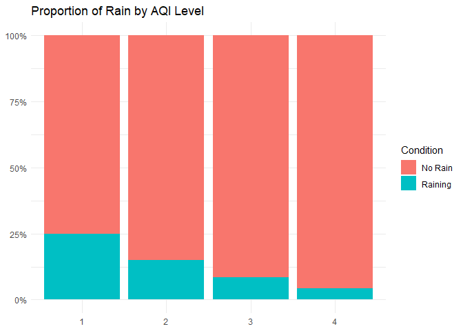<!-- -->

#### Eval multinominal

The macro F1 and poor class recall is significantly better compared to
the partial PO model. When it comes to the ordinal regression, the F1
scores are similar but the recall for poor class is much higher.

``` r
predict_multinom <- function(model, test_data, partition) {
  test_features <- test_data %>% select(all_of(partition))
  actual <- as.integer(as.character(test_data$AQI_p24))
  probs  <- predictvglm(model, newdata = test_features, type = "response")
  preds  <- max.col(probs)
  list(actual = actual, preds = preds)
}

eval_multinom <- function(model, test_data, partition) {
  p <- predict_multinom(model, test_data, partition)
  compute_metrics(p$preds, p$actual)
}

class_recall_multinom <- function(model, test_data, partition) {
  p <- predict_multinom(model, test_data, partition)
  compute_class_recall(p$preds, p$actual)
}

list(
  "A - pollutants only" = eval_multinom(multinomial_A, test_data, PARTITION_A),
  "B - all features" = eval_multinom(multinomial_B, test_data, PARTITION_B)
) %>%
  list_rbind(names_to = "Partition")
```

    ## # A tibble: 2 × 5
    ##   Partition           `Acc (%)` `+-1 Class Acc (%)` `Macro F1` `Poor Recall (%)`
    ##   <chr>                   <dbl>               <dbl>      <dbl>             <dbl>
    ## 1 A - pollutants only      49.9                92.7      0.417              56.4
    ## 2 B - all features         53.4                94.3      0.455              58.0

``` r
cat("--- Partition A ---\n")
```

    ## --- Partition A ---

``` r
class_recall_multinom(multinomial_A, test_data, PARTITION_A) %>% print()
```

    ## # A tibble: 4 × 5
    ##   Class Label    Actual_n Pred_n `Recall (%)`
    ##   <int> <chr>       <int>  <int>        <dbl>
    ## 1     1 Good         1402   2627         42.4
    ## 2     2 Fair         8626   7869         56.6
    ## 3     3 Moderate     6053   4728         41.3
    ## 4     4 Poor          553   1410         56.4

``` r
cat("\n--- Partition B ---\n")
```

    ## 
    ## --- Partition B ---

``` r
class_recall_multinom(multinomial_B, test_data, PARTITION_B) %>% print()
```

    ## # A tibble: 4 × 5
    ##   Class Label    Actual_n Pred_n `Recall (%)`
    ##   <int> <chr>       <int>  <int>        <dbl>
    ## 1     1 Good         1402   2672         50.3
    ## 2     2 Fair         8626   7959         59.1
    ## 3     3 Moderate     6053   4716         45.5
    ## 4     4 Poor          553   1287         58

#### Confusion matrix

``` r
preds_multinom <- predict_multinom(multinomial_B, test_data, PARTITION_B)
actual_cls  <- preds_multinom$actual
pred_cls    <- preds_multinom$preds
act_pred_tb <- tibble(Actual = actual_cls, Predicted = pred_cls)

plot_confusion_matrix(actual_cls, pred_cls, "Confusion Matrix: Multinomial Regression Partition B")
```

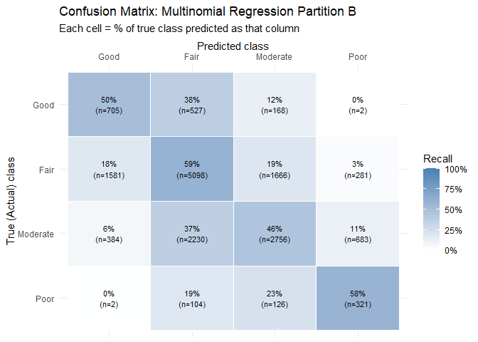<!-- -->

#### Assumption check: Linearity of log-odds

The multinomial logistic regression assumes that the log-odds of each
class vs the reference class (Good) is a linear function of the
continuous predictors. This means that for each predictor, the
relationship between the predictor and the log-odds of being in a
particular AQI category (Fair, Moderate, Poor) vs being in the Good
category should be linear.

We check all continuous predictors in `PARTITION_B` for this assumption.
We exclude some variables that are not suitable for this check, such as
`Rain` and `Snowfall` which are heavily zero-inflated, `Weather_Code`
which is categorical, and `hour` and `month` which are cyclic.

``` r
skip_vars <- c("Rain", "Snowfall", "Weather_Code", "hour", "month")
continuous_vars_check <- setdiff(PARTITION_B, skip_vars)

logodds_df <- map_dfr(continuous_vars_check, function(var) {
  df <- train_data %>%
    select(x = all_of(var), y = AQI_p24) %>%
    mutate(y = as.integer(y))

  breaks <- unique(quantile(df$x, probs = seq(0, 1, length.out = 13)))

  if (length(breaks) < 3) return(NULL)
  df <- df %>% mutate(bin = cut(x, breaks = breaks, include.lowest = TRUE, labels = FALSE))

  bin_stats <- df %>%
    count(bin, y) %>%
    #complete(bin, y = 1:4, fill = list(n = 0)) %>%
    mutate(total = sum(n), prop = n / total, .by=bin) # calculate proportion of each class in the bin

  bin_medians <- df %>%
    summarise(x_med = median(x), .by = bin) # calculate median of each bin

  bin_stats %>%
    left_join(bin_medians, by = "bin") %>%
    group_by(bin) %>%
    mutate(
      p_ref = prop[y == 1], # reference class proportion (Good=1) for the bin
      log_odds = log((prop) / (p_ref)) # log-odds vs reference class (Good=1)
    ) %>%
    filter(y != 1) %>%
    mutate(Class = factor(y, levels = 2:4, labels = c("Fair", "Moderate", "Poor")),
      variable = var
    )
})

ggplot(logodds_df, aes(x_med, log_odds, color = Class)) +
  geom_point(size = 2) +
  geom_smooth(method = "loess", se = FALSE, linewidth = 0.9) +
  geom_hline(yintercept = 0, linetype = "dashed", color = "grey60") +
  facet_wrap(~ variable, scales = "free_x", ncol = 3) +
  scale_color_brewer(palette = "Set1") +
  labs(
    title = "Linearity of log-odds assumption check",
    subtitle = "log(P(AQI=k) / P(AQI=Good)) vs predictor bin median",
    x = "Predictor bin median", y = "log(P(k) / P(Good))", color = "AQI Class"
  ) +
  theme_minimal(base_size = 12) +
  theme(
    legend.position = "bottom"
  )
```

    ## `geom_smooth()` using formula = 'y ~ x'

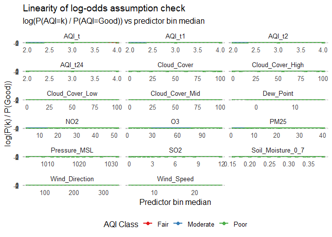<!-- -->

The results are somewhat mixed. For some predictors, the assumptions
holds, but is violated for others. AQI_tX features show a very strong
linear relationship with log-odds (which makes sense given the temporal
autocorrelation of AQI). However, for some weather features (e.g. `O3`,
`Wind_Direction`) the relationship is clearly non-linear, which violates
the assumption and may lead to suboptimal performance of the multinomial
model compared to more flexible methods like Random Forest or XGBoost
that do not rely on this assumption.

## Models Evaluation Summary

To compare all the models, the table below was created.

``` r
summary_table <- bind_rows(
  eval_rf(rf_A, test_data, PARTITION_A)            %>% mutate(Method = "Random Forest",      Type = "Non-parametric", Partition = "A"),
  eval_rf(rf_B, test_data, PARTITION_B)            %>% mutate(Method = "Random Forest",      Type = "Non-parametric", Partition = "B"),
  eval_xgb(xgb_A, dtest_A, test_data)              %>% mutate(Method = "XGBoost",            Type = "Non-parametric", Partition = "A"),
  eval_xgb(xgb_B, dtest_B, test_data)              %>% mutate(Method = "XGBoost",            Type = "Non-parametric", Partition = "B"),
  eval_knn(knn_A, test_data)                       %>% mutate(Method = "kNN",                Type = "Non-parametric", Partition = "A"),
  eval_knn(knn_B, test_data)                       %>% mutate(Method = "kNN",                Type = "Non-parametric", Partition = "B"),
  eval_ordinal(ordinal_A, test_data, PARTITION_A)  %>% mutate(Method = "Ordinal Regression", Type = "Parametric",     Partition = "A"),
  eval_ordinal(ordinal_B, test_data, PARTITION_B)  %>% mutate(Method = "Ordinal Regression", Type = "Parametric",     Partition = "B"),
  eval_partial(partial_A, test_data, PARTITION_A)  %>% mutate(Method = "Partial PO",        Type = "Parametric",     Partition = "A"),
  eval_multinom(multinomial_A, test_data, PARTITION_A) %>% mutate(Method = "Multinomial Reg.", Type = "Parametric",   Partition = "A"),
  eval_multinom(multinomial_B, test_data, PARTITION_B) %>% mutate(Method = "Multinomial Reg.", Type = "Parametric",   Partition = "B")
) %>%
  select(Type, Method, Partition, `Acc (%)`, `+-1 Class Acc (%)`, `Macro F1`, `Poor Recall (%)`) %>%
  rename(Part = Partition, `Acc` = `Acc (%)`, `+-1 Acc` = `+-1 Class Acc (%)`, `Poor Rec` = `Poor Recall (%)`) %>%
  arrange(Type, Method, Part) %>%
  print(width = Inf)
```

    ## # A tibble: 11 × 7
    ##    Type           Method             Part    Acc `+-1 Acc` `Macro F1` `Poor Rec`
    ##    <chr>          <chr>              <chr> <dbl>     <dbl>      <dbl>      <dbl>
    ##  1 Non-parametric Random Forest      A      52.0      92.3      0.419       58.8
    ##  2 Non-parametric Random Forest      B      60.1      96.9      0.467       49.7
    ##  3 Non-parametric XGBoost            A      51.4      92.2      0.432       57.7
    ##  4 Non-parametric XGBoost            B      56.8      95.5      0.476       51.9
    ##  5 Non-parametric kNN                A      57.0      97.3      0.338        4.7
    ##  6 Non-parametric kNN                B      57.9      97.5      0.369       11.4
    ##  7 Parametric     Multinomial Reg.   A      49.9      92.7      0.417       56.4
    ##  8 Parametric     Multinomial Reg.   B      53.4      94.3      0.455       58.0
    ##  9 Parametric     Ordinal Regression A      52.5      95.9      0.428       42.9
    ## 10 Parametric     Ordinal Regression B      55.3      97.0      0.460       38.9
    ## 11 Parametric     Partial PO         A      46.2      89.9      0.386       67.3

The table contains every model tried for AQI classification prediction,
clearly separating parametric and non-parametric models across both
feature spaces. A couple of interesting things can be noted focusing on
the macro F1 score and recall for Poor AQI class. The best models based
on macro F1 were non-parametric RF and XGBoost, but multinomial and
ordinal regression followed very closely. Poor recall was highest for
parametric models, where partial PO outperformed every other one, though
its macro F1 was lower. Then multinomial regression followed, and after
that the XGBoost and RF, making these three models the best balanced on
both of macro F1 and Poor recall class metrics.

### Model performance (Macro F1 plots)

``` r
method_order <- summary_table %>%
  group_by(Method) %>%
  summarise(best_f1 = max(`Macro F1`)) %>%
  arrange(best_f1) %>%
  pull(Method)
 
summary_table %>%
  mutate(Method = factor(Method, levels = method_order)) %>%
  ggplot(aes(x = Method, y = `Macro F1`, fill = Part)) +
  geom_col(position = position_dodge(0.7), width = 0.6) +
  geom_text(aes(label = sprintf("%.3f", `Macro F1`)),
            position = position_dodge(0.7), vjust = -0.4, size = 2.8) +
  scale_fill_brewer(palette = "Set2") +
  scale_y_continuous(limits = c(0, 0.56), expand = c(0, 0)) +
  facet_wrap(~ Type, scales = "free_x") +
  labs(title = "Macro F1 Score by Model and Feature Partition",
       subtitle = "Partition A = pollutants only | Partition B = pollutants + weather",
       y = "Macro F1", fill = "Partition") +
  theme_minimal() +
  theme(legend.position = "bottom")
```

<!-- -->

Partition B (pollutants + weather) consistently outperforms Partition A
(pollutants only) across every model. This confirms that weather
features carry additional predictive signal beyond pollutant lags. Among
non-parametric models, XGBoost achieves the highest Macro F1. Among
parametric models, Ordinal Regression performs the best, based on the
Macro F1, very slightly above Multinomial regression.

### Per-class Recall Heatmap

``` r
recall_long <- bind_rows(
  class_recall_rf(rf_A, test_data, PARTITION_A)                %>% mutate(Method = "Random Forest",    Type = "Non-parametric", Partition = "A"),
  class_recall_rf(rf_B, test_data, PARTITION_B)                %>% mutate(Method = "Random Forest",    Type = "Non-parametric", Partition = "B"),
  class_recall_xgb(xgb_A, dtest_A, test_data)                 %>% mutate(Method = "XGBoost",          Type = "Non-parametric", Partition = "A"),
  class_recall_xgb(xgb_B, dtest_B, test_data)                 %>% mutate(Method = "XGBoost",          Type = "Non-parametric", Partition = "B"),
  class_recall_knn(knn_A, test_data)                           %>% mutate(Method = "kNN",              Type = "Non-parametric", Partition = "A"),
  class_recall_knn(knn_B, test_data)                           %>% mutate(Method = "kNN",              Type = "Non-parametric", Partition = "B"),
  class_recall_ordinal(ordinal_A, test_data, PARTITION_A)      %>% mutate(Method = "Ordinal Reg.",     Type = "Parametric",     Partition = "A"),
  class_recall_ordinal(ordinal_B, test_data, PARTITION_B)      %>% mutate(Method = "Ordinal Reg.",     Type = "Parametric",     Partition = "B"),
  class_recall_partial(partial_A, test_data, PARTITION_A)      %>% mutate(Method = "Partial PO",        Type = "Parametric",     Partition = "A"),
  class_recall_multinom(multinomial_A, test_data, PARTITION_A) %>% mutate(Method = "Multinomial Reg.", Type = "Parametric",     Partition = "A"),
  class_recall_multinom(multinomial_B, test_data, PARTITION_B) %>% mutate(Method = "Multinomial Reg.", Type = "Parametric",     Partition = "B")
) %>%
  mutate(
    Model = paste0(Method, " (", Partition, ")"),
    AQI_Class = factor(Label, levels = aqi_levels)
  )

model_order <- recall_long %>%
  filter(Label == "Poor") %>%
  arrange(Type, desc(`Recall (%)`)) %>%
  pull(Model)

recall_long %>%
  mutate(Model = factor(Model, levels = rev(model_order))) %>%
  ggplot(aes(x = AQI_Class, y = Model, fill = `Recall (%)`)) +
  geom_tile(color = "white", linewidth = 0.5) +
  geom_text(aes(label = paste0(`Recall (%)`, "%")), size = 3) +
  scale_fill_distiller(palette = "RdYlGn", direction = 1, limits = c(0, 100)) +
  facet_wrap(~ Type, scales = "free_y", ncol = 1) +
  labs(title = "Per-class Recall by Model",
       x = "AQI Class", y = NULL, fill = "Recall (%)") +
  theme_minimal()
```

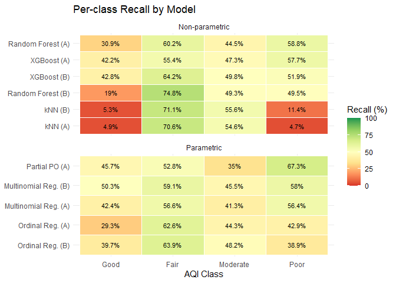<!-- -->

The heatmap reveals a split between non-parametric and parametric.
Parametric models maintain relatively balanced recall thanks to the
class weighting approach. They also were much better at predicting both
minority classes, while the majority classes Fair and Moderate have
slightly lower recall.

### Feature Importance: RF vs XGBoost

``` r
library(patchwork)

p_rf  <- vip(rf_B, num_features = 22, geom = "col") +
  labs(title = "Random Forest B") +
  theme_minimal(base_size = 10)

p_xgb <- vip(xgb_imp_perm_B, num_features = 22, geom = "col") +
  labs(title = "XGBoost B") +
  theme_minimal(base_size = 10)

p_rf + p_xgb +
  plot_annotation(
    title    = "Permutation Feature Importance (Partition B)",
    subtitle = "Accuracy metric, 5 permutations"
  )
```

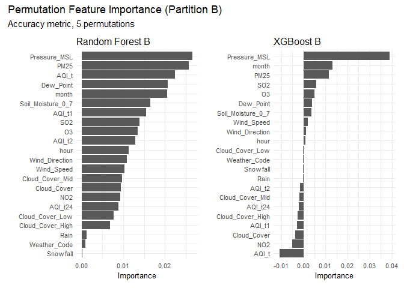<!-- -->

Both models agree that the top two predictors are `Pressure_MSL` and
`PM25`. Pressure is by far the most important predictor in XGBoost, and
also the most important in RF.

On the other hand, Snowfall seems to not be important at all for both
models (near zero importance). The rest of the features are shown on the
plots.

### Poor Class Precision-Recall

We use Precision-Recall (PR) curves to evaluate the ability of models to
detect the Poor class, based on both precision and recall metrics.

``` r
library(PRROC)

actual_poor <- as.integer(test_data$AQI_p24) == 4

xgb_margins <- predict(xgb_B, dtest_B, outputmargin = TRUE, strict_shape = TRUE)
xgb_exp <- exp(xgb_margins)
xgb_prob_B <- xgb_exp / rowSums(xgb_exp)

pr_models <- list(
  "RF B" = PRROC::pr.curve(scores.class0 = predict(rf_B_prob, data = test_data)$predictions[, 4], weights.class0 = actual_poor, curve = TRUE),
  "XGBoost B" = PRROC::pr.curve(scores.class0 = xgb_prob_B[, 4], weights.class0 = actual_poor, curve = TRUE),
  "Multinomial Reg. B" = PRROC::pr.curve(scores.class0 = predictvglm(multinomial_B, newdata = test_data %>% select(all_of(PARTITION_B)), type = "response")[, 4], weights.class0 = actual_poor, curve = TRUE),
  "Partial PPO A" = PRROC::pr.curve(scores.class0 = predictvglm(partial_A, newdata = test_data %>% select(all_of(PARTITION_A)), type = "response")[, 4], weights.class0 = actual_poor, curve = TRUE),
  "Ordinal Reg. B" = PRROC::pr.curve(scores.class0 = predict(ordinal_B, newdata = test_data %>% select(all_of(PARTITION_B)), type = "probs")[, "4"], weights.class0 = actual_poor, curve = TRUE),
  "kNN B" = PRROC::pr.curve(scores.class0 = knn_B$prob[, 4], weights.class0 = actual_poor, curve = TRUE)
)

prevalence <- mean(actual_poor)

pr_df <- pr_models %>%
  enframe(name = "name", value = "pr") %>%
  mutate(
    curve = map(pr, ~ as.data.frame(.x$curve) %>% setNames(c("recall", "precision", "threshold"))),
    auc = map_dbl(pr, ~ .x$auc.integral)
  ) %>%
  unnest(curve) %>%
  mutate(model = paste0(name, "  (AUC=", round(auc, 3), ")"))

ggplot(pr_df, aes(x = recall, y = precision, color = model)) +
  geom_line(linewidth = 0.9) +
  geom_hline(yintercept = prevalence, linetype = "dashed", color = "grey60") +
  annotate("text", x = 0.75, y = prevalence + 0.03,
           label = paste0("Random baseline (", round(prevalence * 100, 1), "%)"),
           size = 3, color = "grey50") +
  scale_color_brewer(palette = "Dark2") +
  scale_x_continuous(limits = c(0, 1)) +
  scale_y_continuous(limits = c(0, 1)) +
  labs(
    title = "One-vs-Rest Precision-Recall (Poor AQI Class)",
    x = "Recall", y = "Precision", color = "Model (PR-AUC)"
  ) +
  theme_minimal() +
  theme(legend.position = "bottom")
```

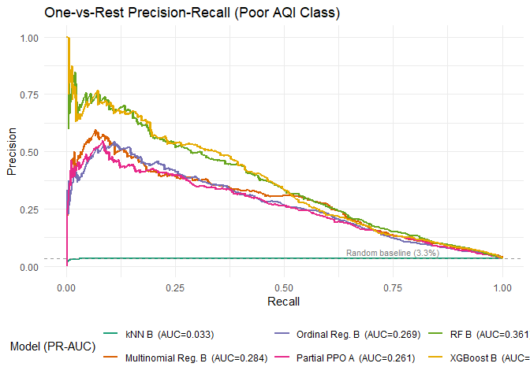<!-- -->

RF and XGBoost are the strongest predictors for the Poor class,
substantially above the random baseline. Parametric models are
noticeably behind the non-parametric models, except for KNN which is
essentially at the random baseline, and not useful for detecting the
Poor class at all. As the parametrics models had equal or even better
recall values in heatmap above, explanation why they are substantially
lower is because of the precision, meaning they more often misclassify
other classes as Poor.

**Scenario 1 - Models across 2 feature space partitions** Across all
three model families (Random Forest, XGBoost, kNN), adding weather
features (Partition B) consistently raises Macro F1 and accuracy over
pollutants-only (Partition A). This shows that weather variables carry
additional predictive signal regardless of the model choice.

Features that matter in both families, such as pollutants, lagged AQI
and weather variables like pressure, were highly useful for AQI
predictions. Non-parametric models expose this through permutation
importance, while with parametric models it can be analyzed by looking
at the coefficients and statistical significance, noting that some
assumptions are violated in this dataset. An interesting variable is
Snowfall, as the dataset contains very few hours with recorded snowfall.
Parametric models interpret this as a highly influential parameter,
while the non-parametric models have it as one of the lowest important
features.

**Scenario 2 - Parametric vs. Non-parametric models** Non-parametric
models (RF and XGBoost) offer the highest macro F1 scores and they are
the best options based on the PR curves, mainly because they capture
non-linear relationships between predictors and AQI. Feature evaluation
is possible by using permutation importance. When it comes to the
reproducibility, all the non-parametric methods are based on randomness
(stochastic) in some way, making the results always different (without
explicitly setting seed).

Parametric methods offer more balanced recall metric across all the AQI
classes and offer explainability in form of fitted coefficients, which
can be interpreted how the predictor is influencing the overall outcome.
Other statistics like std. error and z tests are harder to interpret, as
this dataset is timeseries problem, violating statistical assumptions.
As these models are not random based, the results can be easily
reproduced, offering stronger reproducibility compared to the
non-parametric models. If the inference is desired, the parametric
models are better suited than the non-parametric, which shine when pure
prediction is the priority.

## Scenario 3 - Feature Selection: Wrapper vs. Embedded

The multinomial model fitted above uses all 22 features in PARTITION_B.
By utilizing feature selection methods, it may be possible to find
smaller set of predictors that would explain the data better than the
full 22 features. Two embedded methods and one wrapper method was
performed and compared between each other and the base multinomial
model.

### Parameters

``` r
library(glmnet)

LASSO_ALPHA <- 1.0 # pure L1 penalty (Lasso)
ELNET_ALPHA <- 0.5 # 50/50 L1+L2 blend (Elastic Net)
GLMNET_NFOLDS <- 10 # folds for cross-validated lambda selection
```

### Lasso

Lambda is selected by 10-fold cross-validation. Both the min lambda and
1-SE lambda are computed and shown on the plot. For evaluation, we will
use 1-SE lambda as it picks simpler model within one standard error of
minimum. The plotted lambdas shows that the 1-SE lambda keeps 17
features in the model, while minimal does 21. This does not mean the
model retains only 17 predictors, because in multinomial regression
coefficients are estimated separately for each class. Some predictors
can be included in one class estimation and not in others. The numbers
17 and 21 are median for how many parameters were retained at that point
across all classes.

``` r
set.seed(2026)
cv_lasso <- cv.glmnet(
  as.matrix(train_data %>% select(all_of(PARTITION_B))),
  train_data$AQI_p24,
  family   = "multinomial",
  alpha    = LASSO_ALPHA,
  nfolds   = GLMNET_NFOLDS,
  weights  = compute_class_weights_param(train_data, power = MULTINOMIAL_WEIGHT_POWER),
  type.measure = "class"
)
plot(cv_lasso)
title("Lasso - CV misclassification vs. log(lambda)", line = 2.5)
```

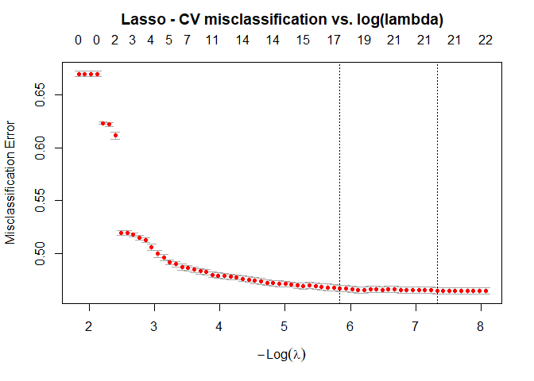<!-- -->

``` r
cat("Lasso lambda.min:", cv_lasso$lambda.min, "\n")
```

    ## Lasso lambda.min: 0.0006571674

``` r
cat("Lasso lambda.1se:", cv_lasso$lambda.1se, "\n")
```

    ## Lasso lambda.1se: 0.00291166

``` r
coef(cv_lasso)
```

    ## $`1`
    ## 23 x 1 sparse Matrix of class "dgCMatrix"
    ##                      lambda.1se
    ## (Intercept)       54.6909923989
    ## AQI_t             -0.2528778895
    ## AQI_t1            -0.0878930264
    ## AQI_t2            -0.1447279534
    ## AQI_t24           -0.2211486259
    ## PM25              -0.0428984592
    ## NO2               -0.0431422787
    ## O3                -0.0217334561
    ## SO2               -0.0378821645
    ## hour              -0.0244467588
    ## month              0.0302145671
    ## Dew_Point          0.0427226410
    ## Rain               0.0998695486
    ## Snowfall          -1.9818320327
    ## Weather_Code       .           
    ## Pressure_MSL      -0.0551969489
    ## Cloud_Cover        0.0008036046
    ## Cloud_Cover_Low    .           
    ## Cloud_Cover_Mid    0.0014768566
    ## Cloud_Cover_High   0.0014319158
    ## Wind_Speed         0.0152975954
    ## Wind_Direction     0.0006669877
    ## Soil_Moisture_0_7 -0.6950297954
    ## 
    ## $`2`
    ## 23 x 1 sparse Matrix of class "dgCMatrix"
    ##                      lambda.1se
    ## (Intercept)       15.5701933398
    ## AQI_t             -0.1819255872
    ## AQI_t1            -0.0837677375
    ## AQI_t2            -0.0435919148
    ## AQI_t24           -0.1123961763
    ## PM25              -0.0104164177
    ## NO2                .           
    ## O3                -0.0006427738
    ## SO2                0.0017011897
    ## hour              -0.0023950786
    ## month             -0.0145784336
    ## Dew_Point          0.0128337876
    ## Rain               .           
    ## Snowfall           .           
    ## Weather_Code       .           
    ## Pressure_MSL      -0.0180824282
    ## Cloud_Cover        0.0003551258
    ## Cloud_Cover_Low    .           
    ## Cloud_Cover_Mid    0.0004056438
    ## Cloud_Cover_High   0.0001659419
    ## Wind_Speed         0.0100575106
    ## Wind_Direction     .           
    ## Soil_Moisture_0_7  .           
    ## 
    ## $`3`
    ## 23 x 1 sparse Matrix of class "dgCMatrix"
    ##                      lambda.1se
    ## (Intercept)       -2.347183e+01
    ## AQI_t              1.819256e-01
    ## AQI_t1             8.376774e-02
    ## AQI_t2             4.359191e-02
    ## AQI_t24            1.123962e-01
    ## PM25               1.041642e-02
    ## NO2                .           
    ## O3                 6.427738e-04
    ## SO2                .           
    ## hour               2.395079e-03
    ## month              1.457843e-02
    ## Dew_Point         -2.108198e-02
    ## Rain               .           
    ## Snowfall           9.014972e-02
    ## Weather_Code       .           
    ## Pressure_MSL       1.808243e-02
    ## Cloud_Cover       -3.551258e-04
    ## Cloud_Cover_Low    1.197827e-03
    ## Cloud_Cover_Mid   -1.558175e-03
    ## Cloud_Cover_High  -1.659419e-04
    ## Wind_Speed        -1.005751e-02
    ## Wind_Direction    -6.338608e-04
    ## Soil_Moisture_0_7  8.949608e-01
    ## 
    ## $`4`
    ## 23 x 1 sparse Matrix of class "dgCMatrix"
    ##                      lambda.1se
    ## (Intercept)       -4.678936e+01
    ## AQI_t              3.929538e-01
    ## AQI_t1             2.843277e-01
    ## AQI_t2             4.564128e-02
    ## AQI_t24            3.909412e-01
    ## PM25               2.664411e-02
    ## NO2                2.933748e-02
    ## O3                 2.385277e-02
    ## SO2                .           
    ## hour               3.387005e-02
    ## month             -2.250325e-02
    ## Dew_Point         -1.283379e-02
    ## Rain               .           
    ## Snowfall           .           
    ## Weather_Code       1.317356e-01
    ## Pressure_MSL       3.611678e-02
    ## Cloud_Cover       -2.373893e-03
    ## Cloud_Cover_Low    .           
    ## Cloud_Cover_Mid   -4.056438e-04
    ## Cloud_Cover_High  -2.676316e-03
    ## Wind_Speed        -1.329089e-02
    ## Wind_Direction     .           
    ## Soil_Moisture_0_7  .

### Elastic Net

Elastic Net adds an L2 penalty alongside L1. The L2 term encourages
correlated features to receive similar (non-zero) coefficients rather
than removing one of them.

``` r
set.seed(2026)
cv_elnet <- cv.glmnet(
  as.matrix(train_data %>% select(all_of(PARTITION_B))),
  train_data$AQI_p24,
  family   = "multinomial",
  alpha    = ELNET_ALPHA,
  nfolds   = GLMNET_NFOLDS,
  weights  = compute_class_weights_param(train_data, power = MULTINOMIAL_WEIGHT_POWER),
  type.measure = "class"
)
plot(cv_elnet)
title("Elastic Net - CV misclassification vs. log(lambda)", line = 2.5)
```

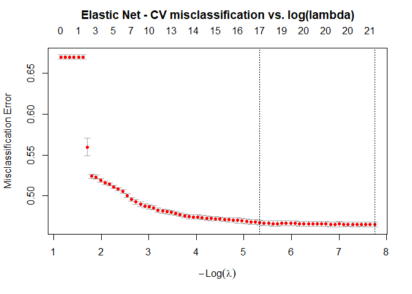<!-- -->

``` r
cat("Elastic Net lambda.min:", cv_elnet$lambda.min, "\n")
```

    ## Elastic Net lambda.min: 0.0004303854

``` r
cat("Elastic Net lambda.1se:", cv_elnet$lambda.1se, "\n")
```

    ## Elastic Net lambda.1se: 0.004834622

### Backward step

Starting from the full multinomial B model, features are removed one at
a time. At each step the feature whose removal most reduces AIC is
dropped, continuing until no removal improves AIC. In this case removing
any features led to worse model so all of the predictors are kept.

``` r
multinom_step_B <- step4vglm(multinomial_B, direction = "backward")
```

    ## Start:  AIC=103668.2
    ## AQI_p24 ~ AQI_t + AQI_t1 + AQI_t2 + AQI_t24 + PM25 + NO2 + O3 + 
    ##     SO2 + hour + month + Dew_Point + Rain + Snowfall + Weather_Code + 
    ##     Pressure_MSL + Cloud_Cover + Cloud_Cover_Low + Cloud_Cover_Mid + 
    ##     Cloud_Cover_High + Wind_Speed + Wind_Direction + Soil_Moisture_0_7
    ## 
    ##                     Df Deviance    AIC
    ## <none>                   103530 103668
    ## - AQI_t2             3   103547 103679
    ## - Rain               3   103547 103679
    ## - Cloud_Cover_High   3   103552 103684
    ## - Cloud_Cover        3   103562 103694
    ## - Cloud_Cover_Mid    3   103567 103699
    ## - Snowfall           3   103572 103704
    ## - Weather_Code       3   103576 103708
    ## - Cloud_Cover_Low    3   103580 103712
    ## - AQI_t1             3   103588 103720
    ## - Wind_Direction     3   103621 103753
    ## - Soil_Moisture_0_7  3   103682 103814
    ## - SO2                3   103702 103834
    ## - AQI_t              3   103710 103842
    ## - month              3   103741 103873
    ## - Wind_Speed         3   103772 103904
    ## - hour               3   103952 104084
    ## - Dew_Point          3   104071 104203
    ## - AQI_t24            3   104075 104207
    ## - PM25               3   104429 104561
    ## - NO2                3   104711 104843
    ## - Pressure_MSL       3   105022 105154
    ## - O3                 3   106014 106146

``` r
cat("Full model AIC:    ", AIC(multinomial_B),   "\n")
```

    ## Full model AIC:     103668.2

``` r
cat("Reduced model AIC: ", AIC(multinom_step_B), "\n")
```

    ## Reduced model AIC:  103668.2

``` r
cat("Features retained:", length(attr(terms(multinom_step_B), "term.labels")), "/", length(PARTITION_B), "\n")
```

    ## Features retained: 22 / 22

### Feature retention table

Summary table that showcase all the features and if they were kept
across feature selection methods. In the case of this dataset and
predicting AQI, all of the features were kept in the models for every
feature selection method.

``` r
extract_kept_features <- function(cv_model, s = "lambda.1se") {
  coef_list  <- coef(cv_model, s = s)
  result_list <- lapply(names(coef_list), function(cl) {
    mat <- as.matrix(coef_list[[cl]])
    tibble(class = cl, feature = rownames(mat), coef = as.numeric(mat))
  })
  bind_rows(result_list) %>%
    group_by(feature) %>%
    summarise(kept = any(coef != 0), .groups = "drop") %>%
    filter(feature != "(Intercept)")
}

kept_lasso <- extract_kept_features(cv_lasso) %>% rename(Lasso_1se = kept)
kept_elnet <- extract_kept_features(cv_elnet) %>% rename(ElNet_1se = kept)

feature_selection_table <- kept_lasso %>%
  left_join(kept_elnet, by = "feature") %>%
  mutate(
    StepAIC = feature %in% attr(terms(multinom_step_B), "term.labels"),
    # Ensure NAs (if any) are treated as FALSE
    Lasso_1se = replace_na(Lasso_1se, FALSE),
    ElNet_1se = replace_na(ElNet_1se, FALSE),
    StepAIC   = replace_na(StepAIC, FALSE),
    # Count how many methods selected the feature
    Kept = as.integer(Lasso_1se) + as.integer(ElNet_1se) + as.integer(StepAIC)
  ) %>%
  arrange(desc(Kept), feature)
print(feature_selection_table, n=22)
```

    ## # A tibble: 22 × 5
    ##    feature           Lasso_1se ElNet_1se StepAIC  Kept
    ##    <chr>             <lgl>     <lgl>     <lgl>   <int>
    ##  1 AQI_t             TRUE      TRUE      TRUE        3
    ##  2 AQI_t1            TRUE      TRUE      TRUE        3
    ##  3 AQI_t2            TRUE      TRUE      TRUE        3
    ##  4 AQI_t24           TRUE      TRUE      TRUE        3
    ##  5 Cloud_Cover       TRUE      TRUE      TRUE        3
    ##  6 Cloud_Cover_High  TRUE      TRUE      TRUE        3
    ##  7 Cloud_Cover_Low   TRUE      TRUE      TRUE        3
    ##  8 Cloud_Cover_Mid   TRUE      TRUE      TRUE        3
    ##  9 Dew_Point         TRUE      TRUE      TRUE        3
    ## 10 NO2               TRUE      TRUE      TRUE        3
    ## 11 O3                TRUE      TRUE      TRUE        3
    ## 12 PM25              TRUE      TRUE      TRUE        3
    ## 13 Pressure_MSL      TRUE      TRUE      TRUE        3
    ## 14 Rain              TRUE      TRUE      TRUE        3
    ## 15 SO2               TRUE      TRUE      TRUE        3
    ## 16 Snowfall          TRUE      TRUE      TRUE        3
    ## 17 Soil_Moisture_0_7 TRUE      TRUE      TRUE        3
    ## 18 Weather_Code      TRUE      TRUE      TRUE        3
    ## 19 Wind_Direction    TRUE      TRUE      TRUE        3
    ## 20 Wind_Speed        TRUE      TRUE      TRUE        3
    ## 21 hour              TRUE      TRUE      TRUE        3
    ## 22 month             TRUE      TRUE      TRUE        3

### Performance comparison

Comparing performances, we can see that Lasso and Elastic Net methods
perform better on all metrics. The stepAIC backward model did keep all
of the features, making it identical to the default multinomial model.

``` r
test_mat <- as.matrix(test_data %>% select(all_of(PARTITION_B)))
preds_lasso  <- as.integer(predict(cv_lasso, newx = test_mat, s = "lambda.1se", type = "class"))
preds_elnet  <- as.integer(predict(cv_elnet, newx = test_mat, s = "lambda.1se", type = "class"))
preds_step   <- predict_multinom(multinom_step_B, test_data, PARTITION_B)$preds
preds_multinom_B <- predict_multinom(multinomial_B, test_data, PARTITION_B)$preds
actual       <- as.integer(as.character(test_data$AQI_p24))

feature_selection_metrics <- bind_rows(
  compute_metrics(preds_multinom_B, actual) %>% mutate(Method = "Multinomial B (all)"),
  compute_metrics(preds_step,   actual) %>% mutate(Method = "StepAIC backward (all)"),
  compute_metrics(preds_lasso,  actual) %>% mutate(Method = "Lasso lambda.1se (- Weather_Code)"),
  compute_metrics(preds_elnet,  actual) %>% mutate(Method = "Elastic Net lambda.1se (all)")
) %>%
  select(Method, everything())

feature_selection_metrics
```

    ## # A tibble: 4 × 5
    ##   Method              `Acc (%)` `+-1 Class Acc (%)` `Macro F1` `Poor Recall (%)`
    ##   <chr>                   <dbl>               <dbl>      <dbl>             <dbl>
    ## 1 Multinomial B (all)      53.4                94.3      0.455              58.0
    ## 2 StepAIC backward (…      53.4                94.3      0.455              58.0
    ## 3 Lasso lambda.1se (…      54.2                94.5      0.458              58.4
    ## 4 Elastic Net lambda…      54.4                94.6      0.459              58.2

#### Per-class recall

The biggest difference is that the penalized model classified the Good
category worse compared to the default multinomial model. For every
other category, the Lasso and Elastic net performed better. Those two
models are almost equivalent in performance, Elastic net has better
macro F1 and worse Poor recall, and lasso vice versa.

``` r
feature_selection_recall <- bind_rows(
  compute_class_recall(preds_multinom_B, actual) %>% mutate(Method = "Multinomial B"),
  compute_class_recall(preds_step,   actual) %>% mutate(Method = "StepAIC"),
  compute_class_recall(preds_lasso,  actual) %>% mutate(Method = "Lasso"),
  compute_class_recall(preds_elnet,  actual) %>% mutate(Method = "Elastic Net")
) %>%
mutate(Label = factor(Label, levels = c("Good", "Fair", "Moderate", "Poor")))
feature_selection_recall
```

    ## # A tibble: 16 × 6
    ##    Class Label    Actual_n Pred_n `Recall (%)` Method       
    ##    <int> <fct>       <int>  <int>        <dbl> <chr>        
    ##  1     1 Good         1402   2672         50.3 Multinomial B
    ##  2     2 Fair         8626   7958         59.1 Multinomial B
    ##  3     3 Moderate     6053   4717         45.5 Multinomial B
    ##  4     4 Poor          553   1287         58   Multinomial B
    ##  5     1 Good         1402   2672         50.3 StepAIC      
    ##  6     2 Fair         8626   7958         59.1 StepAIC      
    ##  7     3 Moderate     6053   4717         45.5 StepAIC      
    ##  8     4 Poor          553   1287         58   StepAIC      
    ##  9     1 Good         1402   2384         47.2 Lasso        
    ## 10     2 Fair         8626   8189         61   Lasso        
    ## 11     3 Moderate     6053   4739         45.6 Lasso        
    ## 12     4 Poor          553   1322         58.4 Lasso        
    ## 13     1 Good         1402   2328         46.7 Elastic Net  
    ## 14     2 Fair         8626   8231         61.4 Elastic Net  
    ## 15     3 Moderate     6053   4765         45.8 Elastic Net  
    ## 16     4 Poor          553   1310         58.2 Elastic Net

``` r
feature_selection_recall %>%
ggplot(aes(x = Label, y = `Recall (%)`, fill = Method)) +
  geom_col(position = "dodge") +
  scale_fill_brewer(palette = "Set2") +
  labs(
    title = "Per-class recall — Scenario 3 methods and full multinomial",
    x = NULL, y = "Recall (%)", fill = "Method"
  ) +
  theme_minimal(base_size = 12) +
  theme(legend.position = "bottom")
```

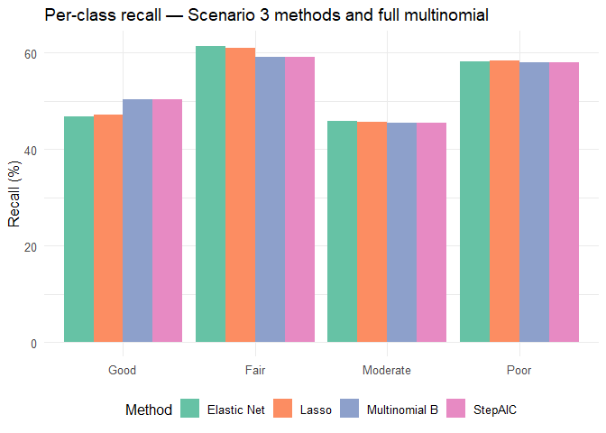<!-- -->

### Interpretation

Both of the embedded feature selection methods kept every predictor, but
the coefficients can be analyzed to tell us what features were important
for what class. It shows that some predictors do not have impact on all
classes, supporting the argument why partial PO models had problems
converging.

The wrapper method, backward step selection, did also keep all the
variables, making the model same as the multinomial B model. All of
these methods suggest that the picked predictors are useful and provide
new information about AQI.

The performance was increased very slightly, Lasso and Elastic net
models being better performing on both macro F1 and Poor recall. The
step model was in the end same as the base multinomial model.

The feature set should be kept as it is, with all the features present
in each model. The preliminary feature selection was based on domain
knowledge and filter methods like VIF. The embedded and wrapper methods
did not showcase any major changes, just confirmed that predictor subset
was picked correctly and every variable does provide meaningful
information to the prediction.

## Scenario 4 - Tree And Heatmap Visualizations (vs. Models)

### Decision Tree

Our goal here is to fit a single decision tree on the PARTITION_B
features used by the RF model, then ask:

1.  Which features does the tree actually use?
2.  What rules does it learn?
3.  At what depth does a single tree “agree” with the RF? (as much as
    possible)
4.  What does the tree fail to do that the RF succeeds at, and why?

#### Parameters and fit

``` r
library(rpart)
library(rpart.plot)

TREE_MAXDEPTH  <- 5 # max depth of the tree
TREE_CP <- 0.001 # complexity parameter (min relative improvement per split)
TREE_MINSPLIT <- 20 # min obs in a node to attempt a split
TREE_MINBUCKET <- 7 # min obs in any terminal leaf

# RF weighted predictions
preds_rf_B <- preds_B$preds
actual_int  <- preds_B$actual
```

- `maxdepth = 5` - more is not very readable
- `cp = 0.001` - the tree should grow as long as it can
- `minsplit = 20, minbucket = 7` - prevent overfitting

``` r
tree_B <- rpart(
  AQI_p24 ~ .,
  data    = train_data %>% select(all_of(c(PARTITION_B, "AQI_p24"))),
  method  = "class",
  control = rpart.control(
    maxdepth  = TREE_MAXDEPTH,
    cp = TREE_CP,
    minsplit = TREE_MINSPLIT,
    minbucket = TREE_MINBUCKET
  )
)

preds_tree_B <- as.integer(predict(tree_B, newdata = test_data %>% select(all_of(PARTITION_B)), type = "class"))
```

#### Complexity table

The table shows the cross-validation estimates of misclassification
error (xerror) at each split. We try to find the optimal tree by looking
for the point where xerror stops decreasing (beyond that, generalisation
does not improve).

``` r
printcp(tree_B)
```

    ## 
    ## Classification tree:
    ## rpart(formula = AQI_p24 ~ ., data = train_data %>% select(all_of(c(PARTITION_B, 
    ##     "AQI_p24"))), method = "class", control = rpart.control(maxdepth = TREE_MAXDEPTH, 
    ##     cp = TREE_CP, minsplit = TREE_MINSPLIT, minbucket = TREE_MINBUCKET))
    ## 
    ## Variables actually used in tree construction:
    ## [1] AQI_t             Dew_Point         month             O3               
    ## [5] PM25              Pressure_MSL      Soil_Moisture_0_7 Wind_Speed       
    ## 
    ## Root node error: 27318/50231 = 0.54385
    ## 
    ## n= 50231 
    ## 
    ##          CP nsplit rel error  xerror      xstd
    ## 1 0.2598653      0   1.00000 1.00000 0.0040863
    ## 2 0.0069795      1   0.74013 0.74013 0.0040234
    ## 3 0.0036057      4   0.71920 0.72114 0.0040056
    ## 4 0.0035325      6   0.71198 0.71052 0.0039949
    ## 5 0.0010738      9   0.70056 0.70316 0.0039871
    ## 6 0.0010616     12   0.69734 0.70097 0.0039847
    ## 7 0.0010000     13   0.69628 0.70056 0.0039842

The `xerror` stops decreasing at around 13 splits, tells us that a
single tree on this problem exhausts its useful complexity at that
number of leaves. More splits would likely only lead to overfitting.

#### Which features does the tree use?

``` r
vars_used <- unique(tree_B$frame$var[tree_B$frame$var != "<leaf>"])
vars_not_used <- setdiff(PARTITION_B, vars_used)

tibble(
  Status = c(rep("Used", length(vars_used)), rep("Not used", length(vars_not_used))),
  Feature = c(vars_used, vars_not_used)
) %>% print(n = Inf)
```

    ## # A tibble: 22 × 2
    ##    Status   Feature          
    ##    <chr>    <chr>            
    ##  1 Used     AQI_t            
    ##  2 Used     PM25             
    ##  3 Used     month            
    ##  4 Used     Wind_Speed       
    ##  5 Used     Soil_Moisture_0_7
    ##  6 Used     Pressure_MSL     
    ##  7 Used     Dew_Point        
    ##  8 Used     O3               
    ##  9 Not used AQI_t1           
    ## 10 Not used AQI_t2           
    ## 11 Not used AQI_t24          
    ## 12 Not used NO2              
    ## 13 Not used SO2              
    ## 14 Not used hour             
    ## 15 Not used Rain             
    ## 16 Not used Snowfall         
    ## 17 Not used Weather_Code     
    ## 18 Not used Cloud_Cover      
    ## 19 Not used Cloud_Cover_Low  
    ## 20 Not used Cloud_Cover_Mid  
    ## 21 Not used Cloud_Cover_High 
    ## 22 Not used Wind_Direction

- AQI_t - This is the root split, which confirms the strong lag-1
  autocorrelation from our EDA
- AQI_t1, AQI_t2, AQI_t24 - These lags are not used, likely because they
  are highly correlated with AQI_t and do not provide additional
  information for splits.
- Pressure_MSL again appears just like in other models, where it was
  explained
- Dew_Point, PM25, O3, Soil_Moisture_0_7, Wind_Speed - these appear in
  the tree
- Cloud cover variables, Rain, Snowfall, Weather_Code, hour, NO2, SO2,
  Wind_Direction - they either carry little additional information, or
  that signal is already captured by other features

#### How deep should the tree be?

We sweep `maxdepth` from 2 to 12 and evaluate the following: 1.
agreement with the weighted RF on the test set, 2. overall test accuracy

``` r
depth_sweep <- tibble(maxdepth = 2:12) %>%
  mutate(
    fit = map(maxdepth, ~ rpart(
      AQI_p24 ~ .,
      data    = train_data %>% select(all_of(c(PARTITION_B, "AQI_p24"))),
      method  = "class",
      control = rpart.control(
        maxdepth = .x, cp = TREE_CP,
        minsplit = TREE_MINSPLIT, minbucket = TREE_MINBUCKET
      ) # each depth gets its own fit
    )),
    preds_tree = map(fit, ~ as.integer(
      predict(.x, newdata = test_data %>% select(all_of(PARTITION_B)), type = "class")
    )), # each fit gets its own preds
    agreement_rf_weighted = map_dbl(preds_tree, ~ mean(.x == preds_rf_B)), 
    accuracy = map_dbl(preds_tree, ~ mean(.x == actual_int)),
    n_leaves = map_int(fit, ~ sum(.x$frame$var == "<leaf>"))
  ) %>%
  select(-fit, -preds_tree)

print(depth_sweep)
```

    ## # A tibble: 11 × 4
    ##    maxdepth agreement_rf_weighted accuracy n_leaves
    ##       <int>                 <dbl>    <dbl>    <int>
    ##  1        2                 0.759    0.570        2
    ##  2        3                 0.772    0.575        6
    ##  3        4                 0.800    0.595       10
    ##  4        5                 0.791    0.594       14
    ##  5        6                 0.798    0.594       18
    ##  6        7                 0.810    0.596       22
    ##  7        8                 0.812    0.597       23
    ##  8        9                 0.812    0.597       23
    ##  9       10                 0.812    0.597       23
    ## 10       11                 0.812    0.597       23
    ## 11       12                 0.812    0.597       23

``` r
depth_sweep %>%
  pivot_longer(c(agreement_rf_weighted, accuracy), names_to = "metric", values_to = "value") %>%
  mutate(metric = case_when(
    metric == "agreement_rf_weighted" ~ "Agreement with RF (weighted)",
    metric == "accuracy" ~ "Test accuracy (vs true labels)"
  )) %>%
  ggplot(aes(maxdepth, value * 100, color = metric)) +
  geom_line(linewidth = 1.2) +
  geom_point(size = 2.5) +
  geom_text(
    data = depth_sweep %>%
      group_by(maxdepth) %>%
      summarise(n_leaves = first(n_leaves),
                y = max(agreement_rf_weighted, accuracy) * 100 + 1.5),
    aes(maxdepth, y, label = paste0(n_leaves, "L")),
    color = "grey40", size = 3
  ) +
  scale_x_continuous(breaks = 2:12) +
  scale_color_manual(values = c(
    "Agreement with RF (weighted)"  = "#2c7bb6",
    "Test accuracy (vs true labels)" = "#d7191c"
  )) +
  labs(
    title = "Decision tree depth vs. RF agreement and test accuracy",
    x = "Tree max depth", y = "(%)", color = NULL
  ) +
  theme_minimal() +
  theme(legend.position = "bottom")
```

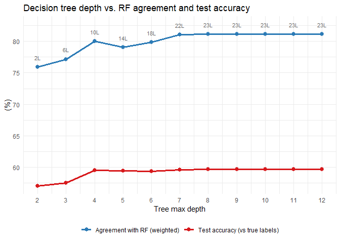<!-- -->

Both curves plateau at depth = 8 with 23 leaves. Deeper growth adds no
leaves (no split improves training error by cp) RF Agreement ceiling is
about 78%. The rest is predictive advantage of combination of the 500
trees (ensemble resolves ambiguity that a single tree cannot). Single
tree has accuracy of 59.7% vs. unweighted RF 61.9% - it is simpler and
more interpretable, but the RF has better accuracy.

For interpretation, we stick with depth = 5, which is more readable.

#### Visualisation

``` r
rpart.plot(
  tree_B,
  type = 4, # display split labels at all nodes
  extra = 104, # show all-class probabilities + leaf percentage
  tweak = 1.2,
  box.palette = list("#50ccaa", "#f0e641", "#ff5050"),
  main = paste0("Decision Tree - AQI 24h-ahead prediction (depth = ", TREE_MAXDEPTH,", balanced)")
)
```

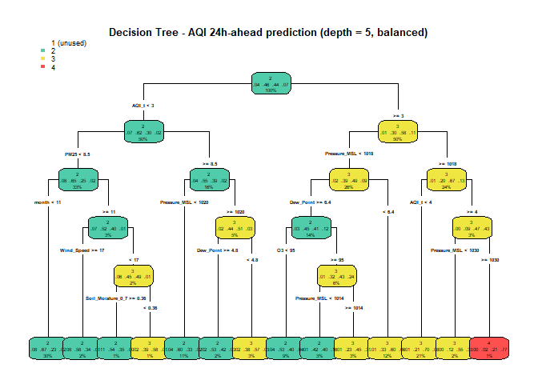<!-- -->

At the root, the tree splits on `AQI_t < 3`, which is the Moderate
threshold. When `AQI_t` is below 3, it looks into `PM25` value. If
`PM25` is below 8.5 µg/m³, the tree predicts Fair mostly, except in late
autumn and winter (month \>= 11) where lower wind speed and higher soil
moisture tip a node toward Moderate. Above 8.5 µg/m³, atmospheric
pressure becomes decisive - low-pressure conditions favour dispersal and
the tree predicts Fair, while a high-pressure lid traps pollutants and
shifts the prediction to Moderate, with dew point providing a seasonal
refinement. In the right branch, pressure again divides the tree: below
1018 hPa, O3 and dew point together determine whether the outcome is
Fair or Moderate (along with another check for pressure). Above 1018
hPa, the `AQI_t` level provides the decisive second split, and only at
the extreme — `AQI_t >= 4` combined with very high pressure (\>= 1030
hPa) - does the tree reach a leaf predicting Poor, with 77% confidence.
The tree never predicts Good, as there are very few training
observations in that class.

#### Class imbalance and its effect on tree predictions

``` r
tibble(
  Class = aqi_levels,
  Predicted = as.integer(table(factor(preds_tree_B, levels = 1:4))),
  Actual = as.integer(table(factor(actual_int, levels = 1:4)))
) %>% print()
```

    ## # A tibble: 4 × 3
    ##   Class    Predicted Actual
    ##   <chr>        <int>  <int>
    ## 1 Good             0   1402
    ## 2 Fair         11136   8626
    ## 3 Moderate      5468   6053
    ## 4 Poor            30    553

Currently, the tree we tested predicts *Fair* and *Moderate* most of the
time, and never predicts *Good* and only rarely predicts *Poor*, even
though those classes together make up around 2000 rows in the test set.
We can address this by setting class priors to be uniform at the cost of
overall accuracy.

#### Balanced tree

We try to address this by setting uniform class priors (weights) which
tells rpart to treat all classes as equally likely before seeing any
data, effectively upweighting minority classes. We didn’t use the
inverse weights as in the RF, because in this case (single tree) it
would be too extreme.

``` r
tree_B_balanced <- rpart(
  AQI_p24 ~ .,
  data = train_data %>% select(all_of(c(PARTITION_B, "AQI_p24"))),
  method = "class",
  parms = list(prior = c(0.25, 0.25, 0.25, 0.25)),  # equal priors
  control = rpart.control(
    maxdepth = TREE_MAXDEPTH,
    cp = TREE_CP,
    minsplit = TREE_MINSPLIT,
    minbucket = TREE_MINBUCKET
  )
)

preds_tree_bal <- as.integer(predict(tree_B_balanced,
  newdata = test_data %>% select(all_of(PARTITION_B)), type = "class"))
```

#### Visualisation (balanced tree)

``` r
rpart.plot(
  tree_B_balanced,
  type = 4, # display split labels at all nodes
  extra = 104, # show all-class probabilities + leaf percentage
  tweak = 1.2,
  box.palette = list("#50f0e6", "#50ccaa", "#f0e641", "#ff5050"),
  main = paste0("Decision Tree - AQI 24h-ahead prediction (depth = ", TREE_MAXDEPTH,", balanced)")
)
```

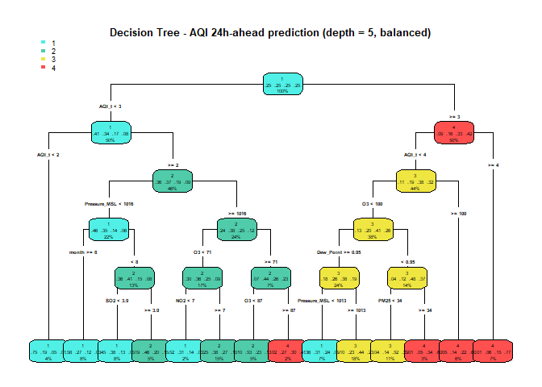<!-- -->

With the class weights, the first split still falls on `AQI_t`, with the
treshold staying the same. On the left branch, the `AQI_t` decides the
next split again - if it’s less than 2, the tree immediately predicts
*Good* with 75% probability. For `AQI_t` of 2 and higher, the tree
splits on `Pressure_MSL` - whether its below 1016 hPa, then decides
based on the `month` and `SO2` values. On the right branch of the
pressure split, where the pressure is above or equal to 1016 hPa, the
tree splits on `O3` - if it’s below 71 µg/m³, the tree further splits on
`NO2` to decide between *Fair* and *Good*, while if it’s above that
threshold, it predicts *Poor* if `O3` is above 87 µg/m³, otherwise it
predicts *Fair*.

On the right branch of the root, the tree first splits on `AQI_t` again,
with a threshold of 4. If it is above or equal to 4, it always predicts
*Poor* with 77% confidence, while if it is below 4, it splits on `O3` -
if `O3` is below 100 µg/m³, it decides based on pressure, dew point and
PM25. If `O3` is above 100 µg/m³, it predicts *Poor* with 60%
confidence.

``` r
recall_comparison <- tibble(
  Class = 1:4,
  Label = aqi_levels,
  Actual_n = as.integer(table(actual_int))
) %>%
  mutate(
    Tree_unweighted = sapply(Class, function(k)
      round(100 * sum(preds_tree_B == k & actual_int == k) / sum(actual_int == k), 1)),
    Tree_balanced = sapply(Class, function(k)
      round(100 * sum(preds_tree_bal == k & actual_int == k) / sum(actual_int == k), 1)),
    RF_weighted = sapply(Class, function(k)
      round(100 * sum(preds_rf_B == k & actual_int == k) / sum(actual_int == k), 1))
  )

recall_comparison %>% print()
```

    ## # A tibble: 4 × 6
    ##   Class Label    Actual_n Tree_unweighted Tree_balanced RF_weighted
    ##   <int> <chr>       <int>           <dbl>         <dbl>       <dbl>
    ## 1     1 Good         1402             0            75.7        18.9
    ## 2     2 Fair         8626            78.8          28.8        74.9
    ## 3     3 Moderate     6053            50.8          36          49.4
    ## 4     4 Poor          553             1.6          59.5        49.7

``` r
tibble(
  Model = c("Tree (unweighted)", "Tree (balanced)", "RF (weighted)"),
  Accuracy = round(c(
    mean(preds_tree_B == actual_int),
    mean(preds_tree_bal == actual_int),
    mean(preds_rf_B == actual_int)
  ) * 100, 1),
  Macro_F1 = round(c(
    macro_f1(preds_tree_B, actual_int),
    macro_f1(preds_tree_bal, actual_int),
    macro_f1(preds_rf_B, actual_int)
  ), 3)
) %>% print()
```

    ## # A tibble: 3 × 3
    ##   Model             Accuracy Macro_F1
    ##   <chr>                <dbl>    <dbl>
    ## 1 Tree (unweighted)     59.4    0.313
    ## 2 Tree (balanced)       36.4    0.339
    ## 3 RF (weighted)         60.1    0.467

``` r
recall_comparison %>%
  pivot_longer(c(Tree_unweighted, Tree_balanced, RF_weighted), names_to = "Model", values_to = "Recall") %>%
  mutate(
    Model = case_when(
      Model == "Tree_unweighted" ~ "Tree (unweighted)",
      Model == "Tree_balanced" ~ "Tree (balanced priors)",
      Model == "RF_weighted" ~ "RF (weighted)"
    ),
    Model = factor(Model, levels = c(
      "Tree (unweighted)", "Tree (balanced priors)", "RF (weighted)")),
    Label = factor(Label, levels = aqi_levels)
  ) %>%
  ggplot(aes(Label, Recall, fill = Model)) +
  geom_col(position = position_dodge(width = 0.75), width = 0.7) +
  scale_fill_manual(values = c(
    "Tree (unweighted)" = "#d7191c",
    "Tree (balanced priors)" = "#fdae61",
    "RF (weighted)" = "#2c7bb6"
  )) +
  labs(
    title    = "Per-class recall: single tree vs. weighted random forest",
    subtitle = "Unweighted tree collapses minority classes. Balanced priors recover recall but sacrifice accuracy.",
    x = "AQI class", y = "Recall (%)", fill = NULL
  ) +
  theme_minimal() +
  theme(legend.position = "bottom")
```

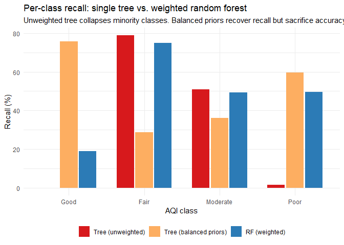<!-- -->

**Summary and evaluation**

- The unweighted tree is the most interpretable, but ignores the
  minority classes completely. It is useful for describing the majority
  patterns in the training data, but would fail badly in an
  early-warning use-case where catching *Poor* air quality is critical.

- The balanced tree recovers minority-class recall dramatically (Good:
  0%-\>76%, Poor: 2%-\>60%) at the cost of heavy over-prediction of
  those classes (predicts Good 6742 times vs. 1402 actual).

- The weighted RF achieves the best macro F1 (0.467) by combining 500
  trees with inverse-frequency weights, recovering minority-class recall
  without totally sacrificing majority-class precision.

A single tree of any depth agrees with the RF on at most ~81% of test
cases. The remaining 19% represent ambiguous observations where the
ensemble finds signal by averaging over many weak learners, while a
single rule-based partition cannot. This is a fundamental limit of the
single-tree model class on this dataset.

# Conclusion

``` r
persistence_preds <- as.integer(test_data$AQI_t)
persistence_actual <- as.integer(test_data$AQI_p24)

tibble(
  Metric = c("Macro F1", "Poor Recall (%)"),
  Value  = c(
    round(macro_f1(persistence_preds, persistence_actual), 3),
    round(100 * sum(persistence_preds == 4 & persistence_actual == 4) / sum(persistence_actual == 4), 1)
  )
) %>% print()
```

    ## # A tibble: 2 × 2
    ##   Metric           Value
    ##   <chr>            <dbl>
    ## 1 Macro F1         0.433
    ## 2 Poor Recall (%) 32.5

The hypothesis is broadly confirmed. The persistence baseline (predict
tomorrow = today) achieves Macro F1 = 0.433 with near-zero Poor recall.
Classes are imbalanced enough that a naive lag strategy almost never
identifies Poor days. All of the models except kNN exceed this baseline
(for partition B), with XGBoost B reaching Macro F1 = 0.483. Class
weighting substantially recovers Poor-class recall.

The second part of the hypothesis, that weather features add value
beyond pollutants alone, is supported. Every model improves from
Partition A (pollutants only) to Partition B (pollutants + weather),
with consistent Macro F1 gains of +0.03-0.04. `Pressure_MSL` ranks as
the single most important feature in both RF and XGBoost, which supports
the theory that atmospheric pressure is the dominant meteorological
driver of next-day AQI in Bratislava.

Among parametric models, Multinomial Regression B competes closely with
ensemble methods. The proportional odds assumption is violated for most
predictors, which limits the ordinal model and makes flexible
non-parametric approaches a better structural fit for this dataset.

# References

- \[1\] [Air Quality in Slovakia - Ministry of
  Health](https://www.minzp.sk/files/oblasti/ovzdusie/ochrana-ovzdusia/dokumenty/strategia-ochrany-ovzdusia/hodnotenie_pre_strategiu_podklady.pdf)
- \[2\] [European Air Quality
  Index](https://www.eea.europa.eu/en/analysis/maps-and-charts/index)
- \[3\] [Explainable forecasting of air quality index using a hybrid
  random forest and ARIMA
  model](https://www.sciencedirect.com/science/article/pii/S2215016125003619)
- \[4\] [Ensemble learning for air quality index prediction: integrating
  gradient boosting, XGBoost, and stacking with SHAP-based
  interpretability](https://www.nature.com/articles/s41598-026-39232-w)
- \[5\] [Designing of KNN-based Air Quality Predicting
  System](https://dl.acm.org/doi/full/10.1145/3744464.3744474)
